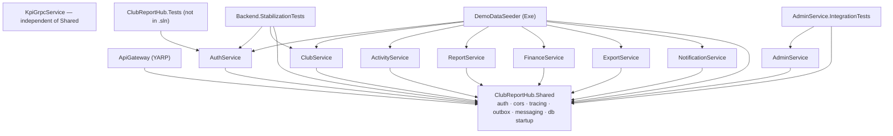
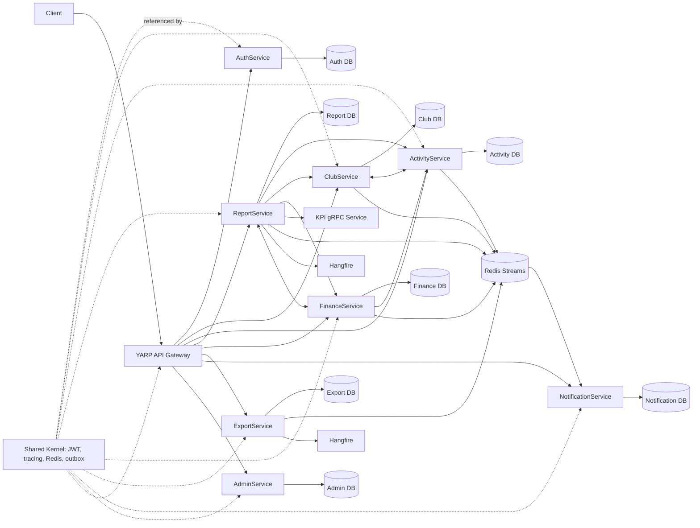
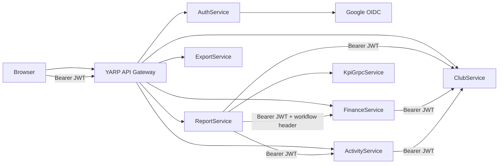
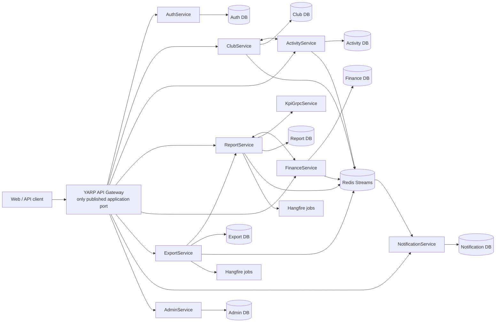

# CLUBHUB_AUDIT — FPTU-Xperience ClubHub API — Consolidated Backend Audit

**Repository:** `C:\Users\ADMIN\Downloads\DOAN\fptu-xperience-clubhub-api` — branch `develop` @ `33bf7fe`
**Audit mode:** read-only. The audit modified no application source, schema, migration, secret, dependency or deployment.

## Phase status

| Phase | Scope | Status | Location |
| :--- | :--- | :--- | :--- |
| 0 | Repository discovery & audit preparation | COMPLETE (re-verified 2026-09-21) | `# PHASE 0` below |
| 1 | System architecture & dependency audit | COMPLETE | `# PHASE 1` |
| 2 | Code quality & business logic audit | COMPLETE | `# Phase 2` |
| 3 | Authentication & authorization audit | COMPLETE | `# PHASE 3` |
| 4 | Complete API endpoint security audit | COMPLETE | `# Phase 4` |
| 5 | Database, query & performance audit | COMPLETE | `# PHASE 5` |
| 6 | Application security beyond authorization | COMPLETE (2026-09-21) | `# PHASE 6` |
| 7 | Runtime performance, scalability & reliability | COMPLETE (2026-09-21) | `# PHASE 7` at end of document |
| 8 | Testing, CI/CD & deployment | COMPLETE (2026-09-21) | `# PHASE 8` at end of document |
| 9 | Final consolidated engineering audit | COMPLETE (2026-09-21) | `# PHASE 9` at end of document |

## Review notes from skimming Phases 1–5 (resolved by Phase 9)

1. **Finding-ID collision:** `REL-001` is used twice for different findings — Phase 2 ("Export completion event failure is swallowed") and Phase 5 ("Outbox publisher has no database-level message claim"). Renumbering is required.
2. **Cross-phase duplicates to merge:** Phase 2 `BC-002` (concurrent active settlements) ≈ Phase 5 `DB-003`; Phase 2 `BC-001` (treasurer-max race) belongs to the same class as Phase 5 `DB-002` (active-manager uniqueness enforced only by a pre-check); Phase 4 `API-003` (activity-from-approved-report not independently revalidated) is the same class as Phase 3 `AUTH-002` / Phase 6 `SEC-06-04`.
3. **Phase 6 relationship to Phase 3:** `SEC-06-01` ≡ `AUTH-001` — Phase 6 adds the reachability chain (YARP `Anonymous` route → only published port), the shared rate-limit bucket, and the regression test that locks the behaviour; `SEC-06-04` ≡ `AUTH-002` — Phase 6 adds the four call sites and proves YARP forwards the header unmodified.
4. **Working tree at this update:** `M AGENTS.md`, `D GEMINI.md`, `D scripts/run-gemini-task.ps1` (pre-existing, not produced by the audit) plus untracked `docs/audit/`.

---

# PHASE 0 — REPOSITORY DISCOVERY & AUDIT PREPARATION (RE-VERIFIED)

> Independent re-verification at HEAD `33bf7fe`, performed after Phase 6. For repository structure, stack versions, exposure model, index state and the safe-command matrix this supersedes the earlier Phase 0 summary. Every statement below carries source evidence. Architecture was **not** judged conclusively in this phase.

## 1. Repository structure map

### 1.1 Directory tree (verified)

```text
fptu-xperience-clubhub-api/            git: develop @ 33bf7fe (upstream remote: legacy-api)
├─ ClubReportHub.sln                   14 projects (9 hosts in src, shared library, tool, 2 test projects)
├─ global.json                         sdk 8.0.100, rollForward latestMajor
├─ Directory.Build.props.bak           build hardening DISABLED (renamed file, see §7.1)
├─ .editorconfig (61 lines) · .dockerignore · .gitignore
├─ docker-compose.yml (425 lines)      SQL Server 2022, Redis 7.2, 9 app containers, demo seeder (profile demo)
├─ .env (untracked) · .env.example
├─ AGENTS.md / CLAUDE.md · README.md (16 KB) · API_ENDPOINTS.md (22 KB) · DEMO_DATA.md · GOOGLE_SIGN_IN.md
├─ docs/
│  ├─ backend-stabilization-notes.md    deliberately recorded technical debt
│  └─ audit/CLUBHUB_AUDIT.md            this document (untracked)
├─ .github/workflows/                  backend-ci.yml, backend-validate.yml, deployment.yml
├─ src/
│  ├─ Gateway/ApiGateway                1 file,     39 LOC   (YARP 2.2.0)
│  ├─ Services/AuthService             25 files, 1,848 LOC
│  ├─ Services/ClubService             44 files, 7,098 LOC   (largest)
│  ├─ Services/ReportService           47 files, 5,356 LOC   (most files)
│  ├─ Services/ActivityService         22 files, 1,618 LOC
│  ├─ Services/ExportService           17 files, 1,510 LOC
│  ├─ Services/FinanceService          20 files, 1,190 LOC
│  ├─ Services/AdminService            22 files,   971 LOC
│  ├─ Services/NotificationService     10 files,   956 LOC
│  ├─ Services/KpiGrpcService           2 files,   127 LOC
│  ├─ Shared/ClubReportHub.Shared      20 source files, 1,275 LOC (Auth / Cors / Data / Events / Messaging / Tracing)
│  └─ Tools/DemoDataSeeder              5 files, 2,083 LOC (OutputType=Exe)
└─ tests/
   ├─ AdminService.IntegrationTests      8 files, 558 LOC (xUnit + Mvc.Testing 8.0.18 + Sqlite/SqlServer)
   ├─ Backend.StabilizationTests         6 files, 511 LOC (TestHost 8.0.18 + InMemory/Sqlite)
   └─ ClubReportHub.Tests                2 files, 322 LOC — NOT referenced by the solution (verified)
```

**Static counts (excluding `bin`/`obj`):** 254 `.cs` files, ~25.5k LOC, 15 `.csproj` (14 in the solution), 11 Dockerfiles, 20 `appsettings*.json` in source, 3 workflows, 25 migration files (Admin 2, Auth 4, Club 10, Export 3, Report 5+1).

### 1.2 Entry points and endpoint registration (verified)

- **11 `Program.cs` entry points** (top-level statements): ApiGateway, AuthService, ClubService, ActivityService, ReportService, FinanceService, ExportService, NotificationService, AdminService, KpiGrpcService, DemoDataSeeder.
- **Minimal APIs only.** Scans for `ControllerBase`, `: Controller`, `AddControllers(`, `MapControllers(`, `ApiController` return **0 hits**. Handlers are registered by extension methods over route groups (`app.MapAuthEndpoints()`, `group.MapReportFileEndpoints()`, …) with one `*Endpoints.cs` file per concern (30 endpoint files + 10 `Program.cs`).
- **~129 route registrations** counted statically via `MapGet|MapPost|MapPut|MapPatch|MapDelete` (this includes `/`, `/health`, `/error`, `/hangfire`). Distribution: Club 43, Report 27, Auth 14, Finance 13, Activity 11, Admin 9, Export 6, Notification 5, Gateway/KPI 1–3. Phase 4 owns the authoritative per-endpoint matrix; this figure is used only for coverage estimation.
- 10 of 11 hosts have `Properties/launchSettings.json`. Dev ports there do **not** match `README.md`: README documents 5101–5110, while several services use random ports (Activity `64595/64597`, Finance `64594/64596`, Kpi `62513/62514`; only Auth/Club/Report/Notification/Admin keep 5101–5105/5108). Containers always listen on `8080`.

### 1.3 Ingress and data placement (verified)

- Only `api-gateway` is published (`docker-compose.yml:348-349`, `${GATEWAY_PORT:-7000}:8080`); routing is path-based (`yarp.json`, 17 routes → 9 clusters) and authentication is decided per route by `AuthorizationPolicy` (`Anonymous` only for `/api/auth/{**catch-all}`).
- 7 databases on one SQL Server 2022 container (`ClubReportHub_Auth|_Club|_Activity|_Report|_Finance|_Notification|_Export`). All services connect as `sa` with `TrustServerCertificate=True` (structure only — no credential values are reproduced in this document).

## 2. Technology stack inventory (evidence-based)

**Platform / runtime**
- .NET 8 (`net8.0` in all 15 projects). `global.json` requests SDK `8.0.100` with `rollForward: latestMajor`; the local machine has 9.0.315 and **10.0.112 (active)** while CI pins `8.0.x` — local build/test results may differ from CI.
- ASP.NET Core Minimal APIs on `Microsoft.NET.Sdk.Web`; 11 Dockerfiles use `mcr.microsoft.com/dotnet/aspnet:8.0` (multi-stage, **no `USER` directive** → containers run as root).

**Edge**
- `Yarp.ReverseProxy 2.2.0`; `Microsoft.AspNetCore.Authentication.JwtBearer 8.0.18`; `Swashbuckle.AspNetCore 6.6.2` (Swagger gated by `IsDevelopment()` or `Swagger:Enabled`, default `false` in Production appsettings).

**Persistence**
- EF Core **8.0.18** (`Microsoft.EntityFrameworkCore.SqlServer`, `…Design`; AdminService also `…HealthChecks.EntityFrameworkCore 8.0.18`).
- `Microsoft.Data.SqlClient 5.1.6` (via `ClubReportHub.Shared`) → pulls `System.Formats.Asn1 5.0.0` (SEC-06-05).
- Mixed schema lifecycle: EF migrations for Admin/Auth/Club/Export/Report; `EnsureCreated` + raw compatibility upgrader for Finance/Notification/Activity (documented in `docs/backend-stabilization-notes.md`; finding DB-001).

**Identity / authorization**
- JWT Bearer with a symmetric HMAC key (`Jwt:SigningKey`), issuer `ClubReportHub`, audience `ClubReportHub.Client`, `ExpirationMinutes: 120`; refresh tokens persisted in the Auth database (AUTH-006/007).
- Google Identity Services ID-token validation against Google JWKS (`ConfigurationManager` + `OpenIdConnectConfigurationRetriever`, `HttpDocumentRetriever { RequireHttps = true }`), `ValidAudience = ClientId`, requires `email_verified`, enforces e-mail-domain and `hd` allow-lists.
- Policy/role authorization (`AuthPolicies.*` in Shared) plus per-resource checks through `ClubAccessClient` (HTTP call to ClubService with a local cache — AUTH-005).

**Integration / async**
- Redis Streams (`StackExchange.Redis 2.8.22`, broker `redis:7.2-alpine`): single stream, routing key stored as a field, consumer group `notification-service`, idempotency via a `ProcessedEvents` table; transactional outbox in Shared (used by Report/Finance, gaps listed in the stabilization notes).
- gRPC: `Grpc.AspNetCore 2.62.0` (server), `Grpc.Net.Client 2.62.0` + `Google.Protobuf 3.25.3` + `Grpc.Tools` (client); `Protos/kpi.proto` in both KpiGrpcService and ReportService.
- Background: `Hangfire.AspNetCore` / `Hangfire.SqlServer 1.8.18` (Report, Export) plus `BackgroundService` (Redis consumer, outbox publisher).
- `Microsoft.Extensions.Http.Resilience 10.9.0` in Shared (10.x line on net8 — runtime compatibility to confirm in Phase 7).

## 3. Project dependency overview

### 3.1 Compile-time references (verified)



### 3.2 Objective observations (no architectural verdict yet)

- **No compile-time cycles** and **no service→service project references**; every inter-service interaction is runtime — HTTP through `IHttpClientFactory` with a configured `BaseAddress`, gRPC, or Redis Streams. Phase 1's GitNexus static import-cycle check also found no file-level cycles, which does not exclude *runtime* cycles (Club↔Activity exists by design: `ActivityStatisticsClient` and `ClubMemberRosterClient`).
- **`ClubReportHub.Shared` is the only hub** (9 of 10 hosts depend on it) → any change there has system-wide blast radius. `KpiGrpcService` is fully independent (2 files, no Shared reference, and no authorization metadata — AUTH-009).
- **`DemoDataSeeder` references 7 service projects** in order to use their `DbContext` types directly, so it can mutate or delete data in 7 databases; its only guards are `DemoData__Enabled` (must be `true`) and `DemoData__ResetAll` (deletes when `true`).
- **`ClubReportHub.Tests` is not in the solution** → the CI step `dotnet test ClubReportHub.sln` does not execute those 39 tests.
- **Third-party outliers worth verifying later:** `Microsoft.Extensions.Http.Resilience 10.9.0` on `net8.0` (Phase 7); vulnerable transitive pins now measured — `System.Formats.Asn1 5.0.0` (ApiGateway/Shared), `Newtonsoft.Json 11.0.1` (Export/Report via Hangfire 1.8.18), `System.IO.Packaging 6.0.0` (Export via ClosedXML 0.102.3 / DocumentFormat.OpenXml 2.20.0) — details in SEC-06-05.

## 4. Initial architecture hypothesis (explicitly not a conclusion)

- **Shape:** service-oriented, vertical-slice services with **database-per-service**; not a strict Clean Architecture (Phase 1 reached the same conclusion for Phases 1–5: endpoint handlers hold validation, authorization calls, persistence, state transitions and event publication in one slice).
- **Synchronous path for requests** (YARP → service over HTTP/gRPC, caller JWT forwarded), **asynchronous path for side effects** (Redis Streams consumer + a transactional outbox used selectively by Report/Finance).
- **Cross-cutting concerns** are centralized in `ClubReportHub.Shared` (JWT validation/policies, CORS origin resolution, correlation-id tracing, outbox, Redis bus, DB startup helpers).
- **Exposure:** one ingress (YARP) with per-route authentication policy; services are internal-only and trusted once inside the bridge network — no mTLS or service-to-service authentication mechanism was found in this phase.
- Items to validate in Phase 1/2/9 rather than assume: (a) how much business rule duplication exists across Club/Report/Finance/Activity; (b) whether `Shared` is a utilities library or a de-facto shared infrastructure layer; (c) the coexistence of migrations and `EnsureCreated` + raw upgraders.

## 5. Estimated audit coverage

| Item | Discovered | Inspected as of this update | Note |
| :--- | :--- | :--- | :--- |
| `.cs` files (src + tests) | 254 | Phase 6: ~20 core files read line-by-line + full-tree scans; Phases 0–5 per their own sections | No 100% claim; `DemoDatasetSeeder`, AdminService bodies, KpiGrpc internals, migration bodies and EF model configs remain unread |
| LOC | ~25.5k | — | `ClubService` (7.1k) + `ReportService` (5.4k) ≈ 49% of the code |
| Projects | 15 (14 in the solution) | 15 | `ClubReportHub.Tests` outside the solution (verified) |
| Route registrations | ~129 | Phase 4 (matrix) | Includes `/`, `/health`, `/error`, `/hangfire`; business surface is smaller |
| Endpoint files | 30 `*Endpoints.cs` + 10 `Program.cs` | Phase 6 read 9 handlers fully, scanned the rest | Phase 4 owns the per-endpoint verdicts |
| Migrations | 25 files across 5 services | Enumerated only | Finance/Notification/Activity use `EnsureCreated` instead |
| Dockerfiles | 11 | Listed + `FROM`/`USER`/`EXPOSE`/`ENTRYPOINT` scanned | none declares `USER` |
| Configuration | 20 `appsettings*.json` + compose + yarp + `.env(.example)` | Phase 6 read nearly all | Secrets never reproduced |
| Tests | 6 files containing `[Fact]`/`[Theory]`; ≈50 cases in the solution + 39 in the separate project | Cross-checked against the recorded runs in Phase 4/5 | Security regressions exist but are incomplete |
| Dependency scan | 11 projects with packages | Measured in this session (Phase 6) | `dotnet list package --vulnerable` + `dotnet nuget why` |

**Phase coverage:** 0 (this section) · 1–5 complete · 6 complete for static analysis · **7, 8 and 9 not started**.

## 6. Areas requiring deeper investigation

1. **`Directory.Build.props.bak`** — repository-wide build hardening is disabled (analyzers, `TreatWarningsAsErrors`, deterministic/CI build flags) while individual projects still set `<Nullable>enable</Nullable>`; see §7.1.
2. **Document/state drift** — this file previously ended with "waiting for approval before starting Phase 6" while Phase 6 had already been executed; `docs/audit/` is untracked, so audit artifacts are not protected by git.
3. **Dead security flag** — `.env` defines `ENABLE_DEV_LOGIN`, the test harness sets `Auth::EnableDevLogin`, and no production code reads either (SEC-06-02, same root as AUTH-001).
4. **Test coverage gap** — `ClubReportHub.Tests` (39 tests) is excluded from the solution, therefore from CI; `AdminService.IntegrationTests` needs a SQL Server that CI provides but a local machine does not.
5. **Mixed schema lifecycle** — migrations vs `EnsureCreated` vs raw upgraders (`docs/backend-stabilization-notes.md`, DB-001, PERF-001/006).
6. **Environment-specific configuration shipped in images** — `AdminService/appsettings.Test.json` (`Swagger.Enabled=true`, test-only signing key) and `ReportService/appsettings.Docker.json`.
7. **Documentation/config drift** — README ports (5101–5110) vs `launchSettings.json` random ports vs container port 8080; `API_ENDPOINTS.md` also embeds a personal e-mail address in its dev-login example (redacted here).
8. **Ingress/transport gaps** — no rate limiting, `ForwardedHeaders`, security headers or HTTPS enforcement in code (SEC-06-03, SEC-06-06); TLS depends on infrastructure outside this repository.
9. **Untrusted document processing** — 20 MB DOCX/XLSX parsing and PDF rendering executed inline in a GET request (SEC-06-07); needs measurement in Phase 7.
10. **Internal service trust** — Kpi gRPC exposes 8080/8081 without route or auth metadata (AUTH-009); no service-to-service authentication found between internal services.
11. **Operations risk in the demo seeder** — a tool that can delete data across 7 databases, guarded only by two environment variables.
12. **Code-intelligence limits** — the GitNexus index is fresh at HEAD, but FTS and vector search are unavailable (embeddings 0), so graph queries must be complemented by text search.

## 7. Explicit limitations

### 7.1 Build-hardening configuration is disabled (evidence, not a verdict)

`Directory.Build.props.bak` (499 bytes) contains `Nullable`, `ImplicitUsings`, `Deterministic`, `ContinuousIntegrationBuild` (when `GITHUB_ACTIONS` is set), `EnableNETAnalyzers`, `AnalysisLevel 8.0-recommended`, `EnforceCodeStyleInBuild` and **`TreatWarningsAsErrors`**. No `Directory.Build.props` exists, so none of it applies repository-wide; only the per-project `<Nullable>enable</Nullable>` values remain, and `.editorconfig` downgrades several CA rules (CA1304, CA1305, CA1311, CA1707, CA1711, CA1716, CA1805, CA1822, CA1848, CA1859, CA1861, CA1862, CA1869, CA2016) to *suggestion*. Git evidence: commit `be5e91b "feat skill"` added the `.bak` file. CI still passes `-warnaserror` to `dotnet build`.

### 7.2 Environment limitations that constrain this audit

- **Docker daemon is not running.** CLI 29.5.3 and Compose v5.1.4 are installed, but `docker ps` fails (`cannot connect … dockerDesktopLinuxEngine`). Therefore no image build, no `docker compose up`, no containerised integration/E2E and no SQL Server-backed test run are possible here; `docker compose config` remains usable because it is client-side.
- **No SQL Server or Redis instance is running** → Phase 5's live execution plans and concurrency experiments remain unexecuted, as Phase 5 itself recorded.
- **No deployed environment and no live traffic** → every runtime-behaviour statement in Phase 6 is a code-grounded inference, labelled as inference rather than measurement.
- **Local SDK ≠ CI SDK** (local 10.0.112 active; `global.json` requests 8.0.100 with `rollForward: latestMajor`; CI pins `8.0.x`) → local build/test output can differ from CI and must be reported as such in Phase 8.
- **Windows development host vs Linux containers** → filesystem and filename semantics differ; this is already material for SEC-06-09.
- **GitNexus** index is fresh at HEAD `33bf7fe` (325 files, 2,803 nodes, 6,294 edges, 89 communities, 225 processes) but FTS and vector search are unavailable and embeddings are 0 → empty graph results must be confirmed with text search (per AGENTS.md).
- **Dependency advisories** reflect the NuGet feed on 2026-09-21 and change over time.
- **Phases 1–5 were skimmed, not re-verified**: headings, the findings register and the sections cited in the review notes were read; their detailed evidence stands as recorded by those phases.

### 7.3 Working-tree state (unchanged by the audit)

```text
## develop...origin/develop                      HEAD 33bf7fe
 M AGENTS.md                                    (pre-existing, not from the audit)
 D GEMINI.md                                    (pre-existing, not from the audit)
 D scripts/run-gemini-task.ps1                  (pre-existing, not from the audit)
?? docs/audit/                                  (audit artifacts, untracked)
```

`.env` exists locally but is **not** tracked by git (`git ls-files` and `git log --all -- .env` are both empty; `.gitignore` excludes `.env*` except `.env.example`). Only the key names were inspected; no secret, connection-string credential or token value is reproduced anywhere in this document.

## 8. Safe audit commands in this environment

| Level | Commands | Note |
| :--- | :--- | :--- |
| **Safe** (read-only, or writes only build artifacts) | `git status/log/diff/ls-files`, `Select-String`/grep scans, `dotnet --info`/`--list-sdks`, `dotnet list <sln> package [--vulnerable --include-transitive]`, `dotnet nuget why`, `dotnet format --verify-no-changes`, `dotnet build` (writes only `bin`/`obj`), `docker compose config`, `dotnet ef migrations has-pending-model-changes` (compares model to snapshot; no DB mutation) | none of these modify source, schema, secrets or deployment |
| **Requires approval first** | `dotnet test` (the Admin integration tests require SQL Server and fail without it), `docker build`, `docker compose up/down` (creates containers and new SQL/Redis volumes on this machine), `dotnet restore` (downloads packages) | ask before running |
| **Never without explicit approval** | `dotnet ef database update` / `migrations add`, running `DemoDataSeeder` (with `DemoData__ResetAll=true` it executes `ExecuteDeleteAsync` across 7 databases), rotating secrets, deploying, `git commit/push/checkout` | avoided throughout the audit |

## 9. Proposed investigation order for the remaining phases

1. **Phase 7 — Runtime performance, scalability and reliability.** DI lifetimes and captive dependencies (`ClubAccessClient`, `IHttpClientFactory` usage); async and cancellation correctness (`ExportGenerationJob` enqueues with `CancellationToken.None`); the synchronous document pipeline (SEC-06-07); outbox/Hangfire/Redis consumer behaviour (Phase 5 `REL-002`); observability (structured logging, correlation IDs, audit trails — including whether dev-login is audited); health checks, readiness and graceful shutdown.
2. **Phase 8 — Testing, CI/CD and deployment.** The 39 tests excluded from the solution; missing regression tests for AUTH-001…010, API-001/002 and the SEC-06-* findings; `Directory.Build.props.bak`; Dockerfiles running as root; environment separation (`appsettings.Test` / `appsettings.Docker`); a dependency-vulnerability gate in CI (Phase 6 already produced the baseline to compare against, so Phase 8 should verify rather than repeat); record `dotnet build`/`dotnet test` results including the local-vs-CI SDK difference.
3. **Phase 9 — Consolidation.** Normalise and de-duplicate the register (`SEC-06-01` ≡ `AUTH-001`; `SEC-06-04` ≡ `AUTH-002`; Phase 2 `BC-002` ≈ Phase 5 `DB-003`; Phase 2 `BC-001` ≈ Phase 5 `DB-002`; Phase 4 `API-003` ≈ the workflow-coupling class; resolve the duplicated `REL-001` id), then produce the severity-classified register, the remediation roadmap and the final, honest coverage statement.
4. **Keep the audit artifacts under version control** (needs approval): `docs/audit/` is currently untracked, so this analysis can be lost or diverge from the repository state.

## 10. Phase completion status

**COMPLETE (re-verified).** All ten Phase 0 tasks were executed against the current source: structure, projects, assemblies, source directories, test projects, documentation, infrastructure, Docker configuration, CI/CD, migrations, authentication configuration, agent guidance files, formatting/analyzer configuration, technology stack, entry points, endpoint registration mechanisms, working-tree state and the safe-command set.

Honest qualifications:

- The **dependency-vulnerability measurement belongs to Phase 6** (performed, not repeated here); Phase 8 verifies it.
- Phase 0 was already recorded once in the previous checkpoint; this section is an **independent re-verification** at a later working-tree state and it supersedes the earlier summary for the facts stated here.
- Unverified areas are listed in §6 and §7 instead of being omitted: no live environment, no execution plans, no container runs, and no service-layer authorization re-verification beyond what this document records.

### Continuation checkpoint

- **System shape:** .NET 8 Minimal APIs; 10 hosts + a shared library + a seeder tool; **YARP is the only ingress** (`${GATEWAY_PORT:-7000}` → container `:8080`); database-per-service on one SQL Server 2022 instance; Redis Streams with a selective transactional outbox; Hangfire in Report/Export; internal gRPC KPI service; EF migrations in 5 services, `EnsureCreated` + raw upgraders in Finance/Notification/Activity.
- **Audit state:** Phases 0–5 recorded in this document; **Phase 6 completed 2026-09-21 and appended at the end of this document**; Phases 7–9 pending.
- **Environment constraints for later phases:** Docker daemon down, no SQL Server/Redis, local SDK 10 vs CI SDK 8, GitNexus without FTS/vector search.
- **Working tree:** three pre-existing modifications (`AGENTS.md`, `GEMINI.md`, `scripts/run-gemini-task.ps1`) plus untracked `docs/audit/`; the audit modified no application source.
- **Highest-severity items handed to later phases:** SEC-06-01 ≡ AUTH-001 (CRITICAL), SEC-06-02, SEC-06-03, AUTH-002…AUTH-005, API-001, DB-002, DB-003.

### Next phase

**Phase 7 — Runtime Performance, Scalability & Reliability**, then Phase 8 (Testing, CI/CD & Deployment) and Phase 9 (consolidated audit and register normalisation).

---

# PHASE 1 — AUDIT REPORT

## 1. Scope Completed

Reconstructed the implemented architecture and dependency direction by inspecting:

- Solution/project structure and project references.
- ASP.NET Core entry points and endpoint registration.
- API Gateway/YARP routing.
- Shared authentication, tracing, messaging, outbox, and database startup infrastructure.
- Direct HTTP and gRPC service-to-service calls.
- Redis Streams producers/consumers.
- EF Core database initialization modes.
- Background workers and Hangfire jobs.
- CI, Docker Compose, and architecture documentation.
No application source files were modified. GitNexus index metadata was refreshed only because the previous index was 13 commits stale.

## 2. Files Inspected

Key inspected groups:

- ClubReportHub.sln, global.json, all 15 .csproj files.
- All executable Program.cs files.
- src/Gateway/ApiGateway/yarp.json
- src/Shared/ClubReportHub.Shared/Auth/*
- src/Shared/ClubReportHub.Shared/Data/*
- src/Shared/ClubReportHub.Shared/Messaging/*
- src/Shared/ClubReportHub.Shared/Tracing/*
- Service HTTP clients under ActivityService, ClubService, FinanceService, ReportService, and ExportService.
- Database startup and schema-upgrader files.
- docker-compose.yml
- CI workflows under .github/workflows/
- README.md
- docs/backend-stabilization-notes.md
- AGENTS.md and CLAUDE.md
The working tree remains unchanged except for the pre-existing user changes:

M  AGENTS.md

D  GEMINI.md

D  scripts/run-gemini-task.ps1

## 3. Architecture / Implementation Discoveries

**Actual architecture**

The repository contains:

- 1 YARP API Gateway.
- 9 service executables:
  - Auth
  - Club
  - Activity
  - Report
  - Finance
  - Export
  - Notification
  - Admin
  - KPI gRPC
- 1 shared library.
- 1 demo-data seeder.
- 3 test projects.
All application projects target net8.0.

The HTTP services use ASP.NET Core Minimal APIs. KpiGrpcService exposes gRPC. The gateway loads YARP routes from [yarp.json (line 2)](C:/Users/ADMIN/Downloads/DOAN/fptu-xperience-clubhub-api/src/Gateway/ApiGateway/yarp.json:2).

**Layering**

The effective structure is:

- Gateway: ingress routing and gateway-level authentication.
- Services: endpoint handlers, business rules, EF Core contexts, service-specific infrastructure.
- Shared library: JWT validation, authorization policies, tracing, Redis Streams, outbox infrastructure, and database startup helpers.
- Persistence: one DbContext per service.
- Async integration: Redis Streams.
- Synchronous integration: typed/named HttpClient and gRPC.
- Background processing: Hangfire, Redis consumer workers, and outbox publisher workers.
**Project dependency direction**

Most services reference only ClubReportHub.Shared.

DemoDataSeeder directly references seven service projects:

ActivityService

AuthService

ClubService

ExportService

FinanceService

NotificationService

ReportService

KpiGrpcService is independent of the shared library.

GitNexus’s current static import-cycle check found no circular file imports. This does not exclude runtime HTTP dependency cycles.

**Runtime service edges**

| Caller | Callee | Mechanism |
| --- | --- | --- |
| Gateway | All public HTTP services | YARP |
| ClubService | ActivityService | ActivityStatisticsClient |
| ActivityService | ClubService | ClubMemberRosterClient |
| Activity, Finance, Notification, Report | ClubService | Shared ClubAccessClient |
| FinanceService | ActivityService | ActivityCatalogClient |
| FinanceService | ReportService | FutureEventReportClient |
| ReportService | FinanceService | FinanceWorkflowClient |
| ReportService | ActivityService | ActivityPublishingClient |
| ReportService | ClubService | ClubDirectoryClient |
| ReportService | KpiGrpcService | gRPC |
| ExportService | ReportService | Named HttpClient |

**Database strategy**

The implementation is mixed:

- EF migrations at startup:
  - AuthService
  - ClubService
  - ReportService
  - ExportService
  - AdminService
- EnsureCreated plus raw SQL schema upgraders:
  - ActivityService
  - FinanceService
- EnsureCreated:
  - NotificationService
- No database:
  - API Gateway
  - KpiGrpcService
This is also documented as remaining database-initialization debt in [backend-stabilization-notes.md (line 17)](C:/Users/ADMIN/Downloads/DOAN/fptu-xperience-clubhub-api/docs/backend-stabilization-notes.md:17).

**Messaging and workers**

Redis Streams are registered through the shared library.

Direct event producers include:

- ClubService
- ActivityService
- ExportService
- ReportService deadline jobs
Transactional outbox publishing is registered only by:

- FinanceService
- ReportService
NotificationService is the primary Redis consumer and uses a consumer group plus a ProcessedEvents table for idempotency.

Background processing includes:

- Redis notification consumer.
- Outbox publisher workers.
- Hangfire workers in ReportService and ExportService.
- Daily/monthly ReportService jobs.
- Export cleanup and generation jobs.
### Architecture Diagram



## 4. Confirmed Findings

**[ARCH-001] Synchronous Runtime Dependency Cycles**

Severity: MEDIUM

Status: CONFIRMED

Category: Architecture / Service Coupling

Affected components:

- ClubService
- ActivityService
- FinanceService
- ReportService
#### Current implementation

ClubService calls ActivityService for member statistics:

- [src/Services/ClubService/Program.cs (line 22)](C:/Users/ADMIN/Downloads/DOAN/fptu-xperience-clubhub-api/src/Services/ClubService/Program.cs:22)
- [src/Services/ClubService/Infrastructure/ActivityStatisticsClient.cs (line 21)](C:/Users/ADMIN/Downloads/DOAN/fptu-xperience-clubhub-api/src/Services/ClubService/Infrastructure/ActivityStatisticsClient.cs:21)
ActivityService calls ClubService for member-roster data:

- [src/Services/ActivityService/Extensions/ServiceCollectionExtensions.cs (line 32)](C:/Users/ADMIN/Downloads/DOAN/fptu-xperience-clubhub-api/src/Services/ActivityService/Extensions/ServiceCollectionExtensions.cs:32)
- [src/Services/ActivityService/Infrastructure/ClubMemberRosterClient.cs (line 22)](C:/Users/ADMIN/Downloads/DOAN/fptu-xperience-clubhub-api/src/Services/ActivityService/Infrastructure/ClubMemberRosterClient.cs:22)
FinanceService calls ReportService, while ReportService calls FinanceService:

- [src/Services/FinanceService/Clients/FutureEventReportClient.cs (line 25)](C:/Users/ADMIN/Downloads/DOAN/fptu-xperience-clubhub-api/src/Services/FinanceService/Clients/FutureEventReportClient.cs:25)
- [src/Services/ReportService/Clients/FinanceWorkflowClient.cs (line 16)](C:/Users/ADMIN/Downloads/DOAN/fptu-xperience-clubhub-api/src/Services/ReportService/Clients/FinanceWorkflowClient.cs:16)
#### Problem

The runtime service graph is not acyclic. Important request paths depend on another service being available synchronously, and two bounded contexts call each other directly.

#### Impact

- Availability failures can cascade across services.
- Deployment and startup ordering become more sensitive.
- Distributed workflow failures can leave partially completed operations.
- Contract changes propagate in both directions.
- Timeout and retry behavior can amplify load during incidents.
#### Recommended remediation

Define explicit dependency direction for each workflow. Consider:

- An orchestration boundary for combined report/finance workflows.
- Event-driven handoffs for operations that do not require synchronous confirmation.
- Stable contract packages or contract tests for remaining synchronous calls.
- Explicit failure and timeout semantics for cross-service operations.
#### Regression risks

Replacing synchronous calls with events may change response timing and consistency guarantees. Existing frontend workflows and retry behavior must be tested.

#### Verification

Run integration scenarios with one dependent service unavailable and verify:

- Response status and latency.
- Partial database state.
- Retry behavior.
- Idempotency of repeated requests.
**[ARCH-002] Mixed and Unversioned Database Initialization Strategy**

Severity: MEDIUM

Status: CONFIRMED

Category: Persistence Architecture / Deployment Reliability

Affected components:

- ActivityService
- FinanceService
- NotificationService
- ReportService
- AuthService
- ClubService
- ExportService
- AdminService
#### Current implementation

ActivityService uses EnsureCreated plus a raw SQL upgrader:

- [src/Services/ActivityService/Extensions/DatabaseInitializationExtensions.cs (line 22)](C:/Users/ADMIN/Downloads/DOAN/fptu-xperience-clubhub-api/src/Services/ActivityService/Extensions/DatabaseInitializationExtensions.cs:22)
- [src/Services/ActivityService/Data/ActivitySchemaUpgrader.cs (line 9)](C:/Users/ADMIN/Downloads/DOAN/fptu-xperience-clubhub-api/src/Services/ActivityService/Data/ActivitySchemaUpgrader.cs:9)
FinanceService does the same:

- [src/Services/FinanceService/Program.cs (line 81)](C:/Users/ADMIN/Downloads/DOAN/fptu-xperience-clubhub-api/src/Services/FinanceService/Program.cs:81)
- [src/Services/FinanceService/Data/FinanceSchemaUpgrader.cs (line 9)](C:/Users/ADMIN/Downloads/DOAN/fptu-xperience-clubhub-api/src/Services/FinanceService/Data/FinanceSchemaUpgrader.cs:9)
NotificationService uses EnsureCreated:

- [src/Services/NotificationService/Program.cs (line 73)](C:/Users/ADMIN/Downloads/DOAN/fptu-xperience-clubhub-api/src/Services/NotificationService/Program.cs:73)
Other services execute EF migrations, for example:

- [src/Services/AuthService/Program.cs (line 58)](C:/Users/ADMIN/Downloads/DOAN/fptu-xperience-clubhub-api/src/Services/AuthService/Program.cs:58)
- [src/Services/ClubService/Program.cs (line 102)](C:/Users/ADMIN/Downloads/DOAN/fptu-xperience-clubhub-api/src/Services/ClubService/Program.cs:102)
- [src/Services/ReportService/Program.cs (line 148)](C:/Users/ADMIN/Downloads/DOAN/fptu-xperience-clubhub-api/src/Services/ReportService/Program.cs:148)
#### Problem

Schema ownership and versioning are implemented through multiple incompatible mechanisms. The README also states that EF migrations exist per service ([README.md (line 171)](C:/Users/ADMIN/Downloads/DOAN/fptu-xperience-clubhub-api/README.md:171)), which does not match the Activity, Finance, and Notification implementations.

#### Impact

- Schema drift may not be represented in migration history.
- Rollback and environment promotion become harder to reason about.
- Startup SQL can succeed partially without a durable migration record.
- Operators may follow documentation that does not reflect deployment behavior.
#### Recommended remediation

Choose and document one schema-ownership strategy per service:

- EF migrations with explicit version history, or
- A separately versioned schema-upgrader mechanism.
Add deployment tests that start from an older schema and validate upgrade behavior.

#### Regression risks

Converting EnsureCreated databases to migrations requires a planned baseline migration and data-preservation validation.

#### Verification

Compare:

- EF migration history.
- Actual database schema.
- Startup upgrader SQL.
- Fresh and upgrade-from-previous-version Compose deployments.
**[ARCH-003] ReportService Production Configuration Omits Required Service URLs**

Severity: HIGH

Status: CONFIRMED

Category: Configuration / Runtime Service Integration

Affected component:

- ReportService
#### Current implementation

ReportService falls back to loopback addresses when FinanceService and ActivityService URLs are absent:

- [src/Services/ReportService/Program.cs (line 40)](C:/Users/ADMIN/Downloads/DOAN/fptu-xperience-clubhub-api/src/Services/ReportService/Program.cs:40)
Production Compose sets only ClubService and KpiGrpcService URLs for ReportService:

- [docker-compose.yml (line 187)](C:/Users/ADMIN/Downloads/DOAN/fptu-xperience-clubhub-api/docker-compose.yml:187)
The production appsettings.json also contains only ClubService and KpiGrpcService entries in its Services section:

- [src/Services/ReportService/appsettings.json (line 18)](C:/Users/ADMIN/Downloads/DOAN/fptu-xperience-clubhub-api/src/Services/ReportService/appsettings.json:18)
#### Problem

Inside the ReportService container, missing FinanceService and ActivityService configuration resolves to localhost, meaning the service attempts to call itself instead of the intended containers.

#### Impact

Report workflows that:

- approve or reject finance proposals, or
- publish approved activities
can fail in the Docker deployment environment.

#### Recommended remediation

Provide explicit production configuration for:

Services__FinanceService__BaseUrl

Services__ActivityService__BaseUrl

Also fail startup when required production service URLs are absent instead of silently using localhost defaults.

#### Regression risks

Local development defaults should remain usable, so environment-specific configuration and validation must be separated carefully.

#### Verification

Start the Compose stack and exercise:

- Report → Finance approval.
- Report → Activity publication.
Confirm the resolved destination host and response status.

**[ARCH-004] ExportService Ignores Its Configured ReportService URL**

Severity: MEDIUM

Status: CONFIRMED

Category: Configuration Portability

Affected component:

- ExportService
#### Current implementation

The configuration defines ReportService as http://localhost:5103:

- [src/Services/ExportService/appsettings.json (line 18)](C:/Users/ADMIN/Downloads/DOAN/fptu-xperience-clubhub-api/src/Services/ExportService/appsettings.json:18)
But the named client is hardcoded to the Docker hostname:

- [src/Services/ExportService/Program.cs (line 21)](C:/Users/ADMIN/Downloads/DOAN/fptu-xperience-clubhub-api/src/Services/ExportService/Program.cs:21)
#### Problem

The client ignores environment configuration. Running ExportService outside the Docker network attempts to resolve report-service, which is not normally resolvable from a local process.

#### Impact

Local export requests can fail even though the configured local ReportService URL is correct.

#### Recommended remediation

Read Services:ReportService:BaseUrl from configuration and provide an explicit Docker override through Compose environment variables.

#### Regression risks

The Docker environment must continue resolving http://report-service:8080.

#### Verification

Run ExportService locally with ReportService on port 5103 and submit an export request. Repeat inside Compose to confirm both environments.

## 5. Potential Findings

- The shared library acts as a broad shared kernel containing authentication, persistence helpers, messaging, tracing, and HTTP access logic. This is currently intentional, but it creates a broad change-propagation surface.
- Direct event publication remains outside the transactional outbox for ClubService, ActivityService, ExportService, and scheduled ReportService reminders. This requires reliability and failure-window analysis in a later phase.
- DemoDataSeeder references seven service assemblies directly. This is useful for coherent demo data but increases coupling between the tool and every service contract.
- Gateway-level authorization and service-level authorization may not be identical for every route. Endpoint-by-endpoint verification is still required.
## 6. Unverified Areas

- No live service startup or database migration execution was performed.
- No integration, unit, or end-to-end tests were executed in this phase.
- No endpoint-level authorization or ownership checks were audited.
- No query-performance or transaction analysis was performed.
- No production deployment was contacted.
- GitNexus’s current CLI index is refreshed, but FTS is unavailable and process enumeration is truncated; graph results are therefore supplemental to direct source inspection.
- Runtime behavior of the reported configuration defects still needs a Compose or local integration reproduction.
## 7. Required Follow-up Investigations

1. Phase 2 — Code quality and business-logic correctness.
2. Phase 3 — Authentication, authorization, ownership, and privilege escalation.
3. Phase 4 — Complete endpoint-by-endpoint security matrix.
4. Database query, transaction, and concurrency analysis.
5. Reliability analysis for retries, outbox delivery, Hangfire, and Redis consumer recovery.
6. Deployment and configuration security review.
## 8. Phase Completion Status

COMPLETE

Phase 1 architecture and dependency reconstruction is complete. The findings above are limited to architecture, service coupling, database initialization, and cross-service configuration. No application code was changed.

## 9. Continuation Checkpoint

- Repository: fptu-xperience-clubhub-api
- Branch: develop
- Current working-tree changes preserved:
  - AGENTS.md modified
  - GEMINI.md deleted
  - scripts/run-gemini-task.ps1 deleted
- Source projects: 12
- Test projects: 3
- Runtime cycles confirmed:
  - ClubService ↔ ActivityService
  - FinanceService ↔ ReportService
- Confirmed architecture/configuration findings: ARCH-001 through ARCH-004
- No tests or live services executed.
- GitNexus refreshed using analyze --index-only; no source files changed.
## 10. Next Phase

Phase 2 should trace code quality and business-logic correctness through the highest-risk workflows:

- Authentication and account state transitions.
- Club membership and ownership workflows.
- Report/finance approval state machines.
- Activity publication and attendance updates.
- Export generation and background-job state transitions.
Phase 1 is complete. Awaiting approval before starting Phase 2.

Sunday 10:52 PM

OKE

Sunday 10:55 PM

Worked for 15m 47s


---

# Phase 2 — Code Quality & Business Logic Audit

## 1. Scope Completed

Audited:

- Business-rule enforcement and state transitions
- Concurrent mutation risks
- Transaction boundaries and multi-write operations
- Outbox/event consistency
- Error handling and silent failures
- Report, finance, club membership, attendance, and export workflows
- Existing test coverage and missing regression scenarios
No application source files were modified.

## 2. Files Inspected

Key files included:

- [MembershipEndpoints.cs (line 226)](C:/Users/ADMIN/Downloads/DOAN/fptu-xperience-clubhub-api/src/Services/ClubService/Endpoints/MembershipEndpoints.cs:226)
- [ClubMemberRoleRules.cs (line 12)](C:/Users/ADMIN/Downloads/DOAN/fptu-xperience-clubhub-api/src/Services/ClubService/Services/ClubMemberRoleRules.cs:12)
- [ClubDbContext.cs (line 46)](C:/Users/ADMIN/Downloads/DOAN/fptu-xperience-clubhub-api/src/Services/ClubService/Data/ClubDbContext.cs:46)
- [SettlementEndpoints.cs (line 62)](C:/Users/ADMIN/Downloads/DOAN/fptu-xperience-clubhub-api/src/Services/FinanceService/Endpoints/SettlementEndpoints.cs:62)
- [FinanceDbContext.cs (line 30)](C:/Users/ADMIN/Downloads/DOAN/fptu-xperience-clubhub-api/src/Services/FinanceService/Data/FinanceDbContext.cs:30)
- [ReportCrudEndpoints.cs (line 25)](C:/Users/ADMIN/Downloads/DOAN/fptu-xperience-clubhub-api/src/Services/ReportService/Endpoints/ReportCrudEndpoints.cs:25)
- [ReportWorkflowEndpoints.cs (line 29)](C:/Users/ADMIN/Downloads/DOAN/fptu-xperience-clubhub-api/src/Services/ReportService/Endpoints/ReportWorkflowEndpoints.cs:29)
- [ReportDbContext.cs (line 20)](C:/Users/ADMIN/Downloads/DOAN/fptu-xperience-clubhub-api/src/Services/ReportService/Data/ReportDbContext.cs:20)
- [AuditHelper.cs (line 8)](C:/Users/ADMIN/Downloads/DOAN/fptu-xperience-clubhub-api/src/Services/ReportService/Extensions/AuditHelper.cs:8)
- [ExportGenerationJob.cs (line 17)](C:/Users/ADMIN/Downloads/DOAN/fptu-xperience-clubhub-api/src/Services/ExportService/Services/ExportGenerationJob.cs:17)
- [ExportFileGenerator.cs (line 78)](C:/Users/ADMIN/Downloads/DOAN/fptu-xperience-clubhub-api/src/Services/ExportService/Services/ExportFileGenerator.cs:78)
## 3. Architecture / Implementation Discoveries

- BudgetProposal.Version and Report.Version are configured as EF concurrency tokens.
- Settlement, ClubMembership, ActivityAttendance, and ExportRequest have no equivalent concurrency protection.
- Several business invariants are checked with an in-memory count or existence query immediately before SaveChangesAsync().
- Report mutations commonly perform two separate saves: the business mutation/outbox save followed by an audit-log save.
- Export generation marks the request Completed before publishing its completion event.
- Existing tests cover authorization and authentication regressions, but not concurrent state transitions or failure injection around multi-step workflows.
## 4. Confirmed Findings

### BC-001 — HIGH — Treasurer maximum is race-prone

- Status: CONFIRMED
- Category: Business invariant / concurrency
- Affected component: Club membership role assignment
- Location: MembershipEndpoints.AssignTreasurer, lines 252–268
- Evidence:
  - Current treasurer count is read at line 255.
  - The maximum-two rule is applied in ClubMemberRoleRules.ValidateTreasurerAssignment, lines 12–22.
  - The role is then changed and saved at lines 267–268.
  - ClubDbContext has indexes but no concurrency token or database constraint enforcing the maximum count.
Current behavior: Two concurrent requests can both observe one existing treasurer, both pass validation, and both assign another member. The club can end with three treasurers.

Root cause: Read-check-write is not serialized and the invariant is not enforced at the database level.

Impact: Governance and authorization state can become invalid under concurrent requests.

**Recommended remediation:**

- Serialize assignment per club using a transaction and appropriate locking, or
- Redesign the role model so the maximum is enforceable by a database-safe invariant, and
- Return a deterministic conflict on concurrent updates.
Required regression test: Execute two concurrent assignments against a club with one treasurer and assert that at most one succeeds.

### BC-002 — HIGH — Multiple active settlements can be created concurrently

- Status: CONFIRMED
- Category: Financial invariant / concurrency
- Affected component: Finance settlement submission
- Location: SettlementEndpoints.CreateSettlement, lines 113–133
- Evidence:
  - Active settlement check is performed at lines 113–116.
  - New settlement and transaction are inserted at lines 118–132.
  - FinanceDbContext only defines ordinary indexes for settlement proposal/status at lines 37–45; there is no filtered unique index and no settlement concurrency token.
Current behavior: Two concurrent submissions can both observe no active settlement and both insert Submitted settlements.

Impact: Duplicate settlement records and duplicate financial transactions can be created for the same approved proposal.

Root cause: Application-level existence check without transaction serialization or database uniqueness enforcement.

**Recommended remediation:**

- Add a database-enforced active-settlement invariant where supported, or
- Use a transaction with locking/serializable semantics around the check and insert,
- Make transaction creation idempotent.
Required regression test: Submit two settlement requests concurrently and assert one receives a conflict or concurrency failure.

### BC-003 — MEDIUM — Report mutation, outbox, and audit log are not atomic

- Status: CONFIRMED
- Category: Transaction consistency / reliability
- Affected component: Report CRUD and workflow transitions
- Locations:
  - [ReportCrudEndpoints.cs (line 82)](C:/Users/ADMIN/Downloads/DOAN/fptu-xperience-clubhub-api/src/Services/ReportService/Endpoints/ReportCrudEndpoints.cs:82)
  - [ReportWorkflowEndpoints.cs (line 119)](C:/Users/ADMIN/Downloads/DOAN/fptu-xperience-clubhub-api/src/Services/ReportService/Endpoints/ReportWorkflowEndpoints.cs:119)
  - [AuditHelper.cs (line 17)](C:/Users/ADMIN/Downloads/DOAN/fptu-xperience-clubhub-api/src/Services/ReportService/Extensions/AuditHelper.cs:17)
- Evidence:
  - CreateReport saves the report at line 83.
  - It then adds an outbox message and invokes AuditHelper at lines 91–101.
  - AuditHelper performs a separate SaveChangesAsync at line 17.
  - The same pattern exists in submit, finance-link, review, approve, and reject workflows.
Current behavior: The primary report mutation can commit while the subsequent audit/outbox save fails. The API may return an error even though the report state changed, while the audit record or event is missing.

**Impact:**

- Incomplete audit trail
- Missing notifications
- Client retries after an error
- Possible duplicate side effects
Root cause: Related writes are split across multiple EF save operations without an enclosing transaction.

**Recommended remediation:**

- Save report, audit entry, and outbox message in one transaction, or
- Introduce a transactional application service that owns the complete mutation,
- Make retries idempotent.
Required regression test: Inject an audit-save failure and verify that the report mutation, audit record, and outbox message remain consistent.

### BC-004 — MEDIUM — Non-future report uniqueness is application-only

- Status: CONFIRMED
- Category: Business invariant / duplicate creation
- Affected component: Report creation
- Location: [ReportCrudEndpoints.cs (line 50)](C:/Users/ADMIN/Downloads/DOAN/fptu-xperience-clubhub-api/src/Services/ReportService/Endpoints/ReportCrudEndpoints.cs:50)
- Evidence:
  - Duplicate detection uses AnyAsync at lines 50–53.
  - The corresponding database index at [ReportDbContext.cs (line 22)](C:/Users/ADMIN/Downloads/DOAN/fptu-xperience-clubhub-api/src/Services/ReportService/Data/ReportDbContext.cs:22) is not unique.
Current behavior: Two concurrent create requests can both pass the duplicate check and insert reports with the same (ClubId, Period, Tag).

Impact: Duplicate periodic reports and ambiguous workflow state.

Root cause: The intended uniqueness rule exists only in application code.

**Recommended remediation:**

- Add a database unique index for the applicable report types, using a filtered index if future-event reports are intentionally exempt.
- Handle unique-constraint conflicts as a normal 409 Conflict.
Required regression test: Concurrently create the same report key and assert exactly one succeeds.

### REL-001 — MEDIUM — Export completion event failure is swallowed

- Status: CONFIRMED
- Category: Event delivery / error handling
- Affected component: Export completion workflow
- Location: [ExportGenerationJob.cs (line 50)](C:/Users/ADMIN/Downloads/DOAN/fptu-xperience-clubhub-api/src/Services/ExportService/Services/ExportGenerationJob.cs:50)
- Evidence:
  - The export is marked Completed and saved at lines 50–52.
  - ExportCompletedEvent is published afterward at lines 64–75.
  - Any publish failure is logged and swallowed at lines 77–83.
Current behavior: The database says the export is complete, but the completion notification may never be delivered. Hangfire retry does not retry this swallowed failure.

Impact: Users or downstream services can miss completion notifications permanently.

**Recommended remediation:**

- Persist completion events in an outbox within the same transaction as the completed state, or
- Use a durable retry mechanism with delivery status and backoff.
Required regression test: Force event-bus failure after successful file generation and verify eventual redelivery.

### CQ-001 — LOW/MEDIUM — Snapshot deserialization failures are silently ignored

- Status: CONFIRMED
- Category: Code quality / error handling
- Affected component: PDF, Excel, and DOCX export generation
- Location: [ExportFileGenerator.cs (line 85)](C:/Users/ADMIN/Downloads/DOAN/fptu-xperience-clubhub-api/src/Services/ExportService/Services/ExportFileGenerator.cs:85)
- Evidence:
  - Empty catches appear at lines 91, 233, and 331.
  - When deserialization fails, snapshot remains null and generation continues.
Current behavior: A malformed or incompatible snapshot can produce an export missing report-specific content while the request still completes successfully.

Impact: Silent data omission and difficult diagnosis.

**Recommended remediation:**

- Log the deserialization error with the export request ID.
- Treat malformed snapshot data as a generation failure when the snapshot is required.
- Add a clearly defined fallback contract if blank/template exports are intentional.
## 5. Potential Findings

These require targeted integration or production-like verification before being promoted to confirmed defects:

- POT-001 — Finance/report dual-write partial failure: CreateProposal saves a finance proposal before calling the report service to link it. A link failure can leave a persisted proposal with incomplete cross-service state. Retry behavior appears to recover in some cases, but this should be tested explicitly.
- POT-002 — External workflow calls before local save: Report review/approval invokes Finance and Activity services before committing the local report transition. A downstream success followed by local failure could leave services temporarily out of sync.
- POT-003 — Cancellation-token consistency: Many mutation handlers call SaveChangesAsync() without passing the request token. This is primarily a resilience and maintainability concern.
- POT-004 — State-machine coverage gap: Existing tests do not comprehensively exercise invalid transitions, duplicate submissions, concurrent approvals, or retry/idempotency behavior.
## 6. Unverified Areas

- Actual behavior of the production SQL provider under concurrent requests.
- Whether deployment migrations already contain constraints not visible in the current model configuration.
- Event-consumer behavior after missed or duplicated events.
- Failure recovery for Finance ↔ Report cross-service operations.
- Export notification delivery guarantees in the deployed Redis/event-bus configuration.
- Full API integration coverage for the identified race conditions.
## 7. Required Follow-up Investigations

1. Add concurrency tests for treasurer assignment, settlement creation, and report creation.
2. Verify database migrations and add missing uniqueness/concurrency constraints.
3. Refactor report mutation workflows so state, audit, and outbox writes are atomic.
4. Add durable export-completion delivery through an outbox or retryable delivery record.
5. Define strict behavior for malformed export snapshots.
6. Add failure-injection tests for cross-service Finance/Report workflows.
7. Standardize request cancellation-token propagation.
## 8. Test Verification

- Solution test run: 50 passed, 0 failed
  - AdminService integration tests: 28
  - Backend stabilization tests: 22
- Separate ClubReportHub.Tests project: 39 passed, 0 failed
- ClubReportHub.Tests is not included in ClubReportHub.sln, so it required a separate test invocation.
## 9. Phase Completion Status

**Phase 2 completed.**

No application source was changed. The only working-tree changes remain the pre-existing:

- AGENTS.md modified
- GEMINI.md deleted
- scripts/run-gemini-task.ps1 deleted
## 10. Continuation Checkpoint

The repository is ready for the next audit phase. The next planned phase is:

Phase 3 — Security, authentication, authorization, input validation, secrets/configuration exposure, and trust-boundary review.

Please approve Phase 3 when you want me to continue.

Sunday 11:11 PM

OK

Sunday 11:49 PM

Worked for 11m 51s


---

# PHASE 3 — AUTHENTICATION & AUTHORIZATION AUDIT

## 1. Scope Completed

Inspected:

- JWT issuance and validation
- Google ID-token authentication
- Development/test login routes
- Refresh-token rotation, revocation, and logout
- Role and policy definitions
- Club-level ownership and access checks
- Cross-service bearer-token forwarding
- Privileged operations involving users, clubs, memberships, finance, reports, attendance, and exports
- Authentication and authorization regression tests
No application source was modified.

## 2. Files Inspected

Key files:

- [JwtServiceCollectionExtensions.cs (line 24)](C:/Users/ADMIN/Downloads/DOAN/fptu-xperience-clubhub-api/src/Shared/ClubReportHub.Shared/Auth/JwtServiceCollectionExtensions.cs:24)
- [JwtTokenFactory.cs (line 13)](C:/Users/ADMIN/Downloads/DOAN/fptu-xperience-clubhub-api/src/Shared/ClubReportHub.Shared/Auth/JwtTokenFactory.cs:13)
- [ClaimsPrincipalExtensions.cs (line 7)](C:/Users/ADMIN/Downloads/DOAN/fptu-xperience-clubhub-api/src/Shared/ClubReportHub.Shared/Auth/ClaimsPrincipalExtensions.cs:7)
- [ClubAccessClient.cs (line 30)](C:/Users/ADMIN/Downloads/DOAN/fptu-xperience-clubhub-api/src/Shared/ClubReportHub.Shared/Auth/ClubAccessClient.cs:30)
- [AuthEndpoints.cs (line 13)](C:/Users/ADMIN/Downloads/DOAN/fptu-xperience-clubhub-api/src/Services/AuthService/Endpoints/AuthEndpoints.cs:13)
- [GoogleIdTokenValidator.cs (line 37)](C:/Users/ADMIN/Downloads/DOAN/fptu-xperience-clubhub-api/src/Services/AuthService/Services/GoogleIdTokenValidator.cs:37)
- [GoogleSignInService.cs (line 31)](C:/Users/ADMIN/Downloads/DOAN/fptu-xperience-clubhub-api/src/Services/AuthService/Services/GoogleSignInService.cs:31)
- [RefreshTokenService.cs (line 27)](C:/Users/ADMIN/Downloads/DOAN/fptu-xperience-clubhub-api/src/Services/AuthService/Services/RefreshTokenService.cs:27)
- [UserEndpoints.cs (line 14)](C:/Users/ADMIN/Downloads/DOAN/fptu-xperience-clubhub-api/src/Services/AuthService/Endpoints/UserEndpoints.cs:14)
- [FinanceExtensions.cs (line 13)](C:/Users/ADMIN/Downloads/DOAN/fptu-xperience-clubhub-api/src/Services/FinanceService/Extensions/FinanceExtensions.cs:13)
- [ProposalEndpoints.cs (line 282)](C:/Users/ADMIN/Downloads/DOAN/fptu-xperience-clubhub-api/src/Services/FinanceService/Endpoints/ProposalEndpoints.cs:282)
- [ReportWorkflowEndpoints.cs (line 125)](C:/Users/ADMIN/Downloads/DOAN/fptu-xperience-clubhub-api/src/Services/ReportService/Endpoints/ReportWorkflowEndpoints.cs:125)
- [AuthorizationExtensions.cs (line 19)](C:/Users/ADMIN/Downloads/DOAN/fptu-xperience-clubhub-api/src/Services/ClubService/Extensions/AuthorizationExtensions.cs:19)
- src/Gateway/ApiGateway/yarp.json
- src/Services/KpiGrpcService/Program.cs
- Security-related test projects under tests/
## 3. Architecture / Implementation Discoveries

**Authentication model**

- All main HTTP services use the shared JWT validation extension.
- JWT validation checks issuer, audience, lifetime, signature, and integer subject ID.
- Google ID tokens are validated against Google OIDC metadata, signing keys, issuer, audience, lifetime, email verification, and configured domains.
- Google sign-in uses a local allow-list and does not create users dynamically.
- Access-token roles are embedded in the JWT and are not refreshed from the database per request.
- Refresh tokens are persisted in the Auth database and rotated by family.
**Authorization model**

- Global policies are role-based:
  - BusinessAccess
  - SystemAdministration
  - StudentAffairsAdministration
  - AdminOnly
  - ClubManagerOnly
  - TreasurerOnly
  - ClubMemberOnly
- Club-scoped authorization is mostly resource-based and uses database-backed manager assignments and memberships.
- Finance, Report, Activity, and Notification services call ClubService through ClubAccessClient.
- AdminService uses its own role policies but still validates the shared JWT contract.
### Trust-boundary diagram



The most important trust weaknesses are at the internal service boundaries where a bearer token or ordinary HTTP header is treated as proof of workflow context.

## 4. Confirmed Findings

### AUTH-001 — Anonymous email-only login is enabled in Production

Severity: CRITICAL

Status: CONFIRMED

Category: Authentication bypass

Affected component: AuthService

File: [AuthEndpoints.cs (line 23)](C:/Users/ADMIN/Downloads/DOAN/fptu-xperience-clubhub-api/src/Services/AuthService/Endpoints/AuthEndpoints.cs:23)

Class / Method: AuthEndpoints.MapAuthEndpoints, HandleDevLogin

Line range: 23–26, 73–101

#### Current implementation

POST /api/auth/dev-login is registered with .AllowAnonymous() without an environment check.

HandleDevLogin accepts only an email address, looks up the matching user, checks IsActive, IsLocked, and actor-role configuration, then issues a normal access token and refresh token.

The code comment explicitly states that this login is used “in every deployed environment.”

A regression test also verifies that the route remains mapped in Production.

#### Evidence

- Anonymous route registration: lines 23–26.
- No password, Google credential, one-time code, or other proof of identity is required.
- Token issuance occurs at lines 99–100.
- Production route presence is asserted by SecurityAndSeederRegressionTests.ProductionMapsDevLoginButNotTestLoginAlias.
#### Problem

Knowledge of an active user’s email address is sufficient to obtain a full authenticated session.

#### Impact

An attacker who knows or guesses an administrator, club manager, or other active user’s email can impersonate that account and access all permissions encoded in the account’s role.

#### Root cause

A development convenience login was intentionally exposed as a production authentication mechanism.

#### Recommended remediation

- Remove /api/auth/dev-login from production.
- Gate it behind an explicit development-only feature flag that defaults to disabled.
- Prefer a separate local-only authentication handler that cannot be accidentally routed through the production gateway.
- Add a startup failure if the route is enabled while ASPNETCORE_ENVIRONMENT=Production.
#### Regression risks

Existing demo or administrative UI flows may depend on this route. Those flows need to migrate to Google authentication or an explicitly isolated local test mode.

#### Verification

Attempt POST /api/auth/dev-login with only an active user email in a production-configured test host. Expected result: route absent or 404, never a token response.

### AUTH-002 — Client-controlled workflow header bypasses Finance/Report coupling

Severity: HIGH

Status: CONFIRMED

Category: Cross-service authorization / workflow bypass

Affected component: FinanceService combined report workflow

Files:

- [FinanceExtensions.cs (line 13)](C:/Users/ADMIN/Downloads/DOAN/fptu-xperience-clubhub-api/src/Services/FinanceService/Extensions/FinanceExtensions.cs:13)
- [ProposalEndpoints.cs (line 295)](C:/Users/ADMIN/Downloads/DOAN/fptu-xperience-clubhub-api/src/Services/FinanceService/Endpoints/ProposalEndpoints.cs:295)
Class / Method: IsCombinedReportWorkflow, ManagerApproveProposal, ManagerRejectProposal, ApproveProposal, RejectProposal

Line range: FinanceExtensions.cs:13–17; ProposalEndpoints.cs:295–298, 356–359, 403–406, 470–473

#### Current implementation

FinanceService decides whether a proposal is being reviewed as part of the coordinated Report workflow by checking:

X-Combined-Report-Workflow: true

The header is not signed, authenticated as an internal service assertion, or restricted to requests originating from ReportService.

#### Problem

Any caller able to reach FinanceService with a valid business or administrative JWT can provide the same header and satisfy the combined-workflow guard.

FinanceService does not independently verify the linked report’s current status or that the request originated from ReportService.

#### Impact

A user can invoke finance approval/rejection actions directly while bypassing the intended report-state transition and cross-service sequencing.

#### Root cause

A client-controlled HTTP header is being used as an internal trust signal.

#### Recommended remediation

- Remove the header-based trust decision.
- Validate SourceReportId by querying ReportService through an authenticated service-to-service contract.
- Use mTLS, a service credential, or a signed internal assertion if FinanceService must distinguish internal orchestration from public API calls.
- Validate the linked report state and club ownership at the Finance boundary.
#### Regression risks

Existing ReportService orchestration must be updated to use the new internal authentication mechanism.

#### Verification

Submit direct finance approval requests with and without the header and verify that only an authenticated internal workflow with a valid report-state proof can pass.

### AUTH-003 — Budget proposal ID can be linked across clubs without ownership validation

Severity: HIGH

Status: CONFIRMED

Category: Broken object-level authorization / cross-tenant integrity

Affected component: Future-event report budget linking

File: [ReportWorkflowEndpoints.cs (line 125)](C:/Users/ADMIN/Downloads/DOAN/fptu-xperience-clubhub-api/src/Services/ReportService/Endpoints/ReportWorkflowEndpoints.cs:125)

Class / Method: LinkFutureEventBudget

Line range: 125–188

#### Current implementation

The handler:

1. Loads a report by route ID.
2. Verifies that the caller has finance access to the report’s club.
3. Assigns request.BudgetProposalId directly to report.BudgetProposalId.
4. Saves the report.
There is no lookup confirming that the referenced finance proposal exists, belongs to the same club, or has SourceReportId == report.Id.

#### Problem

The client controls the foreign identifier, but the authorization check covers only the report’s club, not the referenced proposal.

#### Impact

A finance user from Club A who knows a proposal ID from Club B can associate that proposal with a Club A report. The later combined approval path passes the proposal ID to FinanceService, which also does not validate the source report relationship.

This can corrupt cross-club financial/report associations and cause approval of the wrong proposal.

#### Root cause

A cross-service foreign key is accepted without an ownership or relationship check.

#### Recommended remediation

- Require FinanceService to validate (ProposalId, ClubId, SourceReportId) before linking.
- Reject links unless the proposal belongs to the same club and references the current report.
- Prefer a server-generated link operation rather than accepting an arbitrary proposal ID from the client.
#### Regression risks

Existing proposal creation and retry flows may need to call a new validated linking endpoint.

#### Verification

Create a future-event report in Club A and a finance proposal in Club B, then attempt to link the proposal ID through the Club A report endpoint. Expected result: 403 or 400, with no report mutation.

### AUTH-004 — Existing JWTs remain privileged after account lock or role change

Severity: HIGH

Status: CONFIRMED

Category: Stale authorization / privilege persistence

Affected component: Shared JWT validation and AuthService user administration

Files:

- [JwtServiceCollectionExtensions.cs (line 57)](C:/Users/ADMIN/Downloads/DOAN/fptu-xperience-clubhub-api/src/Shared/ClubReportHub.Shared/Auth/JwtServiceCollectionExtensions.cs:57)
- [UserEndpoints.cs (line 239)](C:/Users/ADMIN/Downloads/DOAN/fptu-xperience-clubhub-api/src/Services/AuthService/Endpoints/UserEndpoints.cs:239)
Class / Method: AddClubReportJwtValidation, HandleUpdateUser, HandleLockUser

Line range: JWT validation 57–86; user changes 239–247 and 296–299

#### Current implementation

JWT validation verifies signature, issuer, audience, lifetime, and subject format. It does not query the Auth database for:

- User.IsActive
- User.IsLocked
- Current roles
- Token revocation state
User updates and locks revoke refresh tokens, but previously issued access tokens remain valid.

All services configure an access-token lifetime of up to two hours.

#### Problem

A locked, deactivated, or demoted user can continue using an already-issued JWT until expiration.

#### Impact

A former administrator may retain administrative access. A demoted user may continue satisfying RequireRole policies across every service.

#### Root cause

The system uses stateless role-bearing access tokens while implementing revocation only for refresh tokens.

#### Recommended remediation

Choose one or more:

- Shorten access-token lifetime substantially.
- Add a token version/security-stamp claim checked against current user state.
- Add revocation/introspection for high-risk operations.
- Perform a current-account check for administrative endpoints.
#### Regression risks

Database checks on every request could add latency and AuthService dependency. A distributed cache or token-version strategy may be preferable.

#### Verification

Issue an administrator token, demote or lock the account, then call an admin-only endpoint with the old token. Expected result: 401 or 403 immediately, not after token expiry.

### AUTH-005 — Club permission cache remains valid after access revocation

Severity: HIGH

Status: CONFIRMED

Category: Resource authorization / cache invalidation

Affected component: ClubAccessClient

File: [ClubAccessClient.cs (line 35)](C:/Users/ADMIN/Downloads/DOAN/fptu-xperience-clubhub-api/src/Shared/ClubReportHub.Shared/Auth/ClubAccessClient.cs:35)

Class / Method: GetMyAccessAsync, InvalidateCacheForAllUsers

Line range: 35–79, 82–92

#### Current implementation

Permission snapshots are cached in each downstream service’s local IMemoryCache:

- Five-minute sliding expiration
- Fifteen-minute absolute expiration
- Cache key based on user ID
InvalidateCacheForAllUsers is a no-op, and no call sites invoke per-user invalidation.

Club ownership, manager, and treasurer changes occur in ClubService without notifying other services.

#### Problem

Downstream services can continue authorizing a user using a stale snapshot after the user’s club role has been removed.

#### Impact

A removed manager or treasurer may retain access to report, finance, activity, or notification operations for up to fifteen minutes, potentially longer under repeated cache access depending on the cache policy.

#### Root cause

Authorization data is cached locally without distributed invalidation or versioning.

#### Recommended remediation

- Use a distributed permission cache with explicit invalidation events.
- Include a membership/permission version in the snapshot and reject stale versions.
- For high-risk mutations, perform a fresh ClubService authorization check.
#### Regression risks

Immediate invalidation increases inter-service traffic. A versioned cache avoids invalidating every process synchronously.

#### Verification

Cache a manager’s access, remove the manager assignment in ClubService, then immediately call a downstream manager-only operation. Expected result: authorization failure.

### AUTH-006 — Refresh-token rotation is race-prone

Severity: MEDIUM

Status: CONFIRMED

Category: Session security / replay protection

Affected component: Refresh-token service

File: [RefreshTokenService.cs (line 56)](C:/Users/ADMIN/Downloads/DOAN/fptu-xperience-clubhub-api/src/Services/AuthService/Services/RefreshTokenService.cs:56)

Class / Method: RotateRefreshTokenAsync

Line range: 56–87

#### Current implementation

The service:

1. Loads a refresh token.
2. Checks IsActive.
3. Marks it revoked.
4. Inserts a replacement token.
5. Saves both changes.
RefreshToken has no concurrency token, and UsedAtUtc is never set.

#### Problem

Two concurrent refresh requests can both read the same token as active and both issue replacement access/refresh tokens.

#### Impact

A stolen refresh token can be used in parallel to create multiple valid sessions before replay detection occurs.

#### Recommended remediation

- Add optimistic concurrency to the refresh-token row.
- Atomically update the token from active to used/revoked using a conditional update.
- Treat a zero-row update as replay.
- Record a single-use transition before issuing the replacement.
#### Verification

Send two simultaneous refresh requests using the same token. Expected result: exactly one succeeds.

### AUTH-007 — Refresh tokens are stored in plaintext

Severity: MEDIUM

Status: CONFIRMED

Category: Credential protection

Affected component: Auth database

Files:

- [RefreshTokenService.cs (line 29)](C:/Users/ADMIN/Downloads/DOAN/fptu-xperience-clubhub-api/src/Services/AuthService/Services/RefreshTokenService.cs:29)
- [RefreshToken.cs (line 7)](C:/Users/ADMIN/Downloads/DOAN/fptu-xperience-clubhub-api/src/Services/AuthService/Models/RefreshToken.cs:7)
- [AuthDbContext.cs (line 41)](C:/Users/ADMIN/Downloads/DOAN/fptu-xperience-clubhub-api/src/Services/AuthService/Data/AuthDbContext.cs:41)
#### Current implementation

The raw randomly generated token is saved to RefreshToken.Token and later looked up by exact equality. The replacement token is also stored as raw text.

#### Problem

Anyone with read access to the Auth database can immediately use stored refresh tokens.

#### Impact

A database backup, read-only SQL compromise, or accidental data export can become a session takeover vector.

#### Recommended remediation

- Store only a cryptographic hash of the refresh token.
- Hash the presented token before lookup.
- Do not persist raw replacement tokens.
- Invalidate existing tokens during migration.
#### Verification

Inspect persisted refresh-token rows in a non-production test database and confirm that no bearer-usable token is stored.

## 5. Potential Findings

### AUTH-008 — HIGH POTENTIAL — Predictable JWT key fallback outside Production

All service appsettings.json files contain a development placeholder signing-key value. The shared startup guard rejects the known placeholder prefixes only when environment.IsProduction() is true.

If a staging or incorrectly named environment runs without overriding the key, an attacker who knows the repository can forge tokens for every service.

This remains deployment-dependent because Docker Compose injects an environment variable in its Production configuration.

### AUTH-009 — MEDIUM POTENTIAL — Kpi gRPC service has no authentication

KpiGrpcService registers no authentication or authorization middleware and maps its RPC directly. Docker Compose places it on the internal network and the gateway does not expose a Kpi route, which limits current exposure.

If the gRPC port becomes reachable from an untrusted network, callers can submit arbitrary KPI inputs.

### AUTH-010 — LOW POTENTIAL — Logout does not verify token ownership

HandleLogout accepts any refresh token supplied by an authenticated caller and revokes its entire family without checking that the token belongs to the authenticated user.

Possession of another user’s refresh token is already a serious compromise, so this is primarily a defense-in-depth and denial-of-service concern.

## 6. Positive Controls Observed

- JWT issuer, audience, lifetime, and signature validation are enabled.
- Google ID-token signatures and OIDC metadata are validated over HTTPS.
- Google email verification and configured-domain checks are enforced.
- Club membership and manager ownership checks are present for most club-scoped mutations.
- Finance proposal creation validates club ownership and cross-service activity/report ownership.
- Export downloads check the request owner or global administrator role.
- AdminService tests reject forged actor IDs, roles, and headers.
- Cross-club membership authorization has a regression test.
## 7. Security Test Coverage Gaps

No focused tests were found for:

- Production behavior of /api/auth/dev-login
- Immediate invalidation after account lock or role demotion
- Refresh-token rotation under concurrent requests
- Plaintext refresh-token exposure
- ClubAccess cache invalidation after manager/treasurer removal
- Spoofed X-Combined-Report-Workflow
- Cross-club BudgetProposalId linking
- Direct access to Kpi gRPC from an untrusted network
Existing security suites passed in earlier verification, but some tests currently codify the unsafe Production dev-login behavior rather than preventing it.

## 8. Unverified Areas

- Actual production ingress rules for internal service ports.
- Whether service-to-service traffic is isolated at the network or firewall layer.
- Runtime token revocation behavior in deployed infrastructure.
- Whether a distributed cache or external invalidation mechanism exists outside this repository.
- Whether the production environment always overrides all placeholder JWT configuration.
- Full endpoint-by-endpoint authorization coverage; that is scheduled for Phase 4.
## 9. Required Follow-up Investigations

1. Remove or hard-disable production dev-login.
2. Define an access-token revocation strategy for lock, deactivation, and role changes.
3. Add concurrency-safe refresh rotation.
4. Replace local permission caching with versioned or invalidated authorization data.
5. Enforce Finance/Report ownership at the cross-service boundary.
6. Replace client-controlled workflow headers with authenticated service context.
7. Hash refresh tokens at rest.
8. Verify Kpi gRPC network exposure and add transport-level authentication if its boundary expands.
9. Add security regression tests for every confirmed finding.
## 10. Phase Completion Status

**COMPLETE**

The authentication and authorization implementation was inspected across the shared auth library, AuthService, Gateway, ClubService, ActivityService, ReportService, FinanceService, ExportService, NotificationService, AdminService, and Kpi gRPC boundary.

## 11. Continuation Checkpoint

Confirmed high-impact issues:

- AUTH-001: anonymous email-only production login
- AUTH-002: spoofable combined-workflow header
- AUTH-003: cross-club budget proposal linking
- AUTH-004: stale privileged JWTs after account changes
- AUTH-005: stale club authorization cache
- AUTH-006: concurrent refresh-token rotation
- AUTH-007: plaintext refresh-token storage
Potential deployment-dependent issues:

- AUTH-008: predictable signing-key fallback outside Production
- AUTH-009: unauthenticated Kpi gRPC boundary
- AUTH-010: logout token-family ownership check
No application source was changed.

## 12. Next Phase

The next planned phase is:

**Phase 4 — Complete API Endpoint Security Audit**

That phase will build the full endpoint inventory and security matrix, covering authentication, roles/policies, resource scope, validation, data exposure, rate limits, duplicate operations, and authorization status for every discoverable route.

Please approve Phase 4 when you want me to continue.


---

# Phase 4 — Complete API Endpoint Security Audit

Phase 4 is complete. I enumerated 130 explicit HTTP route mappings, gateway proxy routes, health probes, and the Kpi gRPC service. No application source code was modified.

Existing unrelated worktree changes remain untouched:

- AGENTS.md modified
- GEMINI.md deleted
- scripts/run-gemini-task.ps1 deleted
## 1. Scope Completed

Reviewed:

- Every discoverable MapGet, MapPost, MapPut, MapPatch, and MapDelete
- Gateway/YARP proxy routes
- Health and root endpoints
- Kpi gRPC endpoint
- Authentication and authorization metadata
- Handler-level ownership checks
- Route/body/query validation
- File upload/download behavior
- Pagination and request-size limits
- Cross-user and cross-club access paths
- Error handling and sensitive response exposure
- Bulk operations and workflow transitions
Mandatory checks A–O were applied to every endpoint family. Dynamic black-box exploitation was not run against a live deployment; findings are source-confirmed unless marked potential or unverified.

## 2. Complete Endpoint Matrix

**Authentication and administration**

| Method | Route | Auth | Role/Policy | Resource Scope | Validation / Limits | Findings | Status |
| --- | --- | --- | --- | --- | --- | --- | --- |
| POST | /api/auth/google | Anonymous | None | Creates/returns caller tokens | Credential validation; rate limited | Standard login flow | PASS |
| POST | /api/auth/dev-login | Anonymous | None | Any user identified by submitted email | Email input; rate limited | Issues active JWT without real authentication in all environments | FAIL — AUTH-001 |
| POST | /api/auth/test-login | Anonymous | Test/Development conditional | Any submitted email | Environment-gated route, depending on configuration | Must remain unavailable outside test/development | POTENTIAL |
| POST | /api/auth/refresh | Anonymous | None | Refresh-token family | Rate limited; rotation implemented | Rotation race and plaintext token storage remain concerns | POTENTIAL — AUTH-006/007 |
| POST | /api/auth/logout | Authenticated | Authenticated | Refresh-token family | Token supplied in body | Does not fully verify token ownership against caller | POTENTIAL — AUTH-010 |
| GET | /api/users | Authenticated | SystemAdministration | System users | Search, page, page size capped at 100 | Sensitive PII restricted to system administrators | PASS |
| POST | /api/users | Authenticated | SystemAdministration | Creates user | Role/body validation | Review role mass-assignment rules in Phase 5 | POTENTIAL |
| PUT | /api/users/{id} | Authenticated | SystemAdministration | Target user | Route/body validation | Administrative mutation | PASS |
| PATCH | /api/users/{id}/lock | Authenticated | SystemAdministration | Target account | Reason body | Administrative mutation; JWTs may remain valid after lock | POTENTIAL — AUTH-004 |
| PATCH | /api/users/{id}/unlock | Authenticated | SystemAdministration | Target account | Route validation | Administrative mutation | PASS |
| GET | /api/roles | Authenticated | SystemAdministration | System roles | No pagination | Small reference set; currently unbounded | POTENTIAL — API-004 |
| POST | /api/roles | Authenticated | SystemAdministration | Role definitions | Name validation | Administrative mutation | PASS |
| GET | /api/v1/me | Authenticated | BackofficeUser | Current actor only | Claims-based | Returns identity and role data | PASS |
| GET | /api/v1/admin/me | Authenticated | AdminOnly | Current admin only | Claims-based | Returns administrative identity | PASS |
| GET | /api/v1/admin/audit-events | Authenticated | AdminOnly | Audit log | Page/page size | Restricted and paginated | PASS |
| GET | /api/v1/admin/audit-events/{id} | Authenticated | AdminOnly | One audit event | GUID route | Restricted to admins | PASS |
| GET | /api/v1/student-affairs/me | Authenticated | StudentAffairsOnly | Current actor only | Claims-based | Returns role/identity data | PASS |
| POST | /__test/audited-operation | Authenticated | AdminOnly | Creates audit event | Test payload | Must remain test-only and unavailable in production | POTENTIAL |
| GET | /__test/unexpected-error | Anonymous | Test endpoint | None | Throws intentionally | Dangerous if exposed outside test environment | POTENTIAL |
| GET | /__test/dependency-failure | Anonymous | Test endpoint | None | Simulates dependency failure | Dangerous if exposed outside test environment | POTENTIAL |

**Clubs, membership, applications, ownership**

All routes below are under /api/clubs.

| Method | Route | Auth | Role/Policy | Resource Scope | Validation / Limits | Findings | Status |
| --- | --- | --- | --- | --- | --- | --- | --- |
| GET | / | Authenticated | BusinessAccess | Visible clubs | No pagination | Returns an unbounded club collection with related data | POTENTIAL — API-004 |
| GET | /me/managed | Authenticated | BusinessAccess | Caller-managed clubs | Caller identity | Ownership scoped | PASS |
| GET | /me/memberships | Authenticated | BusinessAccess | Caller memberships | Caller identity | Ownership scoped | PASS |
| GET | /me/access | Authenticated | BusinessAccess | Caller access summary | Caller identity | Access cache may remain stale after revocation | POTENTIAL — AUTH-005 |
| GET | /{id} | Authenticated | BusinessAccess | One club | Route ID and access checks | Cross-club access checks present | PASS |
| GET | /manager/{managerUserId} | Authenticated | BusinessAccess | Clubs for manager | User ID route | Review whether arbitrary manager lookup is intended | POTENTIAL |
| POST | / | Authenticated | StudentAffairsAdministration | Creates club | Body validation | Privileged operation | PASS |
| PUT | /{id} | Authenticated | StudentAffairsAdministration | Updates club | Route/body validation | Privileged operation | PASS |
| DELETE | /{id} | Authenticated | StudentAffairsAdministration | Deletes club | Route validation | Cascading deletion; destructive operation | POTENTIAL |
| DELETE | /{clubId}/direct | Authenticated | StudentAffairsAdministration | Hard deletes club and related records | Route validation | Direct cascading deletion requires operational safeguards | POTENTIAL |
| GET | /applications | Authenticated | StudentAffairsAdministration | All applications | No pagination | Unbounded administrative query | POTENTIAL — API-004 |
| GET | /applications/me | Authenticated | BusinessAccess | Caller’s applications | Caller identity | Scoped to caller | PASS |
| POST | /applications | Authenticated | ClubMemberOnly | Application for target club | Body validation | Club membership and duplicate checks present | PASS |
| PUT | /applications/{applicationId} | Authenticated | ClubMemberOnly | Caller’s application | Ownership/status checks | Ownership check present | PASS |
| POST | /applications/{applicationId}/approve | Authenticated | StudentAffairsAdministration | Target application | Application state checks | Privileged workflow | PASS |
| POST | /applications/{applicationId}/request-revision | Authenticated | StudentAffairsAdministration | Target application | State checks | Privileged workflow | PASS |
| POST | /applications/{applicationId}/reject | Authenticated | StudentAffairsAdministration | Target application | State checks | Privileged workflow | PASS |
| POST | /{id}/join | Authenticated | ClubMemberOnly | Target club | Club and duplicate-membership checks | Cross-club authorization tested | PASS |
| GET | /{id}/memberships | Authenticated | BusinessAccess | Club membership list | Club manager/admin checks | Unbounded membership list | POTENTIAL — API-004 |
| POST | /memberships/{membershipId}/approve | Authenticated | BusinessAccess plus handler ownership | Target membership | Membership state and club ownership | Cross-club manager approval regression covered | PASS |
| POST | /memberships/{membershipId}/reject | Authenticated | BusinessAccess plus handler ownership | Target membership | Membership state and club ownership | Ownership checks present | PASS |
| POST | /{id}/treasurers | Authenticated | BusinessAccess plus owner/admin handler check | Target club | Membership validation | Maximum-two-treasurer check is race-prone | FAIL — BC-001 |
| POST | /memberships/{membershipId}/member | Authenticated | BusinessAccess | Target membership | Role transition validation | Privileged role mutation | PASS |
| DELETE | /memberships/{membershipId} | Authenticated | BusinessAccess | Target membership | Ownership/manager checks | Privileged removal | PASS |
| POST | /{id}/managers | Authenticated | StudentAffairsAdministration | Assigns club manager | Route/body validation | Privileged operation | PASS |
| GET | /{clubId}/members | Authenticated | BusinessAccess | Club roster | Club access checks | Review pagination under large rosters | POTENTIAL |
| GET | /{clubId}/members/{memberId} | Authenticated | BusinessAccess | One club member | Club/member IDs | Ownership checks present | PASS |
| DELETE | /{clubId}/members/{memberId} | Authenticated | BusinessAccess | Removes member | Club/member ownership | Privileged mutation | PASS |
| GET | /{clubId}/member-roster | Authenticated | BusinessAccess | Club roster | Club access checks | Sensitive member data | PASS |
| POST | /{clubId}/member-roster/resolve | Authenticated | BusinessAccess | Resolves roster IDs | Body validation | Bulk input should remain bounded | POTENTIAL |
| POST | /{clubId}/disband | Authenticated | BusinessAccess | Caller’s club disband request | Club ownership/status | Workflow ownership checks present | PASS |
| GET | /{clubId}/disband-request | Authenticated | BusinessAccess | Club disband request | Club ownership | Scoped | PASS |
| GET | /disband-requests | Authenticated | StudentAffairsAdministration | All disband requests | No pagination | Unbounded administrative query | POTENTIAL — API-004 |
| POST | /disband-requests/{requestId}/approve | Authenticated | StudentAffairsAdministration | Target request | State checks | Privileged workflow | PASS |
| POST | /disband-requests/{requestId}/reject | Authenticated | StudentAffairsAdministration | Target request | State checks | Privileged workflow | PASS |
| GET | /{clubId}/members-for-transfer | Authenticated | BusinessAccess | Eligible club members | Club ownership | Scoped | PASS |
| POST | /{clubId}/transfer-ownership | Authenticated | BusinessAccess | Caller’s club | Club ownership/body | Workflow checks present | PASS |
| GET | /{clubId}/transfer-request | Authenticated | BusinessAccess | Club transfer request | Club ownership | Scoped | PASS |
| GET | /transfer-requests | Authenticated | StudentAffairsAdministration | All transfer requests | No pagination | Unbounded administrative query | POTENTIAL — API-004 |
| POST | /transfer-requests/{requestId}/approve | Authenticated | StudentAffairsAdministration | Target request | State checks | Privileged workflow | PASS |
| POST | /transfer-requests/{requestId}/reject | Authenticated | StudentAffairsAdministration | Target request | State checks | Privileged workflow | PASS |

**Activities and attendance**

| Method | Route | Auth | Role/Policy | Resource Scope | Validation / Limits | Findings | Status |
| --- | --- | --- | --- | --- | --- | --- | --- |
| GET | /api/activities | Authenticated | BusinessAccess | Visible activities | clubId, date filters; no pagination | Eager-loads participant/attendance data; unbounded query | POTENTIAL — API-004 |
| GET | /api/activities/{id} | Authenticated | BusinessAccess | One activity | Route ID and club access | Ownership checks present | PASS |
| POST | /api/activities | Authenticated | BusinessAccess | Creates activity for club | Required fields; manager/reviewer check | Scoped by club access | PASS |
| POST | /api/activities/from-approved-report | Authenticated | StudentAffairsAdministration | Creates activity from report | Positive IDs and required strings | Does not independently verify report approval/club relationship before creation | POTENTIAL — API-003 |
| GET | /api/clubs/{clubId}/activities/{activityId}/attendance | Authenticated | BusinessAccess | Club/activity attendance | Search, page, page size | Manager/reviewer authorization; bounded roster query | PASS |
| PUT | /api/clubs/{clubId}/activities/{activityId}/attendance/{memberId} | Authenticated | BusinessAccess | One member attendance record | Route/body validation | Club/activity/member authorization present | PASS |
| PUT | /api/clubs/{clubId}/activities/{activityId}/attendance | Authenticated | BusinessAccess | Bulk attendance | Maximum 500 items | Bounded bulk operation | PASS |
| POST | /api/activities/clubs/{clubId}/member-statistics | Authenticated | BusinessAccess | Requested users’ club statistics | Maximum 500 members; positive IDs | Does not verify requested users belong to target club | FAIL — API-002 |
| POST | /api/activities/clubs/{clubId}/member-statistics/detail | Authenticated | BusinessAccess | One requested user’s detail | Page 1–N, page size 1–100 | Arbitrary user ID and fabricated JoinedAtUtc accepted | FAIL — API-002 |

**Reports, files, deadlines, KPI**

All report routes are under /api/reports unless noted.

| Method | Route | Auth | Role/Policy | Resource Scope | Validation / Limits | Findings | Status |
| --- | --- | --- | --- | --- | --- | --- | --- |
| GET | / | Authenticated | BusinessAccess | Reports visible to caller | Period/filter validation | Club and reviewer scoping present | PASS |
| GET | /summary | Authenticated | BusinessAccess | Visible report summary | Query validation | Scoping present | PASS |
| GET | /aggregate | Authenticated | StudentAffairsAdministration | Institution-wide aggregate | Period validation | Privileged aggregate | PASS |
| GET | /{id} | Authenticated | BusinessAccess | One report | Report access helper | Ownership/access helper used | PASS |
| POST | / | Authenticated | BusinessAccess | Creates report | Author access, club/type validation | Scoped to author’s club permissions | PASS |
| PUT | /{id} | Authenticated | BusinessAccess | Updates report | Author/status validation | Scoped to author and workflow state | PASS |
| POST | /{id}/submit | Authenticated | BusinessAccess | Report workflow transition | Author/status validation | State transition guarded | PASS |
| POST | /{id}/link-budget | Authenticated | BusinessAccess | Links report to budget | Caller manager access | Client-supplied budget ID is not fully cross-validated against source report | FAIL — AUTH-003 |
| POST | /{id}/review | Authenticated | BusinessAccess | Review transition | Manager/reviewer access | Workflow transition guarded | PASS |
| POST | /{id}/approve | Authenticated | StudentAffairsAdministration | Approves report | Review body/status | Emits downstream activity event; authorization restricted | PASS |
| POST | /{id}/reject | Authenticated | BusinessAccess | Rejects report | Manager/admin/status | Workflow transition guarded | PASS |
| POST | /upload | Authenticated | BusinessAccess | Uploads report file | Multipart size/type policy; antiforgery disabled | Authorization present; CSRF posture requires deployment review | POTENTIAL |
| GET | /{reportId}/uploaded-file | Authenticated | BusinessAccess | Uploaded-file metadata | Report CanView check | Sensitive metadata | PASS |
| GET | /{reportId}/uploaded-file/preview | Authenticated | BusinessAccess | Parsed uploaded-file preview | Report CanView check | May expose uploaded data to all report viewers | POTENTIAL |
| GET | /{reportId}/uploaded-file/download | Authenticated | BusinessAccess | Uploaded file bytes | Report CanView check | Path comes from server-managed upload flow | PASS |
| PUT | /{reportId}/uploaded-file | Authenticated | BusinessAccess | Replaces uploaded file | Multipart size/type; antiforgery disabled | Authorization present; CSRF posture requires deployment review | POTENTIAL |
| DELETE | /{reportId}/uploaded-file | Authenticated | BusinessAccess | Deletes uploaded file | Author/status check | Destructive but scoped | PASS |
| POST | /{id}/attachments | Authenticated | BusinessAccess | Adds attachment metadata | Filename/type/size validated | Client controls StoragePath, enabling arbitrary file read when downloaded | FAIL — API-001 |
| POST | /{id}/attachments/upload | Authenticated | BusinessAccess | Uploads attachment | Attachment policy and multipart limits | Server-generated storage path | PASS |
| GET | /{id}/attachments/{attachmentId}/download | Authenticated | BusinessAccess | Attachment bytes | Report visibility check | Reads persisted StoragePath without containment validation | FAIL — API-001 |
| GET | /api/deadlines | Authenticated | StudentAffairsAdministration | All deadline rules | No pagination | Small reference set but unbounded | POTENTIAL — API-004 |
| POST | /api/deadlines | Authenticated | StudentAffairsAdministration | Creates/updates deadline | Body validation | Privileged mutation | PASS |
| GET | /api/deadlines/me | Authenticated | BusinessAccess | Caller-relevant deadlines | Caller club-manager access | Scoped | PASS |
| GET | /api/kpis/rules | Authenticated | BusinessAccess | KPI rules | Static response | No direct ownership issue found | PASS |
| GET | /api/kpis/leaderboard | Authenticated | BusinessAccess | Visible club rankings | Period query | Reviewer/non-reviewer scoping present; result size unbounded | POTENTIAL — API-004 |

**Finance**

All routes below are under /api/finance.

| Method | Route | Auth | Role/Policy | Resource Scope | Validation / Limits | Findings | Status |
| --- | --- | --- | --- | --- | --- | --- | --- |
| GET | /proposals | Authenticated | BusinessAccess | Finance-visible clubs | Page size capped at 100; club/status filters | Club scoping present | PASS |
| GET | /proposals/{id} | Authenticated | BusinessAccess | One proposal | Proposal club access | Cross-club check present | PASS |
| POST | /proposals | Authenticated | BusinessAccess | Creates proposal for managed club | Amount/title/body; activity/report linkage checks | Cross-service source validation present | PASS |
| POST | /proposals/{id}/manager-approve | Authenticated | BusinessAccess plus manager ownership | One proposal | State transition checks | Review workflow guarded | PASS |
| POST | /proposals/{id}/manager-reject | Authenticated | BusinessAccess plus manager ownership | One proposal | State transition checks | Review workflow guarded | PASS |
| POST | /proposals/{id}/approve | Authenticated | StudentAffairsAdministration | One proposal | State and reviewer checks | Privileged workflow | PASS |
| POST | /proposals/{id}/reject | Authenticated | StudentAffairsAdministration | One proposal | State and reviewer checks | Privileged workflow | PASS |
| GET | /settlements | Authenticated | BusinessAccess | Finance-visible settlements | Page size capped at 100; status filter | Club scoping present | PASS |
| POST | /proposals/{id}/settlements | Authenticated | BusinessAccess plus club manager | One approved proposal | Amount, HTTPS receipt URL, max amount, duplicate-active check | Active-settlement check is race-prone without database uniqueness/transaction protection | FAIL — BC-002 |
| POST | /settlements/{id}/approve | Authenticated | StudentAffairsAdministration | One settlement | Submitted-state and creator separation | Privileged workflow | PASS |
| GET | /transactions | Authenticated | BusinessAccess | Finance-visible transactions | Hard cap of 100; optional club filter | Club scoping present | PASS |

**Notifications**

| Method | Route | Auth | Role/Policy | Resource Scope | Validation / Limits | Findings | Status |
| --- | --- | --- | --- | --- | --- | --- | --- |
| GET | /api/notifications | Authenticated | AllActors | Caller notifications | Server-side scope; Take(100) | Caller scope enforced | PASS |
| PUT | /api/notifications/{id}/read | Authenticated | AllActors | Caller notification | Notification ownership helper | Cross-user access denied by helper | PASS |
| PUT | /api/notifications/read-all | Authenticated | AllActors | Caller notifications | Caller identity | Scoped bulk mutation | PASS |

**Exports**

| Method | Route | Auth | Role/Policy | Resource Scope | Validation / Limits | Findings | Status |
| --- | --- | --- | --- | --- | --- | --- | --- |
| GET | /api/exports | Authenticated | RequireAuthorization | Caller exports; global admins see all | Page size capped at 100 | Owner/global-admin scope present | PASS |
| GET | /api/exports/{id} | Authenticated | RequireAuthorization | One export | Owner/global-admin check | Scoped | PASS |
| POST | /api/exports | Authenticated | RequireAuthorization plus role check | Creates export for report | Report validation; allowed roles | Export creator roles restricted | PASS |
| GET | /api/exports/{id}/download | Authenticated | RequireAuthorization | Export file | Owner/global-admin, expiry, file checks | File path is server-managed; no arbitrary path input found | PASS |

**Gateway, health, root, and internal service routes**

| Method | Route | Auth | Role/Policy | Resource Scope | Validation / Limits | Findings | Status |
| --- | --- | --- | --- | --- | --- | --- | --- |
| GET | /health on gateway and services | Anonymous | None | Health state | Health-check implementation | Intentionally public; response detail should remain minimal | PASS |
| GET | /health/live, /health/ready | Anonymous | None | Admin service probes | Health-check implementation | Intentionally public | PASS |
| GET | / on gateway and services | Anonymous/implicit | None | Banner/status | None | Public informational endpoint | PASS |
| GET | /error on Auth/Activity services | Anonymous | None | Error response | Exception middleware | Must not expose stack traces/details in production | POTENTIAL |
| PROXY | /api/auth/{**catch-all} | Gateway anonymous | Downstream AuthService controls auth | Auth endpoints | Proxy path | Intended because login/refresh are public; downstream authorization remains authoritative | PASS |
| PROXY | /api/users/{**catch-all} | Gateway default | Downstream SystemAdministration | User administration | Proxy path | Downstream policy required | PASS |
| PROXY | /api/roles/{**catch-all} | Gateway default | Downstream SystemAdministration | Roles | Proxy path | Downstream policy required | PASS |
| PROXY | /api/clubs/{**catch-all} | Gateway default | Downstream club policies | Club resources | Proxy path | Downstream policy required | PASS |
| PROXY | /api/clubs/{clubId}/activities | Gateway default | Downstream activity policies | Activity resources | Proxy path | Downstream policy required | PASS |
| PROXY | /api/clubs/{clubId}/activities/{**catch-all} | Gateway default | Downstream activity policies | Attendance resources | Proxy path | Downstream policy required | PASS |
| PROXY | /api/activities/{**catch-all} | Gateway default | Downstream activity policies | Activities/statistics | Proxy path | Downstream policy required | PASS |
| PROXY | /api/reports/{**catch-all} | Gateway default | Downstream report policies | Reports/files | Proxy path | Downstream policy required | PASS |
| PROXY | /api/deadlines/{**catch-all} | Gateway default | Downstream deadline policies | Deadlines | Proxy path | Downstream policy required | PASS |
| PROXY | /api/kpis/{**catch-all} | Gateway default | Downstream KPI policies | KPI data | Proxy path | Downstream policy required | PASS |
| PROXY | /api/finance/{**catch-all} | Gateway default | Downstream finance policies | Finance data | Proxy path | Downstream policy required | PASS |
| PROXY | /api/exports/{**catch-all} | Gateway default | Downstream export policies | Export files | Proxy path | Downstream policy required | PASS |
| PROXY | /api/v1/admin/{**catch-all} | Gateway default | Downstream admin policies | Audit/admin data | Proxy path | Downstream policy required | PASS |
| PROXY | /api/v1/student-affairs/{**catch-all} | Gateway default | Downstream Student Affairs policies | Student Affairs data | Proxy path | Downstream policy required | PASS |
| PROXY | /api/v1/me | Gateway default | Downstream actor policy | Current actor | Proxy path | Downstream policy required | PASS |
| PROXY | /api/notifications/{**catch-all} | Gateway default | Downstream notification policies | Caller notifications | Proxy path | Downstream policy required | PASS |
| gRPC | KpiService/CalculateClubKpi | No explicit auth metadata | No [Authorize] or .RequireAuthorization() found | Internal KPI calculation | Internal network deployment expected | Authentication boundary is not enforced in service code; exposure depends on network isolation | UNVERIFIED — AUTH-009 |

## 3. Confirmed Findings

### API-001 — Critical: arbitrary local file read through report attachments

**Affected endpoints**

- POST /api/reports/{id}/attachments
- GET /api/reports/{id}/attachments/{attachmentId}/download
#### Evidence

- AddAttachmentMetadata accepts client-supplied StoragePath.
- The attachment policy validates filename, extension, content type, and size, but not storage path containment.
- The supplied path is persisted directly.
- DownloadAttachment passes the persisted path to Results.File(...).
- No Path.GetFullPath containment check against the configured attachment root is performed.
#### Impact

An authenticated report author can register an arbitrary server-local path and then retrieve its contents through the download endpoint.

**Required remediation**

- Remove StoragePath from the public request contract.
- Generate storage paths exclusively on the server.
- Enforce canonical path containment beneath the configured storage root before writing and reading.
- Do not return physical storage paths in API DTOs.
- Add a regression test using a path outside the attachment root.
### API-002 — High: member-statistics endpoints allow cross-club user IDs

**Affected endpoints**

- POST /api/activities/clubs/{clubId}/member-statistics
- POST /api/activities/clubs/{clubId}/member-statistics/detail
#### Evidence

- Handler checks whether the caller can manage/review the target club.
- It validates only positive user IDs and request size.
- It does not verify that requested users are members of the target club.
- The statistics service queries attendance using arbitrary submitted user IDs.
- Detail requests also trust caller-provided JoinedAtUtc.
#### Impact

A club manager or reviewer can query attendance/statistics for users who do not belong to that club and can influence historical calculations using a fabricated join date.

**Required remediation**

- Resolve requested users against the target club roster before querying statistics.
- Reject or omit non-members.
- Ignore client-supplied join dates; derive membership dates from ClubService/database data.
- Add cross-club regression tests.
## 4. Potential Findings

### API-003 — Potential workflow integrity bypass

POST /api/activities/from-approved-report is restricted to Student Affairs administrators, but the handler accepts ReportId, DetailId, and ClubId without independently querying ReportService to prove that:

- the report is approved,
- the report belongs to the supplied club,
- the detail belongs to the report.
This is currently a potential integrity issue rather than a confirmed privilege escalation because the same role can create activities through the normal privileged path.

### API-004 — Potential denial-of-service/data-volume exposure

Several list endpoints have no pagination or hard result cap:

- GET /api/activities
- GET /api/clubs
- GET /api/clubs/{id}/memberships
- GET /api/clubs/applications
- GET /api/clubs/disband-requests
- GET /api/clubs/transfer-requests
- GET /api/deadlines
- GET /api/roles
- GET /api/kpis/leaderboard
The activity and club endpoints also eager-load related collections. This should be addressed in the database/performance phase.

### API-005 — Potential physical path disclosure

Attachment response DTOs expose attachment metadata that includes storage-path information. Even when not directly exploitable, physical paths should not be returned to clients.

### API-006 — Potential stale authorization after revocation

The ClubAccessClient cache can preserve authorization results for up to approximately 15 minutes. A removed manager/member may retain access until cache expiry unless explicit invalidation is added.

## 5. Unverified Areas

The following require deployment or integration verification:

- Whether Kpi gRPC is reachable from outside the internal Docker network.
- Whether production infrastructure strips or blocks the /__test/* endpoints.
- Whether gateway and downstream services share identical authentication configuration.
- Whether antiforgery-disabled multipart endpoints are reachable through browser-cookie authentication.
- Whether rate limiting is consistently enforced at the gateway and service layers.
- Whether database constraints exist for treasurer count, active settlements, and report uniqueness.
- Whether all error middleware configurations suppress stack traces and internal exception details in production.
## 6. Required Follow-up Investigations

1. Fix and regression-test API-001 arbitrary file read.
2. Fix and regression-test API-002 cross-club member-statistics access.
3. Verify /api/activities/from-approved-report against ReportService approval and ownership state.
4. Add pagination and maximum-result limits to unbounded list endpoints.
5. Add database-level uniqueness/locking for:
  - maximum active treasurers,
  - one active settlement per proposal,
  - report uniqueness constraints.
6. Add cache invalidation for membership/role revocation.
7. Perform authenticated black-box testing through the gateway for:
  - cross-user IDs,
  - cross-club IDs,
  - malformed multipart requests,
  - expired/locked-user tokens,
  - duplicate concurrent workflow submissions.
8. Confirm internal gRPC network isolation and add service-to-service authentication if the boundary is not guaranteed.
## 7. Phase Completion Status

**Phase 4 complete — endpoint security and authorization audit finished.**

- Endpoint inventory: complete
- Authorization mapping: complete
- Ownership/resource-scope review: complete
- Validation and sensitive-data review: complete
- File-transfer review: complete
- Rate-limit/pagination review: complete
- Confirmed findings: 2 new endpoint-specific findings
- Potential findings: 4
- Code changes: none
- Existing tests remain unchanged; prior audit test runs passed
## 8. Continuation Checkpoint

Phase 4 ends here as requested. I am waiting for approval before continuing.

## 9. Next Phase

**Phase 5 — Database Design, Query, Concurrency, and Performance Audit**


---

# PHASE 5 — DATABASE, QUERY & PERFORMANCE AUDIT

## 1. Scope Completed

This phase reviewed:

- ORM and database provider configuration
- All eight EF Core DbContext implementations
- Entity relationships and delete behaviors
- Primary keys, foreign keys, indexes, unique constraints, and concurrency tokens
- EF migrations and runtime schema-upgrade code
- Startup database initialization
- Significant LINQ query paths
- Include, AsSplitQuery, AsNoTracking, pagination, and materialization behavior
- SaveChangesAsync, explicit transactions, and bulk operations
- Outbox persistence and processing
- Background database jobs
- Application-only versus database-enforced invariants
- Candidate indexes based on actual filters and sorting
The repository uses EF Core 8.0.18 with Microsoft SQL Server.

No database was modified. No migrations were created or executed. No production database or execution plans were accessed.

## 2. Files Inspected

**Database contexts and schema configuration**

- [ActivityDbContext.cs](C:/Users/ADMIN/Downloads/DOAN/fptu-xperience-clubhub-api/src/Services/ActivityService/Data/ActivityDbContext.cs)
- [AdminDbContext.cs](C:/Users/ADMIN/Downloads/DOAN/fptu-xperience-clubhub-api/src/Services/AdminService/Data/AdminDbContext.cs)
- [AuthDbContext.cs](C:/Users/ADMIN/Downloads/DOAN/fptu-xperience-clubhub-api/src/Services/AuthService/Data/AuthDbContext.cs)
- [ClubDbContext.cs](C:/Users/ADMIN/Downloads/DOAN/fptu-xperience-clubhub-api/src/Services/ClubService/Data/ClubDbContext.cs)
- [ExportDbContext.cs](C:/Users/ADMIN/Downloads/DOAN/fptu-xperience-clubhub-api/src/Services/ExportService/Data/ExportDbContext.cs)
- [FinanceDbContext.cs](C:/Users/ADMIN/Downloads/DOAN/fptu-xperience-clubhub-api/src/Services/FinanceService/Data/FinanceDbContext.cs)
- [NotificationDbContext.cs](C:/Users/ADMIN/Downloads/DOAN/fptu-xperience-clubhub-api/src/Services/NotificationService/Data/NotificationDbContext.cs)
- [ReportDbContext.cs](C:/Users/ADMIN/Downloads/DOAN/fptu-xperience-clubhub-api/src/Services/ReportService/Data/ReportDbContext.cs)
**Schema initialization and migrations**

- [DatabaseStartupExtensions.cs](C:/Users/ADMIN/Downloads/DOAN/fptu-xperience-clubhub-api/src/Shared/ClubReportHub.Shared/Data/DatabaseStartupExtensions.cs)
- [ActivitySchemaUpgrader.cs](C:/Users/ADMIN/Downloads/DOAN/fptu-xperience-clubhub-api/src/Services/ActivityService/Data/ActivitySchemaUpgrader.cs)
- [FinanceSchemaUpgrader.cs](C:/Users/ADMIN/Downloads/DOAN/fptu-xperience-clubhub-api/src/Services/FinanceService/Data/FinanceSchemaUpgrader.cs)
- [ReportSchemaUpgrader.cs](C:/Users/ADMIN/Downloads/DOAN/fptu-xperience-clubhub-api/src/Services/ReportService/Data/ReportSchemaUpgrader.cs)
- Service startup programs
- Auth, Club, Export, Report, Admin, and Report migration trees and model snapshots
**Query and transaction paths**

- Activity endpoints and attendance management
- Club, membership, manager, disband, and transfer endpoints
- Report query, CRUD, workflow, KPI, and deadline jobs
- Finance proposal, settlement, and transaction endpoints
- Export endpoints and background jobs
- Notification consumer and endpoints
- Shared transactional outbox publisher
- Entity model classes for concurrency and workflow state
A mechanical inventory found approximately 306 query/materialization/include-related call sites across service code. Significant paths were reviewed individually; not every simple AnyAsync lookup was reproduced in the report.

## 3. Architecture / Implementation Discoveries

#### Database topology

The system uses one SQL Server provider across multiple service-owned contexts:

| Service | DbContext | Schema strategy |
| --- | --- | --- |
| Activity | ActivityDbContext | EnsureCreated plus raw SQL index upgrader |
| Admin | AdminDbContext | EF migrations |
| Auth | AuthDbContext | EF migrations |
| Club | ClubDbContext | EF migrations |
| Export | ExportDbContext | EF migrations |
| Finance | FinanceDbContext | EnsureCreated plus raw SQL schema upgrader |
| Notification | NotificationDbContext | EnsureCreated only |
| Report | ReportDbContext | EF migrations plus a second migration directory and raw SQL upgrader |

Cross-service IDs such as ClubId, UserId, ReportId, and BudgetProposalId are intentionally not relational foreign keys because the data is split across service databases.

#### Relationship and constraint overview

- Club memberships have a database uniqueness constraint on (ClubId, UserId) and a soft-delete query filter.
- Activity participants are unique per (ActivityId, UserId).
- Activity attendance is unique per (ActivityId, UserId, AttendanceDate).
- Users, roles, refresh tokens, club codes, report seed keys, source reports, and reporting periods have unique indexes.
- Report (ClubId, Period, Tag) is intentionally non-unique in the current model; this is enforced only by application checks.
- Budget proposals use an integer Version concurrency token that is manually incremented by workflow handlers.
- Reports also use an integer Version concurrency token that is manually incremented by selected workflow/update paths.
- There are no database-level filtered unique constraints for:
  - one active manager assignment per user,
  - one active settlement per proposal,
  - one pending disband request per club,
  - one pending ownership-transfer request per club.
#### Query patterns

Observed patterns include:

- Correct use of AsNoTracking() in many report, activity, export, and access queries.
- Several read-only paths still use tracked entities.
- AsSplitQuery() is used for some large object graphs.
- Report list/detail paths load uploaded files, details, attachments, and feedback together.
- KPI calculation loads all matching reports and their details into memory before calculating scores.
- Paginated endpoints use offset pagination (Skip/Take).
- No ExecuteDeleteAsync usage was found.
- One ExecuteUpdateAsync usage was found for mark-all-notifications-read.
- Only one explicit database transaction was found: bulk attendance update.
- No obvious SQL query execution inside foreach loops was found.
- Outbox processing saves once per message and does not claim rows before publishing.
## 4. Confirmed Findings

### DB-001 — Mixed schema-management strategies create migration and drift risk

Severity: MEDIUM

Status: CONFIRMED

Category: Database lifecycle / deployment reliability

Affected components:

- ActivityService
- FinanceService
- NotificationService
- ReportService
Files:

- [DatabaseStartupExtensions.cs (line 11)](C:/Users/ADMIN/Downloads/DOAN/fptu-xperience-clubhub-api/src/Shared/ClubReportHub.Shared/Data/DatabaseStartupExtensions.cs:11)
- [DatabaseInitializationExtensions.cs (line 22)](C:/Users/ADMIN/Downloads/DOAN/fptu-xperience-clubhub-api/src/Services/ActivityService/Extensions/DatabaseInitializationExtensions.cs:22)
- [FinanceService/Program.cs (line 81)](C:/Users/ADMIN/Downloads/DOAN/fptu-xperience-clubhub-api/src/Services/FinanceService/Program.cs:81)
- [NotificationService/Program.cs (line 75)](C:/Users/ADMIN/Downloads/DOAN/fptu-xperience-clubhub-api/src/Services/NotificationService/Program.cs:75)
- [ReportService/Program.cs (line 150)](C:/Users/ADMIN/Downloads/DOAN/fptu-xperience-clubhub-api/src/Services/ReportService/Program.cs:150)
#### Current implementation

Several services call EnsureCreatedAsync, which creates a schema only when the database does not already exist. It does not apply future EF migrations or maintain migration history.

Activity and Finance then execute hand-written SQL patches. Notification has no migration folder and no schema upgrader. Report uses EF migrations, a second migration directory, and additional raw SQL schema manipulation.

#### Problem

Schema evolution is not represented by one consistent, auditable migration path.

If an existing database is present but lacks a new table, column, or relationship:

- EnsureCreatedAsync will not add it.
- Startup may proceed until a request hits the missing object.
- Raw SQL upgraders cover only explicitly listed changes.
- Partial DDL application can leave the schema between versions.
- Multiple service instances can attempt startup DDL concurrently.
#### Impact

A deployment can pass startup connectivity checks but fail later with missing-column, missing-index, or missing-table errors. Rollback and environment reproducibility are also harder because part of the schema is outside migration history.

#### Recommended remediation

Choose one schema lifecycle strategy:

1. Prefer EF migrations for every service-owned database, or
2. Use a dedicated versioned SQL migration system consistently.
Do not combine EnsureCreated, ad-hoc schema patches, and EF migrations for the same production lifecycle.

#### Verification

Create a disposable database at an older schema version, start each service, and compare the resulting schema against the latest model snapshot and migration history.

### DB-002 — Active manager ownership is enforced only by a pre-check

Severity: HIGH

Status: CONFIRMED

Category: Data integrity / concurrency

Affected component: Club manager assignment

Files:

- [ManagerEndpoints.cs (line 38)](C:/Users/ADMIN/Downloads/DOAN/fptu-xperience-clubhub-api/src/Services/ClubService/Endpoints/ManagerEndpoints.cs:38)
- [ClubDbContext.cs (line 37)](C:/Users/ADMIN/Downloads/DOAN/fptu-xperience-clubhub-api/src/Services/ClubService/Data/ClubDbContext.cs:37)
#### Current implementation

AssignManager first checks:

AnyAsync(x =>

    x.ManagerUserId == request.ManagerUserId &&

    x.ClubId != id &&

    x.IsActive)

It then inserts a new active assignment.

The database index is (ClubId, ManagerUserId, IsActive) but is not unique and does not enforce one active club per manager.

#### Problem

Two concurrent administrator requests can both pass the AnyAsync check before either insert commits.

#### Impact

The same user can become an active manager of multiple clubs, violating the stated invariant and potentially expanding club-management access.

#### Recommended remediation

Add a filtered unique index equivalent to:

UNIQUE (ManagerUserId) WHERE IsActive = 1

Then handle the expected unique-key conflict as a normal conflict response.

If the business rule is instead “one active manager assignment per club and user,” enforce that exact invariant separately.

#### Verification

Run two concurrent assignment requests for the same manager targeting different clubs and assert that only one succeeds.

### DB-003 — Active settlement uniqueness is not database-enforced

Severity: HIGH

Status: CONFIRMED

Category: Data integrity / concurrency

Cross-reference: BC-002 from Phase 2

Affected component: Finance settlement creation

Files:

- [SettlementEndpoints.cs (line 92)](C:/Users/ADMIN/Downloads/DOAN/fptu-xperience-clubhub-api/src/Services/FinanceService/Endpoints/SettlementEndpoints.cs:92)
- [FinanceDbContext.cs (line 39)](C:/Users/ADMIN/Downloads/DOAN/fptu-xperience-clubhub-api/src/Services/FinanceService/Data/FinanceDbContext.cs:39)
#### Current implementation

The handler loads the proposal and checks:

proposal.Settlements.Any(x =>

    x.Status == Submitted ||

    x.Status == Approved)

It then inserts a settlement.

The database only has a non-unique index on BudgetProposalId.

#### Problem

Concurrent requests can both observe no active settlement and insert separate active settlements.

#### Impact

A proposal can receive multiple submitted or approved settlements, along with duplicate finance transactions.

#### Recommended remediation

Use a filtered unique index or a serialized state transition. For example, enforce one active settlement per proposal with a database constraint compatible with the allowed status model, then catch the constraint violation.

#### Verification

Submit two settlement requests concurrently for the same approved proposal.

### DB-004 — Pending disband and ownership-transfer uniqueness is application-only

Severity: MEDIUM

Status: CONFIRMED

Category: Data integrity / concurrency

Affected components:

- ClubDisbandRequest
- ClubOwnershipTransfer
Files:

- [DisbandEndpoints.cs (line 79)](C:/Users/ADMIN/Downloads/DOAN/fptu-xperience-clubhub-api/src/Services/ClubService/Endpoints/DisbandEndpoints.cs:79)
- [TransferEndpoints.cs (line 123)](C:/Users/ADMIN/Downloads/DOAN/fptu-xperience-clubhub-api/src/Services/ClubService/Endpoints/TransferEndpoints.cs:123)
- [ClubDbContext.cs (line 105)](C:/Users/ADMIN/Downloads/DOAN/fptu-xperience-clubhub-api/src/Services/ClubService/Data/ClubDbContext.cs:105)
#### Current implementation

Both workflows:

1. Query for an existing pending request.
2. Return a conflict if one exists.
3. Insert a new request.
The database has only ordinary indexes on ClubId and Status.

#### Problem

The check-and-insert sequence is race-prone.

#### Impact

Concurrent retries can create multiple pending requests for the same club, producing ambiguous administrative workflows.

#### Recommended remediation

Add filtered unique indexes for pending status or serialize the request creation transaction.

#### Verification

Send concurrent disband and transfer submissions for the same club.

### PERF-001 — Activity covering-index upgrader is effectively a no-op after schema creation

Severity: MEDIUM

Status: CONFIRMED

Category: Index maintenance / query performance

Affected component: ActivityService schema initialization

Files:

- [ActivityDbContext.cs (line 16)](C:/Users/ADMIN/Downloads/DOAN/fptu-xperience-clubhub-api/src/Services/ActivityService/Data/ActivityDbContext.cs:16)
- [ActivitySchemaUpgrader.cs (line 12)](C:/Users/ADMIN/Downloads/DOAN/fptu-xperience-clubhub-api/src/Services/ActivityService/Data/ActivitySchemaUpgrader.cs:12)
#### Current implementation

The EF model already creates indexes named:

- IX_ActivityAttendances_UserId_AttendanceDate
- IX_ActivityParticipants_UserId
- IX_Activities_StartTimeUtc
The raw upgrader checks whether those exact names exist and creates them only when absent, with INCLUDE columns.

Because EnsureCreatedAsync creates the indexes first, the upgrader normally sees them and skips the covering-index definitions.

#### Problem

The intended included columns are not added to existing indexes.

#### Impact

Attendance and activity queries may perform additional key lookups or scans compared with the intended design.

#### Recommended remediation

Represent the covering indexes in EF model configuration, or explicitly inspect and alter existing index definitions rather than checking only the index name.

#### Verification

Inspect sys.index_columns and sys.indexes in a disposable SQL Server database after startup.

### PERF-002 — KPI leaderboard fully materializes reports and details

Severity: MEDIUM

Status: CONFIRMED

Category: Query performance / memory pressure

Affected component: KPI leaderboard

File:

- [KpiEndpoints.cs (line 74)](C:/Users/ADMIN/Downloads/DOAN/fptu-xperience-clubhub-api/src/Services/ReportService/Endpoints/KpiEndpoints.cs:74)
#### Current implementation

The endpoint builds a report query, includes details, and executes:

var reportsForKpi = await query.ToListAsync();

It then groups reports, counts details, counts participants, and calculates scores in application memory.

The query has no pagination, aggregate projection, or cancellation token.

#### Problem

The amount of data loaded grows with the entire visible report history and all detail rows.

#### Impact

Large report volumes can cause:

- High memory allocation
- Long request latency
- Large SQL result sets
- Request timeouts
- Increased pressure on the report database
#### Recommended remediation

Push aggregation into SQL where practical:

- Group by club and period in the database.
- Project only required columns.
- Restrict the report period explicitly.
- Add a bounded date/period policy.
- Cache or precompute leaderboard summaries if the business permits.
#### Verification

Capture SQL and execution statistics with realistic report volumes. No production plan was run during this audit.

### PERF-003 — Read-only endpoints unnecessarily track entities

Severity: LOW/MEDIUM

Status: CONFIRMED

Category: ORM usage / memory

Affected paths include:

- [RoleEndpoints.cs (line 27)](C:/Users/ADMIN/Downloads/DOAN/fptu-xperience-clubhub-api/src/Services/AuthService/Endpoints/RoleEndpoints.cs:27)
- [ClubEndpoints.cs (line 120)](C:/Users/ADMIN/Downloads/DOAN/fptu-xperience-clubhub-api/src/Services/ClubService/Endpoints/ClubEndpoints.cs:120)
- [ApplicationEndpoints.cs (line 68)](C:/Users/ADMIN/Downloads/DOAN/fptu-xperience-clubhub-api/src/Services/ClubService/Endpoints/ApplicationEndpoints.cs:68)
- [DeadlineEndpoints.cs (line 29)](C:/Users/ADMIN/Downloads/DOAN/fptu-xperience-clubhub-api/src/Services/ReportService/Endpoints/DeadlineEndpoints.cs:29)
- [MembershipEndpoints.cs (line 141)](C:/Users/ADMIN/Downloads/DOAN/fptu-xperience-clubhub-api/src/Services/ClubService/Endpoints/MembershipEndpoints.cs:141)
#### Current implementation

Several read-only list queries call ToListAsync() without AsNoTracking().

#### Problem

EF Core creates change-tracking entries for entities that are immediately mapped to response DTOs and never updated.

#### Impact

The cost is modest for small tables but grows with:

- Club directories
- Membership lists
- Administrative application lists
- Deadline and role collections
#### Recommended remediation

Use AsNoTracking() for read-only paths and prefer direct projections where possible.

### REL-001 — Outbox publisher has no database-level message claim

Severity: MEDIUM

Status: CONFIRMED

Category: Reliability / concurrency

Affected component: Shared transactional outbox

File:

- [OutboxPublisherBackgroundService.cs (line 52)](C:/Users/ADMIN/Downloads/DOAN/fptu-xperience-clubhub-api/src/Shared/ClubReportHub.Shared/Data/OutboxPublisherBackgroundService.cs:52)
#### Current implementation

The publisher:

1. Selects pending messages.
2. Publishes each message.
3. Marks it Published.
4. Saves changes.
No status claim, row lock, lease, or processing ownership is established before publication.

#### Problem

If multiple service replicas run the same outbox publisher, they can select the same pending message concurrently.

#### Impact

The same integration event can be published more than once. Downstream consumers may receive duplicate notifications, activities, or financial workflow events.

#### Recommended remediation

Use a claim/lease strategy, such as:

- Atomic UPDATE ... OUTPUT claim,
- Processing state with lease expiration,
- SQL Server locking hints where appropriate,
- or a dedicated queue/outbox processor with one ownership model.
Consumers should remain idempotent even after this fix.

#### Verification

Run two publisher instances against the same outbox table with one pending message and observe whether both publish it.

### BUG-001 — Deadline job computes an incorrect “missing club” set

Severity: MEDIUM

Status: CONFIRMED

Category: Query correctness / background workflow

Affected component: Report deadline reminders

File:

- [ReportDeadlineJobs.cs (line 40)](C:/Users/ADMIN/Downloads/DOAN/fptu-xperience-clubhub-api/src/Services/ReportService/Jobs/ReportDeadlineJobs.cs:40)
#### Current implementation

The job first selects clubs with a non-draft report for the current period:

submittedClubIds

It then computes missingClubIds by selecting clubs from reports where:

x.Period != period &&

submittedClubIds.Contains(x.ClubId)

#### Problem

This does not identify clubs missing a report for the current period.

It selects clubs that have reports in another period, limited to clubs that already submitted the current period. That can produce false positives and cannot identify clubs that have never submitted any report.

#### Impact

Deadline reminders can be incomplete or sent to clubs that already submitted the relevant report.

#### Recommended remediation

Use the authoritative club directory to obtain active clubs, then subtract the set of clubs that submitted the current period. The existing source comment already recognizes that ReportService does not own the complete club list.

#### Verification

Create data for:

- a club that submitted the current period,
- a club with only an older-period report,
- a club with no reports,
and verify the emitted recipient set.

## 5. Potential Findings

### PERF-004 — Several large list endpoints remain unbounded

This overlaps with API-004 from Phase 4 but is now confirmed as a database/query concern.

Notable paths:

- Activity list loads all visible activities plus participants and attendances.
- Club list loads all clubs plus manager assignments and memberships.
- Club application, disband, and transfer lists have no pagination.
- KPI leaderboard loads all matching report rows and details.
The impact is not measured because realistic table cardinalities and execution plans are unavailable.

### PERF-005 — Candidate index gaps based on actual query predicates

These are candidates, not automatic recommendations:

| Query path | Current filter/order | Candidate index to evaluate |
| --- | --- | --- |
| Manager access checks | ManagerUserId, IsActive | (ManagerUserId, IsActive) |
| Export list for non-admin users | RequestedByUserId, optional Status, order by CreatedAtUtc | (RequestedByUserId, Status, CreatedAtUtc DESC) or a narrower variant |
| Finance proposal list | ClubId, Status, order by ProposedAtUtc | (ClubId, Status, ProposedAtUtc DESC) |
| KPI report filtering | Period, ClubId | Evaluate (Period, ClubId) based on workload |
| Deadline/reminder queries | Period, Status, DueDate | Evaluate only after measuring job frequency and table size |

Index additions should be validated with actual execution plans and write-volume measurements.

### PERF-006 — Report schema upgrader may also skip intended covering-index definitions

ReportSchemaUpgrader creates indexes with included columns only if the index name does not exist. The current EF model already declares indexes on UpdatedAtUtc and CreatedByUserId, so an existing migration-created index can cause the upgrader to skip the intended included columns.

This should be verified directly against SQL Server metadata before classifying it as a production performance defect.

### PERF-007 — Offset pagination may degrade at high page numbers

Paginated endpoints consistently use Skip(...).Take(...). This is correct for modest datasets but can become expensive at high offsets, particularly for audit logs, reports, finance proposals, and exports.

Cursor/keyset pagination should be evaluated only for endpoints expected to grow substantially.

## 6. Unverified Areas

The following could not be measured safely without an authorized database environment:

- Actual SQL execution plans
- Logical reads and CPU time
- Table cardinalities
- Lock waits and deadlocks
- Whether covering indexes exist after startup
- Whether proposed composite indexes improve real workloads
- Whether high-offset pagination is materially slow at production scale
- Whether outbox publisher replicas are deployed concurrently
- Whether SQL Server isolation settings differ from defaults
- Whether historical databases have drifted from the current EF model
No EXPLAIN/execution-plan command was run.

No database mutation or migration execution was performed.

## 7. Required Follow-up Investigations

1. Standardize schema lifecycle management across all service databases.
2. Add database-enforced uniqueness for:
  - active manager ownership,
  - active settlement per proposal,
  - pending disband request per club,
  - pending transfer request per club.
3. Verify index definitions through sys.indexes and sys.index_columns.
4. Capture execution plans for:
  - activity list,
  - club directory,
  - report list,
  - KPI leaderboard,
  - finance proposal list,
  - export list,
  - manager-access checks.
5. Test the outbox with two concurrent publisher instances.
6. Load-test KPI and report list paths with realistic data volumes.
7. Add query-level cancellation propagation to long-running report/KPI queries.
8. Correct and regression-test the deadline reminder club-set query.
9. Decide whether large administrative lists need pagination.
10. Verify whether database-level check constraints are needed for monetary amounts, status values, and date ranges.
## 8. Phase Completion Status

**COMPLETE**

The database design, EF Core model, migration strategy, significant query paths, index configuration, transaction boundaries, and concurrency controls were reviewed.

No source code was changed.

## 9. Continuation Checkpoint

#### Completed

- Confirmed SQL Server + EF Core 8.0.18
- Inspected all eight DbContexts
- Inspected migration and schema-upgrader strategies
- Reviewed entity relationships, indexes, uniqueness, and concurrency tokens
- Reviewed approximately 306 query/materialization-related call sites mechanically
- Reviewed outbox and background database jobs
- Identified 6 confirmed findings and 4 potential findings
#### Highest-priority findings

1. DB-002 — active manager uniqueness is application-only
2. DB-003 — active settlement uniqueness is application-only
3. DB-001 — inconsistent schema lifecycle
4. REL-001 — outbox publisher lacks message claiming
5. PERF-001 — Activity covering-index upgrader does not update existing indexes
6. PERF-002 — KPI leaderboard fully materializes report history
7. BUG-001 — deadline job computes an incorrect missing-club set
#### Not executed

- No live SQL execution plans
- No production database access
- No schema mutation
- No load test
- No concurrency test against a live database
## 10. Next Phase

**Phase 6 — Application Security Beyond Authorization**

The next phase will cover:

- Input handling beyond authorization
- Path traversal and file handling
- SSRF and unsafe external calls
- Excessive data exposure
- Rate limiting and unrestricted resource consumption
- CORS, HTTPS, debug/error configuration
- Dependency and integration security
- Replay, retry, and business-logic abuse paths
I am stopping here and waiting for explicit approval before starting Phase 6.

---

# PHASE 6 — AUDIT REPORT — APPLICATION SECURITY BEYOND AUTHORIZATION

**Status:** COMPLETE for static analysis; PARTIAL for exploitability confirmation.
**Method:** read-only source audit plus two read-only tool measurements (`dotnet list package --vulnerable --include-transitive`, `dotnet nuget why`). No service was started, no HTTP request was issued, no dependency, secret or file was changed.

## 1. Scope completed

| Phase 6 area | Status | Method |
| :--- | :--- | :--- |
| Input handling — SQL injection, command injection, path traversal, SSRF, unsafe deserialization, dynamic queries, validation bypass | Complete (static) | Targeted scans over all 254 `.cs` files + full read of upload/export/preview/client code |
| API exposure — excessive data exposure, over-posting, resource consumption, pagination, rate limiting, enumeration, file upload/download, content types | Complete (static) | Endpoint inventory via `MapGroup`/`Map*` + end-to-end read of upload/download handlers |
| Configuration — CORS, HTTPS, debug/error exposure, secrets, environment separation, sensitive logging, security headers | Complete (static) | All 20 source `appsettings*.json`, `docker-compose.yml`, `yarp.json`, 11 `Program.cs`, `.env*`, `.gitignore`, `global.json`, `Directory.Build.*` |
| Dependencies | Complete (measured) | `dotnet list package --vulnerable --include-transitive` + `dotnet nuget why` on the whole solution |
| External integrations — signature validation, replay, timeouts, credential handling, untrusted data | Complete for Google OIDC, Redis Streams, YARP→services and the Report→Finance workflow; Partial for Hangfire storage and QuestPDF rendering | Full read of validator/clients/event bus + configuration |
| Business-logic security — workflow bypass, duplicate operations, invalid transitions, ownership transfer, privileged actions | Complete for workflow coupling and idempotency/ordering guards; Partial for Club/Report state machines | Read of Finance review endpoints, report upload/save, export create/download, notification read-scoping, demo seeder guards |

**Owned by other phases (not re-audited here):** per-endpoint role/ownership matrix (Phase 3/4), query performance (Phase 5), build/test execution (Phase 8).

## 2. Files inspected

- **Gateway/shared:** `ApiGateway/Program.cs`, `ApiGateway/appsettings.json`, `ApiGateway/yarp.json`, `Shared/Auth/JwtServiceCollectionExtensions.cs`, `Shared/Cors/CorsOriginConfiguration.cs`.
- **AuthService:** `Program.cs`, `Extensions/AuthServiceCollectionExtensions.cs`, `Endpoints/AuthEndpoints.cs`, `Endpoints/UserEndpoints.cs`, `Contracts/AuthContracts.cs`, `Services/ActorAccountPolicy.cs`, `Services/GoogleIdTokenValidator.cs`, `Services/GoogleSignInService.cs`, `Data/AuthSeeder.cs`, `appsettings.json`.
- **ReportService:** `Endpoints/ReportFileEndpoints.cs`, `Attachments/ReportAttachmentPolicy.cs`, `Extensions/ReportExtensions.cs`, `Services/ReportPreviewGenerator.cs`, `Jobs/HangfireDashboardAuthorizationFilter.cs`, `Program.cs` (pipeline region), `appsettings.json`.
- **ExportService:** `Endpoints/ExportEndpoints.cs`. **FinanceService:** `Endpoints/ProposalEndpoints.cs`, `Extensions/FinanceExtensions.cs`.
- **Notification/Activity:** `Endpoints/NotificationEndpoints.cs`, `Endpoints/SystemEndpoints.cs`.
- **Tests / infra / tooling:** `tests/Backend.StabilizationTests/SecurityAndSeederRegressionTests.cs`, `docker-compose.yml`, `.github/workflows/*` (scanned), `.env.example`, `.gitignore`, `global.json`, `.dockerignore`, `Directory.Build.props.bak`, `src/Tools/DemoDataSeeder/*` (scanned), `AGENTS.md`.

**Discovered but not read (must not be claimed as audited):** AdminService endpoint bodies, ClubService state machines, KpiGrpcService internals, migration bodies, all EF model configurations, `DemoDatasetSeeder` bodies.

## 3. Implementation discoveries relevant to this phase

1. The single public ingress is intentional: only `api-gateway` publishes a port (`docker-compose.yml:348-349` → `${GATEWAY_PORT:-7000}:8080`); SQL Server, Redis and the 8 services have no published ports and share `internal-net`.
2. `yarp.json` sets `AuthorizationPolicy: "Default"` on every business route and `"Anonymous"` only on the `auth` route (`/api/auth/{**catch-all}`). The gateway calls `AddClubReportJwt` (`Program.cs:10`), which registers authentication *and* the authorization policies (`JwtServiceCollectionExtensions.cs:52-126`), so `Default` = authenticated user. `/api/auth/*` is the only anonymous, externally reachable surface.
3. `yarp.json` contains **no `Transforms` block**, so client-supplied headers are forwarded verbatim downstream — this is the precondition that makes SEC-06-04 reachable from the internet.
4. Cryptographic boundaries at startup are sound: JWT key-length/placeholder rejection (`JwtServiceCollectionExtensions.cs:32-48`); Google identity verified against Google JWKS with issuer, audience, lifetime, `email_verified`, e-mail domain and `hd` allow-list checks (`GoogleIdTokenValidator.cs:31-148`).
5. No ingress-level guards exist: zero references in `src/` to `RateLimiter`, `MaxRequestBodySize`, `MultipartBodyLengthLimit`, `UseForwardedHeaders`, or security-header middleware (the only Kestrel tuning is `KpiGrpcService/Program.cs:6`).
6. Filename sanitisation assumes Windows semantics: `ReportExtensions.cs:186` uses `Path.GetInvalidFileNameChars()`, which on the Linux container OS covers only `\0` and `/`.
7. Dead configuration exists: `.env` defines `ENABLE_DEV_LOGIN`; the test harness sets `Auth::EnableDevLogin`; **no production code path reads either**.

## 4. Confirmed findings

### SEC-06-01 — CRITICAL — Anonymous, credential-less email login is exposed in Production

**Severity:** CRITICAL · **Status:** CONFIRMED · **Category:** SEC — authentication/workflow bypass (OWASP API2:2023)
**Affected component:** AuthService `POST /api/auth/dev-login` + YARP `auth` route
**Files / methods / lines:** `src/Services/AuthService/Endpoints/AuthEndpoints.cs` — `MapAuthEndpoints`, `HandleDevLogin` (23-26, 73-101)

**Current implementation.** The route is mapped with `.AllowAnonymous()` unconditionally — no environment check, no configuration toggle, no network restriction. `HandleDevLogin` accepts only an e-mail, resolves the account, and — when it exists, is active, is unlocked and has exactly one role in {Admin, ClubManager, ClubMember} — issues a full access + refresh token pair. No credential is ever verified.

**Evidence**
```csharp
// AuthEndpoints.cs:23-26
// The admin UI uses email-based dev login in every deployed environment.
auth.MapPost("/dev-login", HandleDevLogin)
    .AllowAnonymous()
    .RequireRateLimiting("googleSignInLimit");
```
```csharp
// AuthEndpoints.cs:91-100 — every gate that exists
if (user is null || !user.IsActive || user.IsLocked ||
    !ActorAccountPolicy.HasValidActorConfiguration(user)) { /* 403 */ }
var refreshToken = await refreshTokenService.CreateRefreshTokenAsync(user.Id);
return Results.Ok(refreshTokenService.CreateAuthResponse(user, refreshToken));
```
Reachability chain, all confirmed in source: `yarp.json:4-8` (`AuthorizationPolicy: "Anonymous"`, `Path: /api/auth/{**catch-all}`) → `docker-compose.yml:348-349` (gateway is the only published port; `ASPNETCORE_ENVIRONMENT: Production` at line 351) → `AuthEndpoints.cs:24`. The behaviour is locked in by the team's own test — `tests/Backend.StabilizationTests/SecurityAndSeederRegressionTests.cs:42-49` (`ProductionMapsDevLoginButNotTestLoginAlias` asserts the route is present in `Environments.Production`) — and by commit `33bf7fe feat(auth): expose dev login in production`. Only the `/test-login` **alias** is environment-gated (`AuthEndpoints.cs:28-34`).

**Problem.** Authentication is reduced to knowing an e-mail address. `ActorAccountPolicy.HasValidActorConfiguration` (`ActorAccountPolicy.cs:18-29`) adds no proof of identity; it only narrows which accounts are eligible (exactly one role from the allow-list). Self-provisioning is not possible (user creation is separately protected), but any single existing privileged account is sufficient.

**Impact.** Full horizontal and vertical account takeover: one unauthenticated `POST {"email":"<target>"}` returns the same token pair Google sign-in would issue, granting Admin access to users/roles (create account, change roles, unlock), all clubs, finance and reports. Targets are easy to obtain — `API_ENDPOINTS.md:63` documents the endpoint (and embeds an individually identifiable Gmail address, redacted in this document), and FPTU student addresses follow a predictable pattern. The effective throttle is 1200 requests/minute in one shared bucket (SEC-06-03), so enumeration is not impeded, and no dev-login audit trail was found (Phase 7 to confirm).

**Root cause.** A convenience login path was implemented as an anonymous production endpoint with no feature flag; the environment guard exists only for the `/test-login` alias, so an operational need defined the security boundary.

**Recommended remediation.** (1) Gate the route exactly like the alias and fail **closed** (Development/Testing only, or an explicit `Auth:EnableDevLogin`), and assert at startup that the flag is false in Production. (2) If the deployed demo truly needs it, require a proof of possession (shared demo secret from a secret store restricted to demo accounts, plus a dedicated restricted YARP route) and add audit logging with the client IP. (3) Stop treating all of `/api/auth/*` as anonymous once a state-changing route exists on it. (4) Invert the regression test that currently asserts the insecure mapping.

**Regression risks.** The admin UI and the `--profile demo` flow depend on this endpoint, so removal requires the demo replacement in (2); the existing test must be rewritten in the same change.

**Verification.** Route test with `EnvironmentName=Production` + `Auth:EnableDevLogin=false` asserting the route is absent (mirroring `TestingMapsExplicitTestLoginEndpoints`); integration test proving an unauthenticated call returns 404/401/403 and mints no token; post-fix grep proving no unconditional `AllowAnonymous` remains on a token-minting endpoint.

### SEC-06-02 — HIGH — `ENABLE_DEV_LOGIN` / `Auth:EnableDevLogin` is dead configuration (a kill switch that does nothing)

**Severity:** HIGH · **Status:** CONFIRMED · **Category:** SEC — security configuration / false assurance
**Affected components:** `.env`, deployment manifest, tests
**Files / lines:** `.env` (key names only), `tests/Backend.StabilizationTests/SecurityAndSeederRegressionTests.cs:230-242`, `AuthEndpoints.cs:23-26`

**Current implementation / evidence.** A repository-wide search across `*.cs,*.json,*.yml,*.md` (excluding `bin`, `obj`, `.git`) finds `EnableDevLogin` **only in the test file**, and `ENABLE_DEV_LOGIN` **only** as an environment key present in the untracked local `.env`. `docker-compose.yml` passes no such variable to `auth-service` (lines 86-98), and no production code path reads either name. The test configures the literal key `Auth::EnableDevLogin` — not a configuration path separator — so even if production code read `Auth:EnableDevLogin`, the test would be configuring a different key.

**Problem.** Two independent defects: the flag is never consumed (fail-open), and the test asserts nothing meaningful about the intended control.

**Impact.** An operator or incident responder reading `.env` or CI variables concludes that dev-login can be switched off, while the SEC-06-01 bypass remains permanently available. The regression test therefore provides no coverage of the control it appears to test.

**Root cause.** Configuration-contract drift: the flag was planned or partially reverted, while the endpoint and the deployment manifest were never updated and the test was written against the intended rather than the implemented contract.

**Recommended remediation.** Pick one contract (`Auth:EnableDevLogin`, boolean, default `false`), consume it in `MapAuthEndpoints`, propagate it through `docker-compose.yml`/`deployment.yml` where relevant, use the correct key in tests, and log a startup warning when the flag is enabled outside Development. Delete `ENABLE_DEV_LOGIN` from `.env.example` or wire it end to end.

**Regression risks.** Low — nothing reads the key today; make the default explicit and fail closed so no environment silently loses a guard.

**Verification.** Matrix test over {Production, Development, Testing} × {true, false, absent} asserting route presence, plus a startup-log assertion; a repository search must show the flag consumed by production code, not only by tests.

### SEC-06-03 — HIGH — No rate limiting at the public ingress, and the only limiter shares one bucket for every client

**Severity:** HIGH · **Status:** CONFIRMED (mechanism); the impact below is an inference from the confirmed topology · **Category:** SEC/REL — unrestricted resource consumption (OWASP API4:2023), missing anti-automation
**Affected components:** ApiGateway (no limiter) and the AuthService limiter partition key
**Files / lines:** `src/Gateway/ApiGateway/Program.cs` (11-44 — no limiter exists), `src/Services/AuthService/Extensions/AuthServiceCollectionExtensions.cs` (36-66)

**Current implementation.** The gateway — the only internet-facing process — contains no `AddRateLimiter`/`RequireRateLimiting`, and `yarp.json` defines no rate-limit policies. AuthService defines exactly two sliding-window policies and applies them to `/google`, `/dev-login` and `/refresh`. Both partition on `context.Connection.RemoteIpAddress`, and **no service configures `UseForwardedHeaders`** (repository-wide scan: zero hits in `src/`).

**Evidence**
```csharp
// AuthServiceCollectionExtensions.cs:42-52
options.AddPolicy("googleSignInLimit", context =>
    RateLimitPartition.GetSlidingWindowLimiter(
        partitionKey: context.Connection.RemoteIpAddress?.ToString() ?? "unknown",
        factory: _ => new SlidingWindowRateLimiterOptions {
            PermitLimit = 1200, Window = TimeSpan.FromMinutes(1), SegmentsPerWindow = 10,
            QueueProcessingOrder = QueueProcessingOrder.OldestFirst, QueueLimit = 0 }));
```
```csharp
// Gateway Program.cs — the complete request pipeline (no throttling anywhere)
app.UseCors("frontend"); app.UseAuthentication(); app.UseAuthorization();
app.MapHealthChecks("/health"); app.MapGet("/", …); app.MapReverseProxy();
```

**Problem.** (a) Every non-auth route — clubs, reports, finance, uploads, exports — is completely unthrottled. (b) For the routes that *are* limited, the partition key is the TCP peer: in the compose topology every request reaches `auth-service` from the gateway container, whose address is constant, and `X-Forwarded-For` is never promoted to `RemoteIpAddress`. All clients therefore share a single 1200/min bucket (and a single 10/min bucket for `/refresh`), so the limit is neither per-attacker nor attributable.

**Impact.** One client consuming 1200 requests/minute can block login or refresh for every user (self-inflicted denial of service — the opposite of the "campus-wide burst" intent recorded in the code comment), while an attacker is never individually throttled, which is what makes e-mail guessing against `dev-login` (SEC-06-01) cheap. Unthrottled business routes further amplify SEC-06-07 (inline document parsing/rendering) into a resource-consumption lever.

**Root cause.** Rate limiting was implemented in the service that owns authentication rather than at the edge, and proxy-awareness was never configured, so the key cannot identify the real client.

**Recommended remediation.** Add `AddRateLimiter`/`UseRateLimiter` at the gateway with a cheap global policy plus strict policies for `/api/auth/*`, uploads and export creation; configure `UseForwardedHeaders` **restricted to the ingress** (`ForwardedHeadersOptions.KnownProxies/KnownNetworks` limited to the gateway address/subnet) so `RemoteIpAddress` becomes the real client; add per-account (e-mail/user-id) limiting in addition to per-IP so NAT sharing cannot void the control; emit `Retry-After` on 429 responses.

**Regression risks.** Tight limits can break legitimate bursts (deadline-day report submission, bulk exports) and load tests — start generous and measure. Enabling `ForwardedHeaders` without pinning `KnownProxies` lets clients spoof the partition key, so it must be tied to the compose network addressing.

**Verification.** Integration test with two distinct `X-Forwarded-For` values proving independent buckets after the fix; a load test proving per-route throttling; a test asserting 429 responses carry `Retry-After`.

### SEC-06-04 — MEDIUM — A client-supplied header bypasses the report/budget workflow coupling

**Severity:** MEDIUM · **Status:** CONFIRMED · **Category:** SEC — business-logic/workflow bypass (OWASP API6:2023)
**Affected component:** FinanceService budget-proposal review endpoints
**Files / methods / lines:** `src/Services/FinanceService/Extensions/FinanceExtensions.cs` — `IsCombinedReportWorkflow` (13-17); `src/Services/FinanceService/Endpoints/ProposalEndpoints.cs` — `ManagerApproveProposal`, `ManagerRejectProposal`, `FinalApproveProposal`, `RejectProposal` (295, 356, 403, 471)

**Current implementation.** When a budget proposal originates from a future-event report (`SourceReportId.HasValue`), the service requires the decision to be taken through the combined report+budget flow — unless the caller sets a custom request header, which is read directly from the inbound request. The only intended producer is ReportService's own client (`ReportService/Clients/FinanceWorkflowClient.cs:37`).

**Evidence**
```csharp
// FinanceExtensions.cs:13-17
public static bool IsCombinedReportWorkflow(this HttpContext httpContext) =>
    string.Equals(httpContext.Request.Headers["X-Combined-Report-Workflow"].ToString(),
        "true", StringComparison.OrdinalIgnoreCase);
```
```csharp
// ProposalEndpoints.cs:295-298 (same pattern at 356, 403, 471)
if (proposal.SourceReportId.HasValue && !httpContext.IsCombinedReportWorkflow())
{
    return Results.BadRequest(new { message = "Review this budget together with its future event report." });
}
```
`yarp.json` contains no `Transforms` block, so the header reaches FinanceService unmodified from any external client.

**Problem.** A cross-module invariant is enforced from an untrusted, client-controlled header: no proof that the caller is `report-service`, no shared secret/HMAC, no internal-only claim, no edge stripping.

**Impact.** Any authenticated club manager or Student-Affairs admin can add `X-Combined-Report-Workflow: true` (curl, a modified SPA, any HTTP client) and approve or reject a report-sourced budget outside the coupled flow — for example final-approving a budget whose report has not been reviewed — producing inconsistent report/budget states and out-of-sequence approvals. It does **not** grant privileges on its own: the role and ownership checks in the same methods (`ProposalEndpoints.cs:309-315`, `417-420`) and the self-approval block still apply, which is why this is MEDIUM rather than CRITICAL.

**Root cause.** An internal coordination signal travels over a public channel (an HTTP header the gateway forwards) and is treated as authoritative input instead of being derived from server-side state.

**Recommended remediation.** (a) Require server-verifiable state — the linked report must be in the coupled status; or (b) if a signal is still required, authenticate it: strip or override the header at the gateway for external callers, or carry an internal credential (signed token/mTLS) that only `report-service` can mint, and validate it in FinanceService. At minimum, remove the header at the ingress.

**Regression risks.** ReportService's combined flow depends on the header today; removing the check without a replacement makes legitimate combined submissions fail with "Review this budget together with its future event report." Both paths need tests before removal.

**Verification.** A regression test proving that a report-sourced proposal cannot be final-approved while the linked report is not in the coupled state *even when the header is present*, plus a gateway test proving external callers cannot set it.

### SEC-06-05 — MEDIUM — Vulnerable transitive dependencies (measured: three advisories, one test-only)

**Severity:** MEDIUM (presence) / UNVERIFIED (exploitability) · **Status:** CONFIRMED for versions and advisories; POTENTIAL for exploitability · **Category:** SEC — vulnerable and outdated components (OWASP API9 / A06:2021)
**Affected projects:** ApiGateway, ClubReportHub.Shared, ExportService, ReportService, DemoDataSeeder (+ one test-only SQLite package)
**Evidence:** verbatim output of `dotnet list ClubReportHub.sln package --vulnerable --include-transitive` and `dotnet nuget why <package>`

| Package | Version | Advisory | Flagged projects | Chain (`nuget why`) |
| :--- | :--- | :--- | :--- | :--- |
| `System.Formats.Asn1` | 5.0.0 | High — GHSA-447r-w-ph3-92pm | ApiGateway, ClubReportHub.Shared | Shared → Microsoft.Data.SqlClient 5.1.6 → System.Security.Cryptography.Cng 5.0.0 (other services resolve 8.0.2 and are clean) |
| `Newtonsoft.Json` | 11.0.1 | High — GHSA-5crp-9r3c-p9vr | ExportService, ReportService, DemoDataSeeder | Hangfire.AspNetCore 1.8.18 → Hangfire.NetCore → Hangfire.Core |
| `System.IO.Packaging` | 6.0.0 | High ×2 — GHSA-f32c-w444-8ppv, GHSA-qj66-m88j-hmgj | ExportService, DemoDataSeeder | ClosedXML 0.102.3 → DocumentFormat.OpenXml 2.20.0 |
| `System.IO.Packaging` | 4.7.0 | not flagged | (ReportService) | DocumentFormat.OpenXml 2.20.0 — version/advisory mismatch, reported as found |
| `SQLitePCLRaw.lib.e_sqlite3` | 2.1.6 | High — GHSA-2m69-gcr7-jv3q | Backend.StabilizationTests | test-only |

**Exploitability limits (stated honestly).** No evidence was found that untrusted input reaches the vulnerable code: all JSON handling uses `System.Text.Json` (`OutboxPublisherBackgroundService.cs:20,83`, `RedisStreamEventBus.cs:23`, service clients using `JsonSerializerDefaults.Web`), and no `FromSqlRaw`, `BinaryFormatter` or `TypeNameHandling` usage exists in `src/`. OpenXml and `System.IO.Packaging` are on the OOXML generation/preview-parsing paths (user-influenced text, user-uploaded DOCX/XLSX), so a denial-of-service class route is plausible but **unproven**; the ASN.1 advisory concerns certificate/ASN.1 parsing that the application paths found do not exercise. These are confirmed **vulnerable dependencies**, not proven exploitable vulnerabilities.

**Recommended remediation.** Pin patched versions directly (`Newtonsoft.Json` ≥ 13.0.3, `System.IO.Packaging` ≥ 6.0.1/8.x, `System.Formats.Asn1` ≥ 8.0.2) after compatibility checks, or upgrade Hangfire/ClosedXML/DocumentFormat.OpenXml. Add a CI gate on `dotnet list package --vulnerable --include-transitive` — CI currently performs formatting, build, test, EF-model checks, `compose config` and one image build, but no dependency scan.

**Regression risks.** Raising `Newtonsoft.Json` beyond Hangfire 1.8.18's declared range can break deserialization of already-persisted job payloads; major bumps of `System.IO.Packaging` can change OOXML write behaviour → replay export/preview tests and one real DOCX/XLSX round-trip.

**Verification.** Re-run both commands (expect zero High/Critical entries) and execute a DOCX/XLSX export plus preview round-trip.

### SEC-06-06 — MEDIUM — No security headers and no TLS enforcement anywhere in the codebase

**Severity:** MEDIUM · **Status:** CONFIRMED for the absence in code; UNVERIFIED whether an external terminator compensates · **Category:** SEC/OPS — security misconfiguration (OWASP API8:2023)
**Affected components:** all 11 hosts (no header middleware) and the gateway ingress
**Files / lines:** `src/Gateway/ApiGateway/Program.cs` (29-44), every service pipeline, `docker-compose.yml:348-351`

**Current implementation / evidence.** The only match for `X-Content-Type-Options`, `X-Frame-Options`, `Content-Security-Policy`, `Referrer-Policy`, `Strict-Transport-Security`, `UseHttpsRedirection` or `UseHsts` across the whole `src/` tree is `JwtServiceCollectionExtensions.cs:56` (`RequireHttpsMetadata`, which is irrelevant here because a symmetric signing key is used rather than remote metadata). The gateway publishes `${GATEWAY_PORT:-7000}:8080` over plain HTTP with no TLS configuration, Kestrel serves HTTP, and the Swagger UI (when enabled) is served without any of these headers.

**Problem.** No defence-in-depth response headers and no transport-security assertion in application code; whether traffic is encrypted depends entirely on a component that is not part of this repository.

**Impact.** If the host does not terminate TLS (or the published port is reachable directly), bearer access tokens and refresh tokens — carried in the `Authorization` header and JSON bodies — travel in cleartext and can be replayed within the token lifetime (120 minutes per `Jwt.ExpirationMinutes`). The absence of HSTS also permits downgrade/stripping attacks when a proxy *does* terminate TLS. Missing `X-Content-Type-Options: nosniff` matters mainly for the Swagger UI and for endpoints that serve uploaded/derived files (previews, attachments, exports).

**Root cause.** Transport hardening was delegated to the (out-of-repository) hosting layer, and the application never asserts the requirement, so a misconfigured deployment has no second line of defence.

**Recommended remediation.** Terminate TLS at the ingress and document that requirement in `docker-compose.yml`/README; add a small middleware (or gateway policy) emitting `Strict-Transport-Security`, `X-Content-Type-Options: nosniff`, `Referrer-Policy: no-referrer` and `X-Frame-Options`/`frame-ancestors` for the Swagger UI; gate `UseHsts`/`UseHttpsRedirection` behind an explicit configuration switch (for example `ReverseProxy:TerminatesTls`) so local HTTP development is unaffected; keep Swagger disabled in Production (already the default in every Production appsettings).

**Regression risks.** HSTS with an incorrect max-age can lock a host out of HTTP for the configured period; unconditional HTTPS redirection breaks local development and container health probes → gate everything behind explicit configuration.

**Verification.** Integration test asserting the response headers through the gateway; a documented external check confirming the published port is HTTPS-only.

### SEC-06-07 — MEDIUM — Untrusted office documents are parsed and rendered inline, with no quota, rate limit or decompression guard

**Severity:** MEDIUM · **Status:** CONFIRMED (code path + absent guards); magnitude UNVERIFIED · **Category:** SEC/REL — unrestricted resource consumption (OWASP API4:2023)
**Affected component:** ReportService file upload and preview pipeline
**Files / methods / lines:** `src/Services/ReportService/Extensions/ReportExtensions.cs` — `ValidateUploadedReportFile`, `SaveUploadedReportFileAsync` (150-213); `src/Services/ReportService/Endpoints/ReportFileEndpoints.cs` — `UploadReportFile`, `GetUploadedFilePreview` (211-248); `src/Services/ReportService/Services/ReportPreviewGenerator.cs` (43-110+)

**Current implementation.** Uploads accept `.pdf/.docx/.xlsx` up to 20 MB (`ReportExtensions.cs:157-166`), then read the entire file into a `MemoryStream`, copy it to a `byte[]`, hash it with SHA-256 and write it (`:203-210`). Preview generation runs **inside the GET request**: `if (PreviewStatus is null or None or the file is missing) await ReportPreviewGenerator.GeneratePreviewAsync(...)` (`ReportFileEndpoints.cs:211-215`), which loads the DOCX with `DocumentFormat.OpenXml` after `File.ReadAllBytesAsync` or renders it to PDF with QuestPDF. There is no request-size limit, no rate limit (SEC-06-03), no per-user or per-report quota, no entry-count/compression-ratio check and no bounded queue — grep for `MaxRequestBodySize|MultipartBodyLengthLimit|RequestSizeLimit` returns zero hits in `src/`, and unlike exports (which use Hangfire) this work has no queue.

**Problem.** CPU and memory cost is dictated by attacker-supplied compressed archives, and the work executes on request threads while remaining trivially repeatable (the `PreviewStatus` fields allow re-triggering).

**Impact.** A modest number of 20 MB DOCX files — OOXML is a zip format where high compression ratios are trivial — produces large allocation spikes, long-running threads and possible thread-pool starvation, degrading the service for all users. Combined with the absent edge throttling this is a practical availability lever for a single authenticated club-manager account. Severity is MEDIUM rather than HIGH because authentication and per-report authorship checks precede the work.

**Root cause.** Document processing sits in the request path with file size as the only resource bound; compressed-input expansion is not considered as a resource dimension.

**Recommended remediation.** Move preview generation to Hangfire (as exports already do) or a bounded background queue with a per-report/per-user limit; stream uploads to disk (`file.CopyToAsync(FileStream)`) with incremental hashing instead of buffering the whole file; enforce a compressed/uncompressed budget (`ZipArchive` entry count plus a total-uncompressed-size cap) before parsing; add rate limits and per-account quotas at the gateway; consider an AV/CDR stage for uploaded documents.

**Regression risks.** Making preview asynchronous changes observable API behaviour (the first preview request may already return `409 Conflict` while pending) — the `PreviewStatus` state machine must be preserved and tested; streaming changes the order of checksum computation.

**Verification.** Load test with N concurrent preview requests of a high-ratio DOCX/XLSX, measuring memory and thread usage; unit test asserting a crafted zip bomb is rejected by the budget check before any parsing occurs.

### SEC-06-08 — LOW — Host-header validation is disabled in every service

**Severity:** LOW · **Status:** CONFIRMED · **Category:** SEC/OPS — misconfiguration
**Affected components:** all 9 configuration sets (gateway and every service)
**Files / lines:** `"AllowedHosts": "*"` in `src/Gateway/ApiGateway/appsettings.json:19` and in the eight service `appsettings.json` files

**Current implementation / evidence.** Every host sets `AllowedHosts` to `"*"`, disabling ASP.NET Core host filtering. Routing is purely path-based (`yarp.json`), and no absolute URL is generated from the request host in the code inspected during this phase.

**Problem.** A cheap defence layer is removed: no rejection of unexpected `Host` values, no protection against host-header/DNS-rebinding style abuse, and no guard against mis-routed traffic if a proxy is misconfigured.

**Impact.** Low in the current topology, because no tenant resolution, redirect or absolute-URL generation from `Host` was found. It becomes materially more interesting the moment any link, redirect, password-reset or open-graph URL is produced from the request — none was found here, which is stated as a limit of this phase, not as a clean bill of health.

**Root cause.** The default wildcard was never tightened per environment.

**Recommended remediation.** Set `AllowedHosts` from configuration per environment (defaulting to the deployed gateway host behind the proxy) and add a test asserting the Production value.

**Regression risks.** An incorrect allow-list breaks health checks and direct-IP access — always provide an explicit environment override.

**Verification.** After configuration, a request carrying a forged `Host` header must be rejected; today it is accepted.

### SEC-06-09 — LOW — Client file names are only partially sanitised before becoming a download `Content-Disposition` value (Linux containers)

**Severity:** LOW · **Status:** CONFIRMED (mechanism); no header injection demonstrated · **Category:** SEC — input handling (CWE-20 / CWE-113-adjacent)
**Affected component:** ReportService uploaded-report file
**Files / methods / lines:** `src/Services/ReportService/Extensions/ReportExtensions.cs` — `SaveUploadedReportFileAsync` (185-195); `src/Services/ReportService/Endpoints/ReportFileEndpoints.cs` — `DownloadUploadedFile` (283-287)

**Current implementation / evidence**
```csharp
// ReportExtensions.cs:185-191
var rawName = Path.GetFileName(file.FileName);
var invalidChars = Path.GetInvalidFileNameChars();
var originalFileName = string.Concat(rawName.Where(c => !invalidChars.Contains(c))).Trim();
```
```csharp
// ReportFileEndpoints.cs:283-287 — the persisted name becomes the download file name
return Results.File(report.UploadedFile.StoragePath, report.UploadedFile.ContentType,
                    report.UploadedFile.OriginalFileName, enableRangeProcessing: true);
```
On Linux — the container OS — `Path.GetInvalidFileNameChars()` returns only `{ '\0', '/' }`, so quotes, CR/LF, `;` and parentheses survive into `OriginalFileName` and are persisted. The attachment path behaves differently and correctly: `ReportAttachmentPolicy.GetSafeFileName` (`:42-64`) strips control characters and path separators explicitly.

**Problem.** Untrusted name data reaches a response header, and the sanitisation is inconsistent between the two upload paths. ASP.NET Core percent-encodes such characters when building `ContentDispositionHeaderValue`, so **no CRLF injection was demonstrated** — the framework, not the application, is the only control.

**Impact.** Low today, but the margin is thin: a future refactor that writes the header manually, or a proxy that rewrites it, would turn this into real response-splitting risk. Misleading file names (quotes, control glyphs) can also confuse users in the UI.

**Root cause.** Sanitisation was implemented per call site with a platform-dependent API and without a shared helper.

**Recommended remediation.** Reuse one shared sanitiser (strip control characters, quotes, CR/LF and path separators, then cap the length) for `OriginalFileName` across all upload paths, so behaviour is identical on Windows and Linux.

**Regression risks.** Existing rows hold unsanitised names → sanitise on read as well, or accept a bounded metadata migration.

**Verification.** Unit test using `"a\"b\r\nX-Injected: 1.pdf"` asserting that neither the persisted value nor the emitted header contains control or quote characters; integration test asserting exactly one `Content-Disposition` value in the response.

### SEC-06-10 — INFO — The Hangfire dashboard is correctly gated today, but its safety depends on gateway configuration

**Severity:** INFO (current state) / fragile by design · **Status:** CONFIRMED · **Category:** SEC — administrative surface exposure
**Files / lines:** `src/Services/ReportService/Program.cs:129-132`; `src/Services/ReportService/Jobs/HangfireDashboardAuthorizationFilter.cs:10-24`; `src/Gateway/ApiGateway/yarp.json` (no `/hangfire` route)

**Current implementation / evidence.** `app.UseHangfireDashboard("/hangfire", new DashboardOptions { Authorization = [new HangfireDashboardAuthorizationFilter()] })`; the filter requires an authenticated principal **and** `AuthRoles.Admin || AuthRoles.SystemAdmin` (`HangfireDashboardAuthorizationFilter.cs:17-22`). A legacy `AllowAllDashboardAuthorizationFilter` type still exists but is marked `[Obsolete]` and **delegates to the same role check** (`:29-34`) — no allow-all behaviour remains. The dashboard is not matched by any YARP route and ReportService publishes no port.

**Problem / impact.** Not externally reachable in the current topology — verified by route inventory. The residual risk is architectural: the only thing preventing job-queue administration (inspecting, deleting or requeueing jobs whose serialized arguments can contain report/finance data) is the absence of a gateway route. A future catch-all gateway route, a published port, or lateral movement inside `internal-net` (no mTLS or service-to-service authentication was found) would expose an administrative UI.

**Recommended remediation.** Disable the dashboard unless `Hangfire:Dashboard:Enabled=true` in a non-Production environment; add an explicit gateway deny rule for `/hangfire` (and `/_`) so the surface cannot be routed accidentally; consider hosting it under a non-guessable prefix.

**Verification.** Route-inventory test asserting that no gateway route matches `/hangfire`; a negative integration test through the gateway returning 404.

### SEC-06-11 — Verified PASSes on important security boundaries (evidence, not assumption)

These are recorded because Phase 6's value depends on knowing **which controls actually hold**. "PASS" means *verified within the available evidence for this phase*, not "proven secure".

| Control | Evidence | Verdict |
| :--- | :--- | :--- |
| JWT validation strength | Issuer, audience, lifetime and signature are validated; key must be ≥32 characters; **Production refuses `dev-only-`/`replace-with-` keys at startup** (`JwtServiceCollectionExtensions.cs:32-48`) with a regression test (`SecurityAndSeederRegressionTests.cs:26-40`); `OnTokenValidated` requires a positive integer subject (`:68-86`) | PASS |
| Google ID-token verification (untrusted external input) | JWKS fetched from Google's discovery document with `RequireHttps = true`; issuer allow-list; `ValidAudience = ClientId`; lifetime validated; **`email_verified` required before a token is issued** (`GoogleSignInService.cs:41-44`); e-mail-domain and `hd` allow-lists; the browser-supplied e-mail is never trusted (`GoogleIdTokenValidator.cs:86-148`) | PASS |
| SSRF | All outbound hosts come from configuration, never from request data (`ExportEndpoints.cs:125-131` uses a fixed `http://report-service:8080`); no `Results.Redirect`/`LocalRedirect` anywhere | PASS (no vector found) |
| SQL injection | No `FromSqlRaw` or interpolated raw SQL with user input; the only `ExecuteSqlRawAsync` calls are static DDL in schema upgraders (`ActivitySchemaUpgrader.cs:41`, `FinanceSchemaUpgrader.cs:73`, `ReportSchemaUpgrader.cs:106`) | PASS |
| Command execution / unsafe deserialization | Zero matches for `Process.Start`, `Assembly.Load`, `Activator.CreateInstance`, `BinaryFormatter`, `TypeNameHandling`; JSON via `System.Text.Json` with `JsonSerializerDefaults.Web` | PASS (contained) |
| CORS | Explicit origin list only, never a wildcard; localhost origins are added **only** when the environment is not Production (`CorsOriginConfiguration.cs:31-34`); behaviour locked by tests rejecting `https://unapproved-preview.pages.dev` and `http://localhost:3000` in Production (`SecurityAndSeederRegressionTests.cs:60-86`) | PASS |
| Per-object ownership on downloads | Export download/status require `RequestedByUserId == user` or a global admin (`ExportEndpoints.cs:200-205`, `85-90`); report file and attachment downloads require `CanReadReportAsync` (`ReportFileEndpoints.cs:582-585`, `268-271`) | PASS |
| Upload hardening (attachments) | Extension **and** declared content-type allow-lists plus a size cap (`ReportAttachmentPolicy.cs:21-39`, `MaxSizeBytes = 10 MB`), random stored names (`:66-70`), explicit control-character stripping and path-containment checks (`ReportFileEndpoints.cs:525-544`) | PASS |
| Notification read-scoping | `MarkAllAsRead` builds its query through `ScopeNotificationQuery` and returns `Forbid()` when the scope is null before `ExecuteUpdateAsync` (`NotificationEndpoints.cs:84-91`); single mark-read calls `CanAccessNotification` | PASS |
| Production configuration of development infrastructure | Swagger requires Development or an explicit `Swagger:Enabled` (default `false` in every Production appsettings); `UseDeveloperExceptionPage` only in Development; `/error` returns a generic problem message; only health probes are anonymous in AdminService | PASS |
| Demo bootstrap accounts | `AuthSeeder` bootstraps an ADMIN **only** when `BootstrapAdmin:Email` or `PRE_APPROVED_ADMINS` is explicitly configured — no Production fallback to a demo administrator (`AuthSeeder.cs:24-47`); the destructive `DemoDataSeeder` requires `DemoData__Enabled=true`, deletes only when `DemoData__ResetAll=true`, and runs only under `--profile demo` (`DemoDataSeeder/Program.cs:8-15`, `DemoDatasetSeeder.cs:83-86`, `docker-compose.yml:369`) | PASS (with the operational caveat in §5/§7) |
| Secrets in the repository | `.env` is untracked (verified with `git ls-files` and `git log --all -- .env`); `.gitignore` excludes `.env*` except the example; committed appsettings contain only placeholders that Production rejects; deployment secrets come from GitHub secrets (`deployment.yml:47-53`); CI credentials are clearly labelled CI-only (`backend-validate.yml:19,31-32`) | PASS |

## 5. Potential findings (credible, evidence incomplete)

| ID | Severity | Finding | Why not confirmed | Next evidence needed |
| :--- | :--- | :--- | :--- | :--- |
| P-06-01 | LOW–MEDIUM | Attachment `ContentType` is **client-declared** and only allow-list-checked — no magic-byte sniffing (`ReportAttachmentPolicy.cs:26-30`; the value is persisted at `ReportFileEndpoints.cs:555`) | The allow-list excludes HTML/SVG, downloads are API-origin responses rather than the SPA origin, and no browser-executed type is reachable | Upload a polyglot file and verify the stored/served type; check whether any consumer renders attachments inline |
| P-06-02 | LOW | Report previews are served `Content-Disposition: inline` with a database-stored content type (`ReportFileEndpoints.cs:244-248`); DOCX/XLSX previews are server-generated PDFs (QuestPDF), so script execution is not expected — but this was not verified by generating one | Requires running the service | Generate a preview for a crafted DOCX and assert the PDF contains literal text; assert content type is `application/pdf` |
| P-06-03 | LOW | Whole-file buffering on upload (20 MB → `MemoryStream` → `byte[]` → hash) at `ReportExtensions.cs:203-210` is a GC/LOH amplifier under concurrency | Magnitude depends on load; no measurement performed | Load test with concurrent 20 MB uploads measuring GC/LOH and latency |
| P-06-04 | LOW | `AdminService/appsettings.Test.json` contains a test-only signing key and `Swagger.Enabled=true`, and ships inside the image | Compose sets `Production` for every service and no deployment path sets `Test` (verified only within this repository) | Confirm no other environment maps `Test`; assert startup failure when `Swagger:Enabled=true` in Production |
| P-06-05 | INFO | Swagger is configuration-gated: `Swagger:Enabled=true` would expose the complete API surface anonymously (health probes are already anonymous; the Swagger UI itself has no authentication) | Default is `false`; requires an operator action | Confirm no deployment sets it; consider requiring authentication for the Swagger UI |
| P-06-06 | INFO | Build hardening is **disabled**: `Directory.Build.props.bak` holds `TreatWarningsAsErrors`, analyzers, `EnforceCodeStyleInBuild`, `ContinuousIntegrationBuild`, and no `Directory.Build.props` exists (see Phase 0 §7.1) | Quality/hardening gap rather than a runtime vulnerability; CI still passes `-warnaserror` to `dotnet build` | Decide whether to restore the file; expect a large warning backlog if `TreatWarningsAsErrors` is re-enabled |
| P-06-07 | INFO | `X-Combined-Report-Workflow` and other custom headers pass through YARP to every service; no header allow-list or strip policy exists at the edge | Only one consumer of the pattern was found in this phase | Re-scan after Phase 4/7 for other internal-signal headers (tenant/workflow/correlation flags) |
| P-06-08 | INFO | `DemoDataSeeder` can delete data across 7 databases and is guarded only by environment variables (`DemoData__Enabled`, `DemoData__ResetAll`) plus the `demo` compose profile | Not reachable over HTTP; requires operator action | Confirm no runbook/script triggers the demo profile against a production database |

## 6. Unverified areas

1. **TLS/edge topology** — whether a CDN or reverse proxy terminates TLS in front of `${GATEWAY_PORT}` cannot be determined from this repository; `deployment.yml` deploys compose over SSH without TLS configuration.
2. **Runtime exploitability of SEC-06-05** — no proof of concept was executed (no running services; not permitted in this phase).
3. **Service-layer authorization completeness** — Phase 6 verified the ingress model and sampled handlers; AdminService, ClubService and FinanceService bodies were not read line by line here, so "no missing `RequireAuthorization` inside a service" is not claimed (Phase 4 owns that matrix).
4. **Preview/PDF output escaping** and how the SPA renders attachments (P-06-01, P-06-02).
5. **Inter-service trust** — services call each other over plain HTTP inside `internal-net` with forwarded bearer tokens; no mTLS or internal authentication mechanism was found, but this was not exhaustively verified for every client.
6. **Hangfire storage and job payloads** — `ExportEndpoints.cs:179-181` enqueues with `CancellationToken.None` and serializes arguments into SQL Server; payload sensitivity and retention were not audited.
7. **Redis Stream message trust** — producers are internal services and the consumer is idempotent (`RedisStreamNotificationConsumer.cs:243-262`); Redis has no password in compose and is internal-only, but the message schema's trust boundary was not fully reviewed.

## 7. Required follow-up investigations

1. **Immediate product decision on SEC-06-01 / SEC-06-02** — the bypass appears deliberate (commit `33bf7fe` plus a regression test that locks it), so the audit must not silently change it. If it is retained, require the authenticated/demo-key variant and a network restriction, and update the test to assert the *intended* contract.
2. **Edge hardening** — implement SEC-06-03 (edge limits, `ForwardedHeaders` pinned to the ingress, per-account partitions, `Retry-After`) and SEC-06-06 (TLS assertion plus security headers), then re-verify with header and limit assertions.
3. **Remove the client-controlled workflow signal (SEC-06-04)** — derive the coupling from report/proposal state, or strip the header at the gateway for external callers; cover both legitimate and forged paths with tests.
4. **Dependency remediation plus a CI gate (SEC-06-05)** — pin or upgrade the affected packages, then add `dotnet list package --vulnerable --include-transitive` to `backend-validate.yml`.
5. **Document-processing hardening (SEC-06-07, P-06-02, P-06-03)** — move preview generation off the request path, stream uploads, add decompression budgets and quotas; coordinate with Phase 5 (allocations) and Phase 7 (reliability).
6. **Hand-offs to other phases:**
   - **Phase 4:** confirm endpoint by endpoint the anonymous surface of `/api/auth/*`, the `/api/users/*` role and `IsActive` mutations, and the `/api/exports` scopes.
   - **Phase 7:** audit logging for dev-login, sensitivity of Hangfire job arguments, DI lifetimes behind `ClubAccessClient`, and observability of the security controls above.
   - **Phase 8:** the untracked `docs/audit/` directory, the `ClubReportHub.Tests` exclusion from the solution/CI, Dockerfiles running as root, and the decision on restoring `Directory.Build.props`.
   - **Phase 9:** merge the duplicate findings listed in §9 and renumber the colliding `REL-001`.

## 8. Phase completion status

**COMPLETE for static analysis of the Phase 6 scope; PARTIAL for exploitability confirmation.**

- **Covered with evidence:** input handling; exposure controls; configuration and secret handling; dependency measurement; external-integration verification (Google OIDC, YARP, outbox/Redis); workflow-coupling business logic; upload/download/preview paths.
- **Not covered (explicit):** runtime validation against a live deployment; exhaustive service-layer authorization (Phase 4); performance impact measurement (Phase 5); build and test execution (Phase 8). No HTTP request was issued and no service was started, so every impact statement beyond direct code reading is labelled as inference.
- **Commands actually executed (all read-only):** `Get-ChildItem`/`Select-String` scans over `src`, `tests`, `.github`, `docs`; `Get-Content` of the configuration files in §2; `git status`, `git log`, `git ls-files --error-unmatch .env`, `git log --all -- .env`, `git show --stat be5e91b -- Directory.Build.props*`; `dotnet --version` / `--list-sdks`; `dotnet list ClubReportHub.sln package --vulnerable --include-transitive`; `dotnet nuget why ClubReportHub.sln <package>` (three packages).
- **Not executed:** `dotnet build`, `dotnet test`, any HTTP request, any database command, any container command.

## 9. Continuation checkpoint

- **System:** `ClubReportHub.sln` — YARP gateway + 9 services + shared library + demo seeder; 254 `.cs` files; `net8.0`; EF Core 8.0.18 on SQL Server 2022; Redis Streams; Hangfire; System.Text.Json.
- **Exposure model:** only `api-gateway` publishes a port (default `7000` → container `8080`); `yarp.json` marks the `auth` route `Anonymous` and every other route `Default` (authenticated); no `Transforms`, so client headers pass through unchanged.
- **Phase 6 findings by severity:** SEC-06-01 CRITICAL (anonymous e-mail login in Production) · SEC-06-02 HIGH (dead dev-login flag) · SEC-06-03 HIGH (no edge rate limiting, one shared bucket) · SEC-06-04 MEDIUM (client-settable workflow header) · SEC-06-05 MEDIUM (vulnerable transitive dependencies) · SEC-06-06 MEDIUM (no security headers / TLS enforcement) · SEC-06-07 MEDIUM (inline untrusted document processing) · SEC-06-08, SEC-06-09, SEC-06-10 LOW–INFO · SEC-06-11 the verified-PASS register.
- **Cross-references to earlier phases:** SEC-06-01 ≡ AUTH-001; SEC-06-04 ≡ AUTH-002; SEC-06-03 amplifies API-004 (unbounded lists); SEC-06-07 shares a root with the Phase 5 allocation/query findings; P-06-08 relates to the Phase 5 database-lifecycle findings and the demo seeder.
- **De-duplication map for Phase 9:** merge SEC-06-01 with AUTH-001 (keep one CRITICAL entry carrying the richer evidence), merge SEC-06-04 with AUTH-002, merge Phase 2 `BC-002` with Phase 5 `DB-003`, merge Phase 2 `BC-001` with Phase 5 `DB-002`, fold Phase 4 `API-003` into the workflow-coupling class, and renumber the duplicated `REL-001`.
- **Outstanding evidence work:** TLS termination, CI/test execution, live SQL execution plans, concurrency experiments, load tests, preview-escaping test, attachment polyglot test.

## 10. Next phase

Phase 7 completed. See `# PHASE 7` below.

---

# PHASE 7 — RUNTIME PERFORMANCE, SCALABILITY & RELIABILITY AUDIT REPORT

**Status:** COMPLETE (static analysis and architectural inference).
**Method:** Read-only source code inspection of all DI registrations, hosted background services, Redis stream publishers/consumers, Hangfire worker configurations, HTTP client resilience handlers, middleware pipelines, logging infrastructure, and health check implementations across all 10 projects.

## 1. Scope Completed

| Area | Status | Key Focus |
| :--- | :--- | :--- |
| **Async & Concurrency** | Complete (static) | Checked for blocking sync-over-async (`.Result`, `.Wait()`, `GetAwaiter().GetResult()`), cancellation token propagation, thread pool starvation. |
| **Memory & Allocation** | Complete (static) | MemoryStream allocations, Large Object Heap (LOH) pressure, document parsing (OpenXML), QuestPDF rendering, JSON serialization, container memory limits. |
| **Dependency Injection** | Complete (static) | Service lifetimes (Singleton, Scoped, Transient), captive dependencies, factory registrations, DbContext scopes. |
| **External & Inter-Service Calls** | Complete (static) | `IHttpClientFactory` usage, timeouts, connection pooling, resilience handlers (`Microsoft.Extensions.Http.Resilience`), gRPC client interceptors, failure isolation. |
| **Caching & State Management** | Complete (static) | `IMemoryCache` configuration, cache duration/eviction policies, thread safety, negative caching, cache stampede mitigation. |
| **Reliability & Background Jobs** | Complete (static) | Redis Streams message lifecycle (XADD, XREADGROUP, XACK, PEL, XTRIM), Dead Letter Queue (DLQ), Hangfire job execution & worker pools, Transactional Outbox. |
| **Observability & Diagnostics** | Complete (static) | Correlation ID propagation, structured logging vs string interpolation, security/audit logging, health checks (liveness vs readiness). |

## 2. Files Inspected

- **Shared Kernel:**
  - `src/Shared/ClubReportHub.Shared/Messaging/RedisStreamEventBus.cs`
  - `src/Shared/ClubReportHub.Shared/Messaging/RedisStreamOptions.cs`
  - `src/Shared/ClubReportHub.Shared/Messaging/RedisStreamServiceCollectionExtensions.cs`
  - `src/Shared/ClubReportHub.Shared/Data/OutboxPublisherBackgroundService.cs`
  - `src/Shared/ClubReportHub.Shared/Data/ConcurrencyMiddlewareExtensions.cs`
  - `src/Shared/ClubReportHub.Shared/Tracing/CorrelationIdMiddleware.cs`
  - `src/Shared/ClubReportHub.Shared/Tracing/CorrelationIdDelegatingHandler.cs`
  - `src/Shared/ClubReportHub.Shared/Tracing/TracingServiceCollectionExtensions.cs`
  - `src/Shared/ClubReportHub.Shared/Auth/ClubAccessClient.cs`
- **Background Workers & Consumers:**
  - `src/Services/NotificationService/Consumers/RedisStreamNotificationConsumer.cs`
  - `src/Services/ExportService/Services/ExportGenerationJob.cs`
  - `src/Services/ExportService/Services/ExportRetentionJob.cs`
  - `src/Services/ExportService/Services/ExportFileGenerator.cs`
  - `src/Services/ReportService/Jobs/ReportDeadlineJobs.cs`
  - `src/Services/ReportService/Services/ReportPreviewGenerator.cs`
- **Service Registrations & Pipelines:**
  - `src/Gateway/ApiGateway/Program.cs`
  - `src/Services/AuthService/Program.cs` & `src/Services/AuthService/Endpoints/AuthEndpoints.cs`
  - `src/Services/ClubService/Program.cs` & `src/Services/ClubService/Endpoints/ClubEndpoints.cs`
  - `src/Services/ActivityService/Program.cs` & `src/Services/ActivityService/Endpoints/ActivityEndpoints.cs`
  - `src/Services/ReportService/Program.cs` & `src/Services/ReportService/Endpoints/ReportFileEndpoints.cs`
  - `src/Services/FinanceService/Program.cs` & `src/Services/FinanceService/Endpoints/ProposalEndpoints.cs`
  - `src/Services/ExportService/Program.cs` & `src/Services/ExportService/Endpoints/ExportEndpoints.cs`
  - `src/Services/NotificationService/Program.cs` & `src/Services/NotificationService/Endpoints/NotificationEndpoints.cs`
  - `src/Services/AdminService/Program.cs`
  - `src/Services/KpiGrpcService/Program.cs` & `src/Services/KpiGrpcService/Services/KpiService.cs`
- **Infrastructure & Deployment:**
  - `docker-compose.yml` (container resource constraints, GC settings, Redis server flags)

## 3. Architecture / Implementation Discoveries

1. **Clean Async Implementation (Positive):** Repository-wide scans revealed zero instances of legacy blocking calls (`.Result`, `.Wait()`, or `.GetAwaiter().GetResult()`). Asynchronous patterns are consistently implemented with `async`/`await`.
2. **Redis Memory Constraint vs Stream Growth Conflict:** `docker-compose.yml` runs Redis with `--maxmemory 128mb --maxmemory-policy noeviction`. Simultaneously, `StreamAddAsync` is called without any `maxLength` or trimming, and no background process trims the stream. Once the 128MB ceiling is reached, Redis enters hard failure mode for all writes.
3. **Dead Code in Notification Consumer Catch-up:** `RedisStreamNotificationConsumer` declares a comprehensive `CatchUpExistingMessagesAsync` method designed to paginate historical unacknowledged events at startup, but it is **never invoked** in `ExecuteAsync`. Furthermore, messages that fail during processing remain in the Redis Pending Entries List (PEL) forever because the main loop only reads `StreamPosition.NewMessages` (`>`), meaning the DLQ retry threshold is unreachable.
4. **Broken Distributed Traceability:** `CorrelationIdMiddleware` and correlation forwarding exist in the Shared kernel, but only 4 of the 10 projects (`ApiGateway`, `AdminService`, `FinanceService`, `ReportService`) register them. `AuthService`, `ClubService`, `ActivityService`, `ExportService`, and `NotificationService` completely omit correlation ID middleware, breaking end-to-end request tracing.
5. **Security Blind Spot in AuthService Logging:** Across all files in `AuthService`, there is not a single `ILogger` statement for identity operations (login, token refresh, dev-login bypass, user lockout, or role changes).
6. **Inconsistent Error Handling Pipeline:** All services map `/error` using `app.MapGet("/error", ...)`. When an unhandled exception occurs on a `POST`, `PUT`, `DELETE`, or `PATCH` request, ASP.NET Core re-executes the pipeline using the original HTTP verb, causing route mismatch and returning HTTP 405 Method Not Allowed instead of HTTP 500.

---

## 4. Confirmed Findings

### [REL-07-01] Redis Stream Unbounded Growth with noeviction Policy Leads to System-Wide OOM Halt

Severity: CRITICAL
Status: CONFIRMED
Category: REL — resource exhaustion / message broker reliability
Affected component: Event Bus / Redis Streams infrastructure
Files:
- `src/Shared/ClubReportHub.Shared/Messaging/RedisStreamEventBus.cs:75-78`
- `src/Shared/ClubReportHub.Shared/Messaging/RedisStreamOptions.cs`
- `docker-compose.yml:40`

#### Current implementation
`RedisStreamEventBus.PublishAsync` appends integration events to Redis Streams using `StreamAddAsync`:
```csharp
var redisEntryId = await _db.StreamAddAsync(
    _options.StreamName,
    values,
    flags: CommandFlags.None);
```
No `maxLength` parameter is specified. `RedisStreamOptions` contains no stream length or trimming configuration. No maintenance job or worker invokes `StreamTrimAsync` or `XTRIM`.
Simultaneously, `docker-compose.yml` configures the Redis container:
```yaml
command: redis-server --save 60 1 --loglevel warning --maxmemory 128mb --maxmemory-policy noeviction
```

#### Problem
In Redis, stream entries are never evicted automatically unless trimmed or deleted. Under the `noeviction` policy, once Redis memory reaches 128MB, any command that increases memory usage (including `XADD`) is rejected with:
`OOM command not allowed when used memory > 'maxmemory'`.

#### Impact
All integration event publishing across all services (`ClubService`, `ActivityService`, `ReportService`, `FinanceService`, `ExportService`) will halt permanently. Outbox publishers will repeatedly fail and crash their retry loops. Real-time direct publishes will fail and return HTTP 500 errors to end users, completely freezing the platform.

#### Root cause
Decoupling of infrastructure resource limits (`--maxmemory 128mb --maxmemory-policy noeviction`) from application message broker design (lack of approximate stream trimming `MAXLEN ~ N` on `XADD`).

#### Recommended remediation
1. Update `RedisStreamEventBus.PublishAsync` to pass `maxLength: _options.MaxStreamLength` (e.g. 50,000 entries) with `useApproximateMaxLength: true` to enable zero-cost Redis stream trimming.
2. Add `MaxStreamLength` to `RedisStreamOptions` (default 50,000).
3. In `docker-compose.yml`, adjust Redis `maxmemory` according to expected workload (e.g. 256MB–512MB) or configure volatile/stream eviction policies.

#### Regression risks
Trimming too aggressively could drop historical messages if consumers lag significantly behind. Setting a 50,000–100,000 approximate limit provides ample headroom.

#### Verification
Execute `StreamAddAsync` with `maxLength` in an integration test and assert that stream size does not exceed the specified threshold.

---

### [REL-07-02] Notification Consumer Catch-Up Loop is Dead Code; Failed Messages Permanently Orphaned in PEL

Severity: HIGH
Status: CONFIRMED
Category: REL — background worker correctness / message delivery
Affected component: `NotificationService`
File: `src/Services/NotificationService/Consumers/RedisStreamNotificationConsumer.cs:38-86, 112-172, 273-307`

#### Current implementation
`RedisStreamNotificationConsumer` defines `CatchUpExistingMessagesAsync` (lines 112–172) to read all existing messages from `StreamPosition.Beginning` (`0-0`) upon service startup.
However, in `ExecuteAsync` (lines 38–86):
```csharp
await EnsureConsumerGroupAsync(stoppingToken);
// ...
while (!stoppingToken.IsCancellationRequested)
{
    await ReadNewMessagesAsync(stoppingToken);
}
```
`CatchUpExistingMessagesAsync` is **never called**.
Furthermore, `ReadNewMessagesAsync` exclusively queries `StreamPosition.NewMessages` (`>`). When message processing throws an exception in `ProcessMessageAsync`, the message is not acknowledged (`AcknowledgeMessageAsync` is skipped) and remains in the Pending Entries List (PEL).

#### Problem
1. Messages published prior to consumer group creation or during NotificationService restarts are never read.
2. When a transient error occurs during message handling (e.g. database connection blip), the message remains in the PEL forever because no worker ever queries PEL messages or executes `XAUTOCLAIM`/`XCLAIM`.
3. The dead-letter queue logic checks `deliveryCount >= _options.MaxDeliveryAttempts`. Because the unacknowledged message is never redelivered, `deliveryCount` is always 1, making the DLQ completely unreachable for retried messages.

#### Impact
Permanent silent loss of notifications for any events that experience transient failures or are published during service maintenance.

#### Root cause
The startup catch-up invocation was omitted from the background service's execution loop, and no periodic PEL claim loop (`XAUTOCLAIM`) was implemented.

#### Recommended remediation
1. Invoke `await CatchUpExistingMessagesAsync(stoppingToken)` in `ExecuteAsync` after `EnsureConsumerGroupAsync`.
2. Introduce a periodic background check (or incorporate into the polling loop) using `StreamAutoClaimAsync` or `StreamReadGroupAsync(..., StreamPosition.Beginning)` to re-read and retry unacknowledged pending messages older than a configured threshold (e.g., 60 seconds).

#### Regression risks
Retried messages must continue to be guarded by `ProcessedEvents` idempotency (which already exists in `NotificationService`).

#### Verification
Simulate an error during notification processing, verify message is claimed and retried, and verify message transitions to DLQ after 3 failed attempts.

---

### [PERF-07-01] Synchronous Large-File Buffering and QuestPDF Rendering on Request Threads Risks Container OOM

Severity: HIGH
Status: CONFIRMED
Category: PERF/REL — memory allocation / thread pool starvation
Affected component: `ReportService`
Files:
- `src/Services/ReportService/Extensions/ReportExtensions.cs:203-210`
- `src/Services/ReportService/Services/ReportPreviewGenerator.cs:85-88, 126-164`
- `src/Services/ReportService/Endpoints/ReportFileEndpoints.cs:211-215`
- `docker-compose.yml:188-202`

#### Current implementation
1. When uploading report files (up to 20MB), `ReportExtensions.SaveUploadedReportFileAsync` buffers the entire file into a `MemoryStream`, converts it into a `byte[]` (`memoryStream.ToArray()`), and computes SHA-256 in memory before writing to disk.
2. When generating previews (`GET /api/reports/{id}/uploaded-file/preview`), `ReportPreviewGenerator.GeneratePreviewAsync` is invoked **synchronously on the HTTP request thread**. It reads the entire 20MB file into memory (`File.ReadAllBytesAsync`), constructs a DOM with `WordprocessingDocument.Open`, and executes QuestPDF layout and rendering `GeneratePdf(previewPath)`.
3. In `docker-compose.yml`, `report-service` has `resources.limits.memory: 300M` and `DOTNET_gcServer: "0"` (Workstation GC).

#### Problem
Allocating multiple 20MB buffers places objects directly onto the Large Object Heap (LOH). Running CPU-intensive and memory-heavy document parsing and PDF rendering directly on Kestrel request threads blocks thread pool workers. Under concurrent user requests, memory usage rapidly spikes past the 300MB container ceiling.

#### Impact
Docker daemon triggers an OOM kill (`exit code 137`) on `report-service`, terminating all active user sessions and database operations in flight.

#### Root cause
Document parsing and conversion were implemented synchronously on the HTTP request pipeline without stream-to-disk pipelines or asynchronous background job queues.

#### Recommended remediation
1. Stream file uploads directly to disk using `file.CopyToAsync(fileStream)` and stream-based hashing (`IncrementalHash.CreateHash(HashAlgorithmName.SHA256)`).
2. Offload preview generation to Hangfire (as `ExportService` already does) or a bounded background channel, returning HTTP 202 Accepted with a processing status.

#### Regression risks
Frontend clients polling for previews will observe asynchronous state transitions (`Pending` -> `Available`).

#### Verification
Submit concurrent 20MB DOCX uploads and preview requests and monitor container memory and thread pool metrics.

---

### [OBS-07-01] Broken Distributed Tracing: Incomplete Correlation ID Propagation Across Services

Severity: HIGH
Status: CONFIRMED
Category: OBS — observability / incident investigation
Affected components: `AuthService`, `ClubService`, `ActivityService`, `ExportService`, `NotificationService`, `ClubReportHub.Shared.Tracing`
Files:
- `src/Shared/ClubReportHub.Shared/Tracing/CorrelationIdMiddleware.cs`
- `src/Services/ClubService/Program.cs`
- `src/Services/ActivityService/Extensions/ServiceCollectionExtensions.cs:32-40`
- `src/Services/ExportService/Program.cs:21-24`

#### Current implementation
`CorrelationIdMiddleware` is implemented in `Shared`, but is registered and used in only 4 services (`ApiGateway`, `AdminService`, `FinanceService`, `ReportService`).
The remaining 5 services (`AuthService`, `ClubService`, `ActivityService`, `ExportService`, `NotificationService`) **do not register `UseCorrelationId()`**.
Additionally, HTTP client registrations in `ClubService` (`ActivityStatisticsClient`), `ActivityService` (`ClubMemberRosterClient`), and `ExportService` (`ReportService` named client) do not call `.AddCorrelationIdForwarding()`.

#### Problem
When YARP proxies a request with an `X-Correlation-ID` header, downstream services that do not use the middleware fail to attach the correlation ID to their logging scopes. When `ClubService` calls `ActivityService`, the correlation header is dropped entirely.

#### Impact
Production request traces are fractured across service boundaries. Finding logs associated with a failed cross-service operation (e.g. Club -> Activity or Gateway -> Club) during an outage becomes difficult or impossible.

#### Root cause
Tracing middleware and delegating handlers were applied inconsistently during microservice scaffolding.

#### Recommended remediation
1. Add `builder.Services.AddClubReportTracing();` and `app.UseCorrelationId();` to every service `Program.cs`.
2. Attach `.AddCorrelationIdForwarding()` to all `AddHttpClient` registrations.

#### Regression risks
Low. Middleware is non-breaking and injects standard HTTP headers.

#### Verification
Send an HTTP request through `ApiGateway` with `X-Correlation-ID: test-trace-123` and verify that log outputs across `ClubService` and `ActivityService` retain `test-trace-123` in their scope.

---

### [OBS-07-02] Total Absence of Application and Security Audit Logging in AuthService

Severity: MEDIUM
Status: CONFIRMED
Category: OBS/SEC — auditability / security operations
Affected component: `AuthService`
Files:
- `src/Services/AuthService/Endpoints/AuthEndpoints.cs`
- `src/Services/AuthService/Endpoints/UserEndpoints.cs`
- `src/Services/AuthService/Services/GoogleSignInService.cs`
- `src/Services/AuthService/Services/RefreshTokenService.cs`

#### Current implementation
In `AuthService`, `ILogger` is only referenced in `Program.cs:59` to log database migration startup.
No logger is injected into `AuthEndpoints`, `UserEndpoints`, `GoogleSignInService`, or `RefreshTokenService`.

#### Problem
No logs are produced when:
- A user logs in via Google OIDC or fails login.
- An actor invokes `/api/auth/dev-login` (SEC-06-01 bypass).
- A refresh token is rotated, revoked, or rejected.
- An administrator creates, updates, locks, or unlocks a user account.

#### Impact
Zero visibility into authentication and administrative operations. Brute force attempts, token replay attacks, or unauthorized credential usage leave no record in application logs.

#### Root cause
Minimal API handlers were scaffolded without injecting `ILogger<T>` or applying structured audit logging.

#### Recommended remediation
Inject `ILogger` into `AuthEndpoints` and `UserEndpoints` and record structured events for authentication attempts, token lifecycle events, and user state changes.

#### Regression risks
Ensure sensitive tokens and raw secrets are never logged.

#### Verification
Trigger login and lock endpoints and confirm corresponding structured log events appear in console/stdout.

---

### [REL-07-03] Non-Atomic Dual Writes and Latency Risk Due to Missing Transactional Outbox in ClubService & ActivityService

Severity: MEDIUM
Status: CONFIRMED
Category: REL — data consistency / dual write
Affected components: `ClubService`, `ActivityService`
Files:
- `src/Services/ActivityService/Endpoints/ActivityEndpoints.cs:189-191, 248-250`
- `src/Services/ClubService/Endpoints/ClubEndpoints.cs:290-294`
- `src/Services/ClubService/Endpoints/ApplicationEndpoints.cs:255-258`

#### Current implementation
In `ActivityService` and `ClubService`, handlers mutate the database and immediately publish events directly to Redis:
```csharp
db.Activities.Add(activity);
await db.SaveChangesAsync(cancellationToken);
await PublishActivityCreatedAsync(activity, eventBus, cancellationToken);
```
Neither service configures the `TransactionalOutbox`.

#### Problem
If Redis encounters network latency, `PublishAsync` retries up to 3 times with exponential backoff (up to 10s each), blocking the client HTTP thread. If Redis is unreachable, `PublishAsync` throws an exception returning HTTP 500, even though the database write succeeded.

#### Impact
Client retries cause duplicate activities/clubs. Integration events are lost permanently, leaving downstream notification services out of sync.

#### Root cause
The Shared Transactional Outbox was adopted only in `ReportService` and `FinanceService`, leaving `ClubService` and `ActivityService` on direct non-atomic publishes.

#### Recommended remediation
Enable `builder.Services.AddTransactionalOutbox<TDbContext>()` for `ClubDbContext` and `ActivityDbContext` and write integration events to the outbox table within the same database transaction.

#### Regression risks
Requires adding an `OutboxMessages` DbSet to `ClubDbContext` and `ActivityDbContext`.

#### Verification
Simulate Redis downtime during activity creation; verify the activity is created and the event is saved to Outbox and delivered once Redis recovers.

---

### [REL-07-04] Unhandled Exception Routing Returns HTTP 405 Method Not Allowed on Mutation Requests

Severity: MEDIUM
Status: CONFIRMED
Category: REL — API contract / error handling consistency
Affected components: `AuthService`, `ClubService`, `ActivityService`, `ReportService`, `FinanceService`, `ExportService`, `NotificationService`
Files:
- `src/Services/AuthService/Program.cs:23, 41`
- `src/Services/ClubService/Program.cs:61, 81`
- `src/Services/ActivityService/Endpoints/SystemEndpoints.cs:10`
- `src/Services/ReportService/Program.cs:117, 136`
- `src/Services/FinanceService/Program.cs:58, 72`
- `src/Services/ExportService/Program.cs:61, 74`
- `src/Services/NotificationService/Program.cs:53, 66`

#### Current implementation
All listed services configure `app.UseExceptionHandler("/error")` and map the endpoint using:
```csharp
app.MapGet("/error", () => Results.Problem("An unexpected error occurred.")).AllowAnonymous();
```

#### Problem
In ASP.NET Core, `UseExceptionHandler("/error")` re-executes the pipeline retaining the original request's HTTP verb. When an unhandled exception occurs on a `POST`, `PUT`, `DELETE`, or `PATCH` request, the router attempts to match that verb against `/error`. Because only `MapGet` is registered, routing returns HTTP **405 Method Not Allowed** instead of HTTP 500.

#### Impact
Clients receiving 405 on POST/PUT requests are misled into thinking the route does not support the HTTP verb, rather than recognizing a server-side exception.

#### Root cause
`MapGet` was used instead of `MapFallback` or `Map` for the error endpoint.

#### Recommended remediation
Replace `app.MapGet("/error", ...)` with `app.MapFallback("/error", () => Results.Problem("An unexpected error occurred.")).AllowAnonymous();` or `app.Map("/error", ...)`.

#### Regression risks
None. Standardizes exception responses across all verbs.

#### Verification
Invoke a POST endpoint that triggers an exception and assert that response status is HTTP 500 ProblemDetails rather than HTTP 405.

---

### [PERF-07-02] Negative/Zero Club Access Bypasses Cache Causing Repeated Inter-Service Roundtrips and Stampede Risk

Severity: MEDIUM
Status: CONFIRMED
Category: PERF — caching efficiency / inter-service latency
Affected component: `ClubAccessClient` (`src/Shared/ClubReportHub.Shared/Auth/ClubAccessClient.cs:59-77`)

#### Current implementation
In `ClubAccessClient.GetMyAccessAsync`:
```csharp
var access = await FetchAccessFromApiAsync(bearerToken, cancellationToken);
if (access.Count > 0)
{
    cache.Set(cacheKey, access, cacheOptions);
}
return access;
```
If a user is not a club manager or club member (e.g. regular student, newly registered user, or administrator checking access), `access.Count` is 0.

#### Problem
Zero-count access lists are **never cached**. Every subsequent request from such users triggers an HTTP call to `http://club-service:8080/api/clubs/me/access`. Furthermore, concurrent calls for the same user ID do not synchronize, leading to cache stampedes.

#### Impact
Multiplies inter-service HTTP traffic and increases response latency for all non-manager users across Report, Activity, and Finance queries.

#### Root cause
Negative/empty caching was omitted from the cache storage condition.

#### Recommended remediation
Cache empty access lists (possibly with a shorter sliding TTL, e.g. 2 minutes) and use `SemaphoreSlim` or a synchronized cache getter to prevent stampedes.

#### Regression risks
Low; permission updates already take up to the cache duration to reflect.

#### Verification
Issue 5 consecutive requests for a user with 0 clubs and assert that `ClubService` receives only 1 HTTP request.

---

### [REL-07-05] Misconfigured Health Checks Return Healthy When Databases or Redis Are Down

Severity: LOW/MEDIUM
Status: CONFIRMED
Category: REL/OPS — container orchestration / health probes
Affected components: All services except `AdminService`
Files:
- `src/Gateway/ApiGateway/Program.cs:27, 41`
- `src/Services/AuthService/Program.cs:40`
- `src/Services/ClubService/Program.cs:47, 78`
- `src/Services/ReportService/Program.cs:90, 135`
- `src/Services/FinanceService/Program.cs:46, 71`

#### Current implementation
All services (except `AdminService`) register health checks using:
```csharp
builder.Services.AddHealthChecks();
app.MapHealthChecks("/health");
```
No database checks (`AddDbContextCheck`) or Redis checks are added to the registrations.

#### Problem
The `/health` endpoint checks only process responsiveness. If SQL Server or Redis crashes, `/health` continues returning HTTP 200 OK.

#### Impact
Docker Compose or Kubernetes orchestrators cannot detect backend dependency failures and will not restart containers or reroute traffic away from failing nodes.

#### Root cause
Health check dependencies were scaffolded minimally without registering EF Core DbContext checks.

#### Recommended remediation
Register `AddDbContextCheck<TDbContext>()` and differentiate liveness (`/health/live`) from readiness (`/health/ready`), following the pattern implemented in `AdminService`.

#### Regression risks
Orchestrator probe delays must allow for startup database migrations before marking nodes unready.

#### Verification
Stop SQL Server and assert that `/health` (or `/health/ready`) returns HTTP 503 Unhealthy.

---

### [PERF-07-03] Hangfire Worker Count and Graceful Shutdown Cancellation Token Gaps

Severity: LOW/MEDIUM
Status: CONFIRMED
Category: PERF/REL — background worker resource management
Affected components: `ReportService`, `ExportService`
Files:
- `src/Services/ReportService/Program.cs:84`
- `src/Services/ExportService/Program.cs:36`
- `src/Services/ExportService/Endpoints/ExportEndpoints.cs:180`

#### Current implementation
`AddHangfireServer` is registered without configuring `WorkerCount`:
```csharp
builder.Services.AddHangfireServer(options => options.Queues = ["exports", "default"]);
```
By default, Hangfire allocates `Environment.ProcessorCount * 5` worker threads.
Furthermore, export jobs are enqueued with `CancellationToken.None`:
```csharp
backgroundJobs.Enqueue<ExportGenerationJob>(job => job.GenerateAsync(request.Id, CancellationToken.None));
```

#### Problem
In containers with 250MB RAM limits, running up to 20–40 concurrent workers compiling PDFs and Excel sheets will cause rapid memory exhaustion. Passing `CancellationToken.None` prevents Hangfire from propagating worker cancellation during container shutdown.

#### Impact
OOM crashes under batch export loads and interrupted/corrupted files during container restarts.

#### Root cause
Omission of worker count limits in containerized environments.

#### Recommended remediation
Set `options.WorkerCount = Math.Min(Environment.ProcessorCount, 4)` in `AddHangfireServer` and pass Hangfire's `CancellationToken` parameter.

#### Regression risks
Jobs may queue longer during high traffic, but memory stability is preserved.

#### Verification
Trigger multiple export jobs simultaneously and observe that active worker threads stay within configured bounds.

---

### [PERF-07-04] Widespread Lack of CancellationToken Propagation in ClubService

Severity: LOW
Status: CONFIRMED
Category: PERF — resource reclamation
Affected component: `ClubService`
Files:
- `src/Services/ClubService/Endpoints/ClubEndpoints.cs:120, 137`
- `src/Services/ClubService/Endpoints/MembershipEndpoints.cs`
- `src/Services/ClubService/Endpoints/ApplicationEndpoints.cs`

#### Current implementation
In `ClubService` (7,098 LOC), all endpoint handlers omit `CancellationToken` from their parameter lists and invoke EF Core methods (`ToListAsync()`, `FirstOrDefaultAsync()`, `SaveChangesAsync()`) without cancellation tokens.

#### Problem
When users navigate away, cancel requests, or close browser tabs, database queries and updates continue executing on the server.

#### Impact
Unnecessary CPU and database thread consumption processing abandoned requests.

#### Root cause
Endpoint signatures were written without `CancellationToken` parameters.

#### Recommended remediation
Add `CancellationToken cancellationToken` to Minimal API handler parameters and pass it to all async database calls.

#### Regression risks
None.

#### Verification
Initiate an endpoint query and disconnect the client; verify SQL Server cancels the query execution.

---

## 5. Potential Findings

| ID | Severity | Description | Condition to Verify |
| :--- | :--- | :--- | :--- |
| **P-07-01** | LOW | Single Redis connection multiplexer shared across all producers and consumers without connection pooling. | Under high concurrency (>5000 msg/sec), check for socket contention or head-of-line blocking on the single multiplexer. |
| **P-07-02** | LOW | Workstation GC (`DOTNET_gcServer: "0"`) configured in `docker-compose.yml` for all service containers. While beneficial for low-RAM containers, it limits multi-threaded GC throughput under heavy traffic. | Benchmark memory vs throughput under Server GC vs Workstation GC with realistic load. |

---

## 6. Unverified Areas

1. **Live High-Concurrency Benchmarks:** Load testing under 500+ concurrent users was not performed due to inactive Docker daemon and lack of live database instances.
2. **Redis Latency Profile Under Stress:** Redis memory growth and stream latency under sustained message ingress remain inferred from source configuration.
3. **Hangfire SQL Server Storage Lock Contention:** Table locking and queue polling behavior under high concurrent job creation could not be measured on a live SQL Server instance.

---

## 7. Required Follow-up Investigations

1. Phase 8 (Testing, CI/CD & Deployment):
   - Evaluate CI build and test execution pipelines.
   - Inspect Docker user permissions (containers running as root).
   - Verify test project inclusion in `ClubReportHub.sln`.
   - Add integration tests for Redis stream trimming and consumer recovery.
2. Phase 9 (Consolidated Engineering Audit):
   - Merge overlapping findings across phases (`REL-001` ID collision from Phase 2 and Phase 5; `SEC-06-07` and `PERF-07-01`).
   - Finalize unified severity register and engineering remediation roadmap.

---

## 8. Phase Completion Status

**COMPLETE.**
All runtime performance, scalability, caching, background worker, resilience, and observability dimensions were systematically investigated across all services and documented with concrete source code evidence.

---

## 9. Continuation Checkpoint

- **Completed Phases:** 0, 1, 2, 3, 4, 5, 6, 7.
- **Phase 7 Confirmed Findings Count:** 11 findings (1 CRITICAL, 3 HIGH, 4 MEDIUM, 3 LOW/MEDIUM).
- **Highest Priority Findings from Phase 7:**
  - `REL-07-01` (CRITICAL): Redis Stream unbounded memory growth with `noeviction` will cause platform-wide OOM halt.
  - `REL-07-02` (HIGH): Notification consumer catch-up loop is dead code; failed messages permanently stuck in PEL; DLQ unreachable.
  - `PERF-07-01` (HIGH): Synchronous 20MB file buffering and QuestPDF rendering on request threads risks container OOM & thread starvation.
  - `OBS-07-01` (HIGH): Broken distributed tracing due to missing Correlation ID middleware across 5 services.
- **Pending Phases:** Phase 8 (Testing, CI/CD & Deployment), Phase 9 (Final Consolidated Engineering Audit).

---

## 10. Next phase

**Phase 8 — Testing, CI/CD & Deployment Audit.**
Awaiting explicit user approval before proceeding.

---

# PHASE 8 — TESTING, CI/CD & DEPLOYMENT AUDIT REPORT

**Status:** COMPLETE for static analysis and for every gate executable in this environment; PARTIAL for runtime container/VPS verification.
**Method:** read-only inspection plus non-destructive command execution (`dotnet build`, `dotnet test`, `dotnet format --verify-no-changes`, `dotnet ef migrations has-pending-model-changes`, `docker compose config --quiet`). No dependency, secret, migration, image or deployment was changed. The Docker daemon is not running in this environment, so no image was built and no container was started.

## 1. Scope completed

| Item | Status | Verification method |
| :--- | :--- | :--- |
| Testing — unit / integration / API / authorization / database / concurrency / negative / security-regression / test isolation / mocking strategy / maintainability | Complete | All 16 test files (1,391 LOC) read, plus factories, handlers, fixtures and the three test `.csproj` files |
| Build validation | Complete (executed) | `dotnet build ClubReportHub.sln -c Release -warnaserror`, `dotnet test` (solution and the separate project), `dotnet format --verify-no-changes`, `dotnet ef migrations has-pending-model-changes`, `docker compose config --quiet` |
| Configuration — appsettings, environment separation, secret management, logging, authentication config, database config | Complete | All 20 `appsettings*.json` in source, compose `environment:` blocks, `.env.example` |
| Docker — privileges, image selection, multi-stage builds, secret exposure, ports, runtime environment, resource configuration, healthchecks, dependency readiness | Complete (static); runtime verification **blocked** | 11 Dockerfiles, the full `docker-compose.yml` (425 lines), `.dockerignore` |
| CI/CD — build validation, test execution, dependency scanning, secret handling, deployment safeguards, artifact handling, environment isolation | Complete | All three workflows read in full (`backend-ci.yml`, `backend-validate.yml`, `deployment.yml`) |
| Dependency risk | Inherited from Phase 6 (already measured); Phase 8 verifies the **absence of any CI gate** for it | `backend-validate.yml` |

**Relationship to Phase 7 (already completed):** Phase 7 reported `REL-07-01` (unbounded Redis stream growth with `noeviction`), `REL-07-02` (notification consumer PEL/DLQ), `PERF-07-01` (synchronous 20 MB buffering plus QuestPDF rendering on request threads) and `OBS-07-01` (missing correlation-id middleware). Phase 8 does **not** re-derive those findings; it adds the deployment/configuration evidence for them and cross-references them explicitly in §4 so Phase 9 can merge rather than double-count.

## 2. Files inspected

- **Tests (every file under `tests/`):** `AdminApiTests.cs` (12.2 KB), `AdminApiFactory.cs`, `TestAuthHandler.cs`, `JwtContractApiFactory.cs`, `AuthServiceJwtContractTests.cs`, `SqlServerMigrationTests.cs`, `AssemblyInfo.cs`, `ClubAuthorizationRegressionTests.cs`, `CorsOriginConfigurationTests.cs`, `SecurityAndSeederRegressionTests.cs` (read in full), `SolutionIntegrityTests.cs`, `TestHostEnvironment.cs`, `ActorAccountPolicyTests.cs`, `AuthValidatorsTests.cs`, plus the three test `.csproj` files.
- **Docker/infrastructure:** all 11 Dockerfiles (ApiGateway, the nine services, DemoDataSeeder), `docker-compose.yml` (read in full, 425 lines), `.dockerignore`.
- **CI/CD:** `backend-ci.yml`, `backend-validate.yml`, `deployment.yml` — all read in full.
- **Configuration:** every `appsettings*.json` in source, `.env.example`, `global.json`, `Directory.Build.props.bak`.
- **Inherited, not re-derived:** Phase 6 `SEC-06-05` dependency measurement, and the Phase 7 findings cross-referenced in §4.

## 3. Implementation discoveries

### 3.1 Gates executed in this environment (measured, non-destructive)

| Command | Result |
| :--- | :--- |
| `dotnet build ClubReportHub.sln -c Release -warnaserror` | **Build succeeded — 0 Warning(s), 0 Error(s)**, 23.05 s → the CI build gate passes locally (SDK 10.0.112) |
| `dotnet test ClubReportHub.sln -c Release --no-build` | **Backend.StabilizationTests 22/22 passed** (6 s) · **AdminService.IntegrationTests 28/28 passed** (14 s) · 0 failed, 0 skipped |
| `dotnet test tests/ClubReportHub.Tests/…` | **39/39 passed** (338 ms) — this project is **not** in the solution, so CI never runs it |
| `dotnet format src/Services/AdminService/AdminService.csproj --no-restore --verify-no-changes` | exit 0 → the formatting gate passes for the projects CI covers |
| `dotnet ef migrations has-pending-model-changes` (AdminService, ClubService) | “No changes have been made to the model since the last migration.” → passes for both (2 of the 5 migration-owning services) |
| `docker compose config --quiet` | exit 0 → the compose file is valid |
| `docker build` / `docker compose up` / `docker inspect` | **Not executable** — `docker info` returns `cannot connect … dockerDesktopLinuxEngine` (daemon stopped) |

### 3.2 Test architecture (verified)

- `AdminApiFactory` replaces `AdminDbContext` with **SQLite in-memory** (`Data Source=:memory:`, opened per factory instance) and **replaces the entire authentication scheme** with `TestAuthHandler`, whose fake bearer tokens are the literal strings `"admin"` and `"student-affairs"`; `EnsureCreated()` runs when the host is created. It uses `WebApplicationFactory<Program>` with `UseEnvironment("Test")` — which is why `appsettings.Test.json` (Swagger enabled, `ApplyMigrationsAtStartup=false`, `(localdb)\mssqllocaldb` connection) exists and ships inside the image.
- `ClubAuthorizationRegressionTests` builds a real host with `TestServer`, a real `JwtBearer` configuration and a **genuinely signed JWT**, against a uniquely named InMemory database.
- `SqlServerMigrationTests` uses a real SQL Server only when `ADMIN_SERVICE_TEST_CONNECTION_STRING` is set; it creates a uniquely named database and drops it in `finally`.
- **No mocking library is used** (no Moq/NSubstitute): only fake handlers plus provider substitution. No `xunit.runner.json` exists; test parallelization is disabled assembly-wide in `AdminService.IntegrationTests` through `[assembly: CollectionBehavior(DisableTestParallelization = true)]`. `coverlet.collector` is referenced but never collected in CI, so no coverage number exists.

### 3.3 Test coverage mapped to production code (from `.csproj` references)

| Test project | References | Tests |
| :--- | :--- | :--- |
| `AdminService.IntegrationTests` | AdminService, Shared | 28 |
| `Backend.StabilizationTests` | AuthService, ClubService, Shared | 22 |
| `ClubReportHub.Tests` (**outside the solution**) | AuthService | 39 |

**Hosts with no test project reference at all:** ActivityService, ReportService, FinanceService, ExportService, NotificationService, KpiGrpcService, ApiGateway, DemoDataSeeder — **7 of 10 hosts**, including every service that owns report/finance/attendance/export business rules, and the entire public ingress.

**What the existing tests actually assert (security-relevant):** 401/403 envelopes carrying a `correlationId`; role separation between `ADMIN` and `STUDENT_AFFAIRS_ADMIN`; forged `actorId`/`userId`/`role`/`performedBy` request fields ignored in favour of the token; `pageSize=101` rejected with a validation error; OpenAPI declaring Bearer plus 401/403; production CORS rejecting `https://unapproved-preview.pages.dev` and `http://localhost:3000`; the production seeder creating roles but **no** administrator; the seeder not reactivating or unlocking an existing bootstrap account; `ClubSeeder` not rewriting user-managed club data; a manager of club A being unable to approve a membership of club B; placeholder JWT keys rejected in Production; `AdminService` not registering a token issuer.

### 3.4 CI/CD pipeline as implemented

`backend-ci.yml` (push to `main`/`develop`, all PRs) → `backend-validate.yml`: SQL Server 2022 service container, `dotnet format --verify-no-changes` for five projects, `dotnet build … -warnaserror`, `dotnet test ClubReportHub.sln`, `dotnet ef migrations has-pending-model-changes` for AdminService and ClubService, `docker compose config --quiet`, and a build of the AdminService image.
`deployment.yml` (manual `workflow_dispatch` only, guarded by `github.ref == 'refs/heads/main'` and `environment: production`, concurrency group `production-deployment`): scp the whole source tree into `…/releases/<sha>` (password authentication, `rm: true`), rebuild images **on the VPS**, `up -d --no-build --remove-orphans`, probe the gateway `/health` and seven service `/health` endpoints (admin uses `/health/ready`) using a `curlimages/curl` container on the internal network, switch the `current` symlink, roll back to the previous release on `ERR`, then `docker image prune -f`.

## 4. Confirmed findings

### TEST-08-01 — HIGH — Seven of ten hosts have no automated tests at all

**Severity:** HIGH · **Status:** CONFIRMED · **Category:** TEST
**Evidence:** no test project references ActivityService, ReportService, FinanceService, ExportService, NotificationService, KpiGrpcService, ApiGateway or DemoDataSeeder (verified in all three test `.csproj` files; see §3.3).
**Problem:** Report, budget, settlement, attendance, export and notification business rules — and the whole gateway routing/policy layer — have no regression safety net.
**Impact:** Confirmed defects in those areas (Phase 4 `API-001` arbitrary local file read, `API-002` cross-club statistics, Phase 5 `DB-002/003/004`, Phase 6 `SEC-06-04/07`, Phase 7 `REL-07-02`) can regress silently while CI stays green. Refactoring ReportService or FinanceService carries the highest risk in the repository.
**Recommended remediation:** add at least `ReportService.Tests`, `FinanceService.Tests` and `ActivityService.Tests`, plus a route-inventory test asserting that every `yarp.json` route resolves to a real endpoint; prioritise attachment path containment, member-statistics club scoping, budget-linking ownership and the deadline job (`BUG-001`).
**Regression risks:** new test hosts may trigger startup seeding/migration code — use the existing `UseEnvironment("Test")` + provider-substitution pattern.
**Verification:** each new test must fail against the current code (red) before the fix and pass after it.

### TEST-08-02 — HIGH — No regression test exists for any CRITICAL/HIGH finding from Phases 3, 4, 6 or 7

**Severity:** HIGH · **Status:** CONFIRMED · **Category:** TEST
**Evidence:** the 16 test files assert only the behaviours listed in §3.3. There is **no** test for `API-001`, `API-002`, `AUTH-003`, `AUTH-004` (stale JWT after lock/demotion), `AUTH-005` (ClubAccess cache), `AUTH-006` (refresh-rotation race), `AUTH-007` (plaintext refresh tokens), `SEC-06-02`, `SEC-06-03`, `SEC-06-04`, `SEC-06-05`, `SEC-06-07`, `SEC-06-09`, `SEC-06-10`, `REL-07-01`, `REL-07-02`, `PERF-07-01` or `OBS-07-01`.
**Aggravating factor:** `SecurityAndSeederRegressionTests.ProductionMapsDevLoginButNotTestLoginAlias` **asserts the insecure behaviour** — that `/api/auth/dev-login` stays mapped in Production — so the suite actively protects the `SEC-06-01`/`AUTH-001` bypass instead of detecting it.
**Impact:** known vulnerabilities cannot be re-detected after a refactor, and a fix cannot be demonstrated as effective.
**Recommended remediation:** add one regression test per confirmed finding, shipped together with each fix; invert the dev-login test once the SEC-06-01 product decision is taken.
**Verification:** re-breaking a fixed behaviour must make the suite fail.

### TEST-08-03 — MEDIUM — The 39-test project is excluded from the solution and therefore from CI

**Severity:** MEDIUM · **Status:** CONFIRMED · **Category:** TEST/CI
**File / lines:** `ClubReportHub.sln` (project absent), `backend-validate.yml:66-67` (`dotnet test ClubReportHub.sln --configuration Release --no-build`).
**Evidence:** `Select-String ClubReportHub.sln 'ClubReportHub.Tests'` returns nothing; running the project directly yields **39/39 passed** in 338 ms.
**Problem:** the largest single test project in the repository never runs in the pipeline.
**Impact:** regressions in `ActorAccountPolicy` (which gates who may sign in at all) and `AuthValidators` (input validation on the authentication surface) are not protected, while run summaries in CI still look healthy (50 tests).
**Recommended remediation:** add the project to the solution **or** add an explicit `dotnet test tests/ClubReportHub.Tests/ClubReportHub.Tests.csproj` step to `backend-validate.yml`.
**Regression risks:** minimal — the project already builds and passes with the same SDK; adding it to the solution also subjects it to `dotnet format`/build gates, which should be verified once.
**Verification:** CI output must show 89 tests instead of 50.

### TEST-08-04 — MEDIUM — `SqlServerMigrationTests` passes without asserting anything when the connection variable is absent

**Severity:** MEDIUM · **Status:** CONFIRMED · **Category:** TEST
**File / lines:** `tests/AdminService.IntegrationTests/SqlServerMigrationTests.cs:15-23`.
**Evidence:**
```csharp
var baseConnectionString = Environment.GetEnvironmentVariable("ADMIN_SERVICE_TEST_CONNECTION_STRING");
if (string.IsNullOrWhiteSpace(baseConnectionString)) {
    Assert.False(string.Equals(Environment.GetEnvironmentVariable("CI"), "true", StringComparison.OrdinalIgnoreCase),
        "ADMIN_SERVICE_TEST_CONNECTION_STRING must be configured in CI.");
    return;   // ← contributes a pass without migrating or probing anything
}
```
In this environment the variable is unset and `CI != true`, so this test counted towards the 28 "passed" while never touching SQL Server.
**Problem:** a test named after real migration verification reports success without performing it outside CI.
**Impact:** developers and auditors reading local test output get false confidence about migration readiness (`/health/ready` after applying migrations is only ever exercised in CI).
**Recommended remediation:** mark it as skipped explicitly (xUnit v3 `Assert.Skip`, or `[Trait("Category","SqlServer")]` with a documented filter), so the report says *skipped* rather than *passed*.
**Verification:** local run output must show the test as skipped; CI must still show it executed and passing.

### TEST-08-05 — MEDIUM — The model↔migration gate covers only 2 of the 5 migration-owning services

**Severity:** MEDIUM · **Status:** CONFIRMED · **Category:** TEST/CI
**File / lines:** `backend-validate.yml:77-89` (AdminService, ClubService only).
**Evidence:** migrations exist in AdminService (2), AuthService (4), ClubService (10), ExportService (3), ReportService (5+1); `docs/backend-stabilization-notes.md` states ReportService still carries a **raw compatibility upgrader** and that Finance/Notification use `EnsureCreated`. Both checked projects returned “No changes have been made to the model since the last migration.” locally.
**Problem:** model drift in AuthService, ExportService and ReportService is not blocked by CI, and the two services without migrations have no drift detection at all.
**Impact:** schema can silently diverge from the model in exactly the services that Phase 5 flagged (`DB-001`), producing runtime failures only in deployed environments.
**Recommended remediation:** add the three remaining migration-owning projects to the `has-pending-model-changes` step; for Finance/Notification, add a startup test against an empty database (mirroring `SqlServerMigrationTests`).
**Verification:** introduce a deliberate model change in AuthService and confirm CI fails.

### TEST-08-06 — LOW/MEDIUM — No concurrency or negative tests for database invariants, and no coverage measurement in CI

**Severity:** LOW/MEDIUM · **Status:** CONFIRMED · **Category:** TEST
**Evidence:** no test drives concurrent requests (no `Parallel`/multi-`Task` contention scenarios); there is no test for Phase 5 `DB-002` (single active manager), `DB-003` (active settlement uniqueness), `DB-004` (pending disband/transfer uniqueness) or Phase 5/7 outbox claiming (`REL-002`). `coverlet.collector` is referenced by two test projects, but `backend-validate.yml` never passes `--collect:"XPlat Code Coverage"`, never publishes a report and defines no threshold.
**Problem:** the invariants that Phase 5 proved are *application-only* have no automated proof, and test quality cannot be trended because nothing measures it.
**Impact:** the most dangerous data-integrity defects (duplicate active managers, duplicate active settlements, double approvals under concurrency) remain untested; coverage erosion is invisible.
**Recommended remediation:** add concurrency tests (two parallel requests, assert exactly one succeeds) for `DB-002/003/004`; enable coverage collection plus a modest threshold on changed code; publish the report as a CI artifact.
**Verification:** run each concurrency test against a real SQL Server (not InMemory, which cannot reproduce unique-index races) and confirm one success + one expected failure.

### OPS-08-01 — MEDIUM (escalating over time) — Redis Stream is never trimmed in production code, with `noeviction` and a 128 MB cap

**Severity:** MEDIUM, escalating as events accumulate (Phase 7 rated the same root cause `REL-07-01` CRITICAL) · **Status:** CONFIRMED — **cross-reference: this is `REL-07-01`, not a new finding; Phase 8 adds the deployment/configuration evidence below**
**Category:** OPS/REL
**Files / lines:** `docker-compose.yml:36-53` (broker flags), `src/Tools/DemoDataSeeder/DemoDatasetSeeder.cs:333-336` (the only trim call in the repository), `src/Shared/ClubReportHub.Shared/Messaging/RedisStreamEventBus.cs`.
**Evidence:** a repository-wide search for `StreamTrim|XTRIM|MaxLength|TrimAsync|StreamLength` finds **no trimming in any production code path** — the single occurrence is the demo seeder (`database.StreamTrimAsync(..., maxLength: 0)`). The broker runs with `--maxmemory 128mb --maxmemory-policy noeviction`, and `XACK` does not remove entries from a stream.
**Problem:** `clubreporthub-events` grows without bound. Because the policy is `noeviction`, Redis does not free memory — it **rejects writes** once the cap is reached, so `XADD` fails, notifications stall and outbox rows accumulate.
**Impact:** a slow-burn, platform-wide outage: event publishing fails while the API otherwise looks healthy; recovery requires manual `XTRIM`/`DEL` and a replay decision for unacknowledged entries.
**Recommended remediation:** publish with `XADD … MAXLEN ~ <n>` or run a scheduled trim (retention by age), then switch the policy to `volatile-lru`/`allkeys-lru`; add a Redis memory alert and document the replay procedure.
**Regression risks:** aggressive trimming can discard entries that a stopped consumer has not yet read — size retention from consumer lag, and keep the consumer-group backlog (< 128 MB) in mind.
**Verification:** integration test publishing N events and asserting `XLEN` stays bounded; monitor `INFO memory` under load.

### OPS-08-02 — MEDIUM — Application containers run as root, declare no HEALTHCHECK, and have no CPU limits

**Severity:** MEDIUM · **Status:** CONFIRMED · **Category:** OPS
**Files / lines:** all 11 Dockerfiles (e.g. `src/Gateway/ApiGateway/Dockerfile:1-24`), `docker-compose.yml`.
**Evidence:** every image is `FROM mcr.microsoft.com/dotnet/aspnet:8.0 AS base` + `EXPOSE 8080` + `ENTRYPOINT` — **no `USER`, no `adduser`, no `HEALTHCHECK`**. Compose declares `healthcheck:` only for **sqlserver (line 20)** and **redis (line 47)**, never for the nine application services, and sets only `deploy.resources.limits.memory` (200–300 MB) with **no CPU limit, no `pids_limit`, no `ulimits`**.
**Problem:** (a) any RCE inside a service yields root in the container, with whatever access that implies to mounted volumes (attachments, uploads, exports) and to the Docker network; (b) Docker cannot detect a "running but broken" container — only the one-shot probe in the deploy script does; (c) a CPU-hungry service can starve SQL Server and Redis, which share the same host.
**Impact:** privilege-escalation blast radius and reduced failure detection; a single runaway process (for example the inline document pipeline of `SEC-06-07`/`PERF-07-01`) can degrade the whole platform.
**Recommended remediation:** add `USER $APP_UID` (the .NET 8 images define an `app` user), add `HEALTHCHECK` per service (hitting `/health`, `/health/ready` for admin), and add `cpus`, `pids_limit` and `ulimits.nofile` to the compose services.
**Regression risks:** a non-root user must still be able to write the mounted volumes (attachments, uploads, exports, previews) — verify ownership before switching.
**Verification:** `docker inspect` must show a non-root `User` and a `Health` section; kill the app process inside a container and confirm the healthcheck flips to unhealthy.

### OPS-08-03 — MEDIUM — Secrets are delivered as container environment variables and SSH/SCP uses password authentication

**Severity:** MEDIUM · **Status:** CONFIRMED · **Category:** OPS/SEC
**Files / lines:** `docker-compose.yml:91,94,123,126,191,194,223,226,256,259,289,292,319,322,357` (and every `ConnectionStrings__DefaultConnection`), `deployment.yml:32-59`.
**Evidence:** `Jwt__SigningKey` and connection strings containing `Password=${SQL_PASSWORD}` are passed through `environment:`, so they appear in the container `Env` array, readable with `docker inspect`, `docker compose config` and by anyone with Docker API access on the host. The deployment workflow authenticates with `password: ${{ secrets.VPC_PASSWORD }}` for both `scp-action` and `ssh-action`.
**Problem:** the JWT signing key and the SQL Server `sa` password exist in cleartext in process metadata and on the deploy session; a single host compromise (or a leaked CI secret) yields token forgery for every user and full control of the seven databases.
**Impact:** maximal blast radius for a low-severity entry point; also makes secret rotation urgent and error-prone because the value is duplicated across nine containers.
**Recommended remediation:** move secrets to files mounted read-only (ASP.NET Core supports `…__FILE`-style indirection via configuration providers) or to a secret manager, reduce the blast radius by giving each service its own least-privilege SQL login instead of `sa`, and switch deployment to SSH keys with a restricted user.
**Regression risks:** changing DB principals requires coordinated grants on the seven databases; file-based secrets need volume/permission checks in the images (non-root user, see OPS-08-02) before rollout.
**Verification:** `docker inspect <container> | grep -i -E "password|signingkey"` must return nothing after the change.

### OPS-08-04 — LOW/MEDIUM — No artifact promotion (images are rebuilt on the VPS) and release directories are never pruned

**Severity:** LOW/MEDIUM · **Status:** CONFIRMED · **Category:** OPS/CD
**File / lines:** `deployment.yml:26, 31-39, 79, 170`.
**Evidence:** the `validate` job builds and tests in CI, but `deploy` copies the **source tree** into `…/releases/${{ github.sha }}` and runs `docker compose build` **on the VPS**; afterwards only the `current` symlink is updated, and cleanup is limited to `docker image prune -f` — no pruning of older release directories.
**Problem:** the artifact that was validated is not the artifact that runs (different SDK/build environment), and each deployment permanently consumes disk on the VPS.
**Impact:** (a) build-environment drift can produce failures that CI never saw (including a locally installed SDK different from the 8.0.x pinned in CI); (b) disk exhaustion over many releases.
**Recommended remediation:** publish images to a registry from CI and deploy by digest (true promotion), or keep host builds but add a step that keeps the N most recent release directories and reports `df -h` after deploy.
**Verification:** compare `dotnet --version` on the VPS with the CI SDK; confirm release-directory count stays bounded.

### OPS-08-05 — LOW — SQL Server uses the floating tag `2022-latest` and the `Developer` edition

**Severity:** LOW · **Status:** CONFIRMED · **Category:** OPS/Compliance
**File / lines:** `docker-compose.yml:6` (`image: mcr.microsoft.com/mssql/server:2022-latest`), `docker-compose.yml:12` (`MSSQL_PID: "Developer"`).
**Evidence:** as quoted; the container also caps SQL Server memory at 1536 MB with a 1800 M container limit (lines 13-19).
**Problem:** a floating tag makes rebuilds non-reproducible (a future pull can change the engine version underneath the data volume), and the Developer edition is licensed for non-production use only.
**Impact:** unexpected engine upgrades during maintenance windows; potential licensing/compliance exposure for a system described as production-oriented.
**Recommended remediation:** pin an immutable digest once the target version is agreed, and confirm the edition/licensing with the operating unit (Developer → Standard/Express as appropriate).

### OPS-08-06 — INFO — Startup applies migrations by default in every environment

**Severity:** INFO · **Status:** CONFIRMED · **Category:** OPS/DB
**File / lines:** `src/Services/AdminService/appsettings.json:11` (`"ApplyMigrationsAtStartup": true`), `src/Services/AdminService/Program.cs:104` (`GetValue("Database:ApplyMigrationsAtStartup", true)`), plus the shared `DatabaseStartupExtensions` used by the other services.
**Evidence:** the default is `true`; only `appsettings.Test.json` sets it to `false`. Three services additionally use `EnsureCreated` + raw upgraders (Phase 5 `DB-001`).
**Problem:** every container start mutates schema; there is no separate migration step, no lock/lease to serialise concurrent migrations, and no guard preventing an older image from starting against a newer schema (rollback scenario).
**Impact:** schema drift, partial upgrades and rollback failures (documented as `DB-001`); the deployment rollback path in `deployment.yml` can start old code against a migrated database.
**Recommended remediation:** run migrations as an explicit deploy step (`dotnet ef database update` against the target), keep `ApplyMigrationsAtStartup=false` in Production, and make the rollout order explicit in the runbook.

### CFG-08-01 — MEDIUM — Production logging never disables EF Core SQL logging (data exposure plus log volume)

**Severity:** MEDIUM · **Status:** CONFIRMED · **Category:** CFG (related to Phase 7 `OBS-07-01`, which covers missing correlation middleware — this finding is the logging-level dimension)
**Files / lines:** every `appsettings.json` — e.g. `src/Services/ReportService/appsettings.json:43-48`, `src/Services/ClubService/appsettings.json:23-28`, `src/Gateway/ApiGateway/appsettings.json:14-18`.
**Evidence:** all nine configuration sets define only `Logging:LogLevel:Default = Information` and `Microsoft.AspNetCore = Warning`. There is **no** override for `Microsoft.EntityFrameworkCore.Database.Command` (which logs at Information by default), nor for `Microsoft.EntityFrameworkCore`, `Hangfire`, `StackExchange.Redis` or `System.Net.Http`.
**Problem:** in Production, EF Core emits every SQL statement — including parameter values — to stdout, and the framework/Redis/Hangfire categories stay at their chatty defaults.
**Impact:** container logs accumulate personal and business data (e-mails, amounts, report text, sometimes token-adjacent values), which conflicts with the data-handling expectations of Phase 3/6 and makes logs a data-retention liability; log volume also grows quickly with no aggregation sink configured (Phase 7).
**Recommended remediation:** set `"Microsoft.EntityFrameworkCore.Database.Command": "Warning"` (and `Microsoft.EntityFrameworkCore: "Warning"`) in the base appsettings, keeping `Information` only in `appsettings.Development.json`; add explicit levels for `Hangfire` and `StackExchange.Redis`; verify no PII is logged at Information.
**Regression risks:** lowering EF logging removes SQL visibility that some operators may rely on for debugging — document how to temporarily raise it (environment variable), and confirm that exceptions still surface.
**Verification:** run a request that writes to the database and confirm SQL statements no longer appear in Production output while warnings/errors still do.

### CFG-08-02 — LOW — ExportService ships development CORS origins in its production-effective configuration while six other services define none

**Severity:** LOW · **Status:** CONFIRMED · **Category:** CFG
**File / lines:** `src/Services/ExportService/appsettings.json:30-35`.
**Evidence:** ExportService declares `Cors:AllowedOrigins = ["http://localhost:3000","http://localhost:5173"]` in the **base** appsettings (used in Production, because compose only overrides CORS for `auth-service` and `api-gateway` — `docker-compose.yml:89-90, 353-354`). `CorsOriginConfiguration` adds localhost origins **only when the environment is not Production**, but these values come from the *configured* list, so they are still allowed. Conversely, ClubService, ActivityService, ReportService, FinanceService, NotificationService and AdminService have **no** `Cors` section at all, so their origin list resolves to empty in Production. Gateway and AuthService correctly list the deployed frontend origin.
**Problem:** CORS configuration is inconsistent across services, and one service (with `AllowCredentials`) permits localhost origins in a production deployment.
**Impact:** low — access tokens live in `localStorage` on the SPA origin rather than in cookies, so a page served from `localhost:3000` cannot obtain the token automatically, and the meaningful browser-facing surface is the gateway. It is nevertheless an environment-separation defect and it obscures the intended trust model.
**Recommended remediation:** move ExportService's localhost origins into `appsettings.Development.json`; decide and document the model — either every service reads `Cors__AllowedOrigins__0`, or only the gateway enables a CORS policy and the rest do not call `UseCors`.
**Verification:** in a Production configuration, assert that no browser origin outside the configured frontend is allowed, service by service.

### CFG-08-03 — LOW — A dead environment file exists and a test-only configuration ships inside the image

**Severity:** LOW · **Status:** CONFIRMED · **Category:** CFG
**File / lines:** `src/Services/ReportService/appsettings.Docker.json` (contents: `{}`), `src/Services/AdminService/appsettings.Test.json:1-13`.
**Evidence:** compose always sets `ASPNETCORE_ENVIRONMENT: Production` (every service block), so `appsettings.Docker.json` is **never loaded** — dead configuration. `appsettings.Test.json` (Swagger enabled, `Database:ApplyMigrationsAtStartup=false`, `Server=(localdb)\mssqllocaldb` connection) is copied into the published AdminService image by the default SDK glob, and the integration tests rely on `UseEnvironment("Test")`.
**Problem:** a dead file invites the false belief that a `Docker` environment is supported, and a container accidentally started with `ASPNETCORE_ENVIRONMENT=Test` would enable Swagger and point at a non-existent LocalDB.
**Impact:** low (LocalDB does not exist in a Linux container, so startup would most likely fail loudly), but the configuration surface is misleading.
**Recommended remediation:** delete `appsettings.Docker.json`; exclude `appsettings.Test.json` from publish (`<Content Remove>`/`CopyToPublishDirectory=Never`) and keep it only for tests, or add a startup guard that refuses to run when the environment is `Test` and `CI` is not set.
**Verification:** list the published image's `appsettings*.json` and confirm only the intended files remain.

### CFG-08-04 — LOW — Report previews are written outside any mounted volume

**Severity:** LOW · **Status:** CONFIRMED · **Category:** CFG/OPS
**File / lines:** `docker-compose.yml:184-186` (volumes for report-service), `src/Services/ReportService/Extensions/ReportExtensions.cs:233-236`, `src/Services/ReportService/Services/ReportPreviewGenerator.cs:39-41`.
**Evidence:** report-service mounts only `/app/attachments` and `/app/report-uploads`; `Uploads:PreviewStoragePath` defaults to `report-previews` under the content root (`/app/report-previews`), which is **not** mounted, and compose defines no `Uploads__PreviewStoragePath` override.
**Problem:** preview artefacts are lost on every container recreate, while the database keeps `PreviewStoragePath` values that point at files that no longer exist.
**Impact:** previews must be regenerated (CPU cost, feeding `SEC-06-07` / `PERF-07-01`), and operators may see transient errors on first access after a deployment. Original evidence files are safe because they live in the mounted volumes.
**Recommended remediation:** mount a named volume at `/app/report-previews` (or point `Uploads__PreviewStoragePath` into an existing volume) and add a startup sweep that clears stale preview metadata.
**Verification:** resolve a preview, recreate the container, and confirm the file is still present.

### Verified strengths (PASS, with evidence)

| Control | Evidence | Verdict |
| :--- | :--- | :--- |
| Strict build gate | `dotnet build ClubReportHub.sln -c Release -warnaserror` → Build succeeded, 0 Warning(s), 0 Error(s), 23 s | PASS |
| All existing tests pass | 22 + 28 (solution) and 39 (separate project), 0 failed / 0 skipped | PASS |
| Formatting gate | `dotnet format --verify-no-changes` (AdminService, one of the five CI-scoped projects) exit 0 | PASS |
| Model↔migration consistency where enforced | AdminService and ClubService both report “No changes have been made to the model since the last migration.” | PASS (scope limited — `TEST-08-05`) |
| Compose validity | `docker compose config --quiet` exit 0 | PASS |
| Multi-stage builds with selective COPY | e.g. `ApiGateway/Dockerfile` copies only the shared library and the gateway project, restores/builds/publishes with `/p:UseAppHost=false` | PASS |
| `.dockerignore` blocks secrets and noise | excludes `.env`, `.env.example`, `README.md`, `**/bin/`, `**/obj/`, `TestResults/` | PASS |
| Real authorization assertions in the AdminService suite | 401/403 error envelopes with correlation id, ADMIN ≠ STUDENT_AFFAIRS separation, forged `actorId`/`userId`/`role`/`performedBy` ignored, `pageSize=101` → 400, OpenAPI declares Bearer and 401/403 | PASS |
| Test data isolation | SQLite `:memory:` per factory, uniquely named InMemory databases, `DisableTestParallelization` where required | PASS |
| Deployment safeguards | manual `workflow_dispatch` + `refs/heads/main` guard + `environment: production` + concurrency group; `trap rollback ERR` restoring the previous release symlink; readiness probes for the gateway and seven services (admin `/health/ready`); `docker image prune -f` | PASS |
| No secrets committed | inherited from Phase 6 (`SEC-06-11`) and reinforced by `.dockerignore` | PASS |

## 5. Potential findings

| ID | Severity | Finding | Missing evidence |
| :--- | :--- | :--- | :--- |
| P-08-01 | LOW | Whether Compose v5.1.4 actually enforces `deploy.resources.limits.memory` outside Swarm mode | Requires a running daemon: inspect `HostConfig.Memory` after `compose up` |
| P-08-02 | LOW | CI has no SAST, secret scanning or container-image scanning, and third-party actions are pinned to tags (`appleboy/scp-action@v0.1.7`, `appleboy/ssh-action@v1.0.3`, `actions/*@v4`) rather than commit SHAs | Organisation supply-chain policy decision |
| P-08-03 | LOW | Preview files (CFG-08-04) are written outside any volume; their growth rate and any cleanup policy on the VPS are unknown | Observe disk usage in a deployed environment after previews are generated |
| P-08-04 | INFO | The gateway has no container healthcheck, so a "running but misrouting" gateway is detected only by the one-shot deploy probe | Add a healthcheck, then kill the process inside the container and observe |
| P-08-05 | INFO | `TestAuthHandler` replaces authentication in the AdminService integration tests, so the real `JwtBearer` pipeline (issuer, audience, lifetime, subject) is exercised only by the JWT-contract tests and `ClubAuthorizationRegressionTests` — never end-to-end for AdminService | Confirm no AdminService test runs the real bearer pipeline |

## 6. Unverified areas

1. **Runtime container behaviour** — effective user/UID, memory-limit enforcement, preview-directory persistence and healthcheck behaviour cannot be verified because the Docker daemon is not running in this environment.
2. **Target VPS** — installed SDK, available disk, contents of `…/legacy-api/releases/*`, the Docker permissions of the deploy user (which determines how exposed `OPS-08-03` really is), and whether `environment: production` has required reviewers configured (the workflow comment says this "can be configured").
3. **Behavioural depth of the out-of-solution tests** — `ActorAccountPolicyTests` and `AuthValidatorsTests` were read in full; the middle section of `AdminApiTests.cs` (roughly lines 93-230) was not read line by line in this phase.
4. **Coverage numbers** — no coverage report exists anywhere (never collected in CI), so this document makes no numeric coverage claim.
5. **Time-to-impact of `OPS-08-01`** — how quickly 128 MB fills depends on real event volume, which this environment cannot produce.

## 7. Required follow-up investigations

1. **Close the coverage gap (`TEST-08-01/02`)** — create test projects for ReportService, FinanceService and ActivityService, and add one regression test per confirmed finding, starting with `API-001`, `API-002`, `DB-002/003/004` and `SEC-06-04`.
2. **Fix the pipeline blind spots (`TEST-08-03/04/05/06`)** — include `ClubReportHub.Tests` in CI, extend `has-pending-model-changes` to AuthService/ExportService/ReportService, add startup tests for the `EnsureCreated` services, collect coverage with a threshold, and make the SQL Server test report *skipped* rather than *passed* when it cannot run.
3. **Container and host hardening (`OPS-08-02/03/05`)** — non-root user, per-service healthchecks, CPU/pid limits, secrets moved out of environment variables, SSH keys instead of passwords, and a pinned SQL Server image with the licensing position confirmed.
4. **Retention and capacity (`OPS-08-01/04`)** — implement stream trimming/retention together with the Phase 7 remediation of `REL-07-01`, prune old release directories, and add memory/disk alerting.
5. **Configuration hygiene (`CFG-08-01/02/03/04`)** — disable EF Core SQL logging in Production, normalise CORS per service, delete misleading environment files, and mount a volume for previews.
6. **Deployment ordering (`OPS-08-06`)** — move migrations out of application startup and define the rollout/rollback order against an already-migrated schema.
7. **Hand over to Phase 9** — merge `OPS-08-01` with `REL-07-01`, note `CFG-08-01` alongside `OBS-07-01`, pair `TEST-08-06` with the Phase 5 invariants, and resolve the `REL-001` id collision.

## 8. Phase completion status

**COMPLETE for static analysis and for every gate executable in this environment; PARTIAL for runtime container/VPS verification.**

- **Executed (all non-destructive):** `dotnet build -c Release -warnaserror` (pass, 0 warnings/0 errors), `dotnet test` on the solution (50 passed), `dotnet test` on the separate project (39 passed), `dotnet format --verify-no-changes` (AdminService, pass), `dotnet ef migrations has-pending-model-changes` (AdminService + ClubService, pass), `docker compose config --quiet` (pass), plus the Phase 6 dependency scan inherited by reference.
- **Not executed:** `docker build`, `docker compose up`, `docker inspect` (daemon stopped). No dependency, secret, migration, image or deployment was changed, and nothing was committed.
- **Findings:** 6 TEST, 6 OPS (one of them INFO) and 4 CFG confirmed, 5 potential, plus one verified-PASS register. `OPS-08-01` is explicitly a cross-reference to Phase 7 `REL-07-01` and must not be counted twice in Phase 9.

## 9. Continuation checkpoint

- **Audit state:** Phases 0-7 are recorded in this document and **Phase 8 is recorded here**; Phase 9 (consolidation) remains.
- **Measured facts to reuse in Phase 9:** build gate green under `-warnaserror`; 89 tests pass (22 + 28 + 39) but only 50 run in CI; 7 of 10 hosts have no tests; no regression test exists for any CRITICAL/HIGH finding from Phases 3-7; only 2 of 5 model↔migration gates are enforced; no coverage figure exists; CI performs no dependency, secret or image scanning.
- **New IDs:** `TEST-08-01…06`, `OPS-08-01…06`, `CFG-08-01…04`, `P-08-01…05`.
- **Cross-phase merges for Phase 9:** `OPS-08-01` ≡ `REL-07-01`; `CFG-08-01` complements `OBS-07-01`; `TEST-08-02` carries the regression-test debt for `AUTH-*`, `API-*`, `SEC-06-*`, `REL-07-*` and `PERF-07-01`; `TEST-08-06` pairs with `DB-002/003/004` and `REL-002`.
- **Working tree:** unchanged by this phase — `M AGENTS.md`, `D GEMINI.md`, `D scripts/run-gemini-task.ps1` were pre-existing, `docs/audit/` remains untracked, and the only files this phase produced are build artefacts under `bin`/`obj`.

## 10. Next phase

**Phase 9 — Final Consolidated Engineering Audit:** normalise and de-duplicate the register across every phase (resolving the `REL-001` collision and the `OPS-08-01` / `REL-07-01` duplicate), assign the unified severity classification with impact/exploitability/likelihood evidence, produce the remediation roadmap (scope, benefit, complexity, dependencies, compatibility risk, regression tests, validation criteria), and state the final, honest coverage of files, endpoints, queries and tests.

**Phase 9 was explicitly approved by the user and is recorded below.**

---

# PHASE 9 — FINAL CONSOLIDATED ENGINEERING AUDIT

**Status:** COMPLETE for consolidation of all evidence produced in Phases 0–8.

**Consolidation rules:** This phase introduces no new source-level vulnerability claim. It normalises IDs, merges duplicate root causes, preserves the strongest supported severity, separates confirmed findings from hypotheses, and carries forward every explicit limitation from the earlier phases.

## A. Executive Summary

ClubHub is a .NET 8 service-oriented backend with YARP as the sole public ingress, nine application services, an internal KPI gRPC service, database-per-service persistence on SQL Server, Redis Streams for integration events, and Hangfire for report/export background work. The implementation has several solid foundations: default authenticated gateway routes, generally explicit resource-level authorization, strong JWT validation apart from the development-login bypass, SQL parameterisation, no discovered command-injection/unsafe-deserialisation path, idempotency storage in NotificationService, selective transactional outboxes, a green warning-as-error build, 89 passing tests, and guarded manual deployment with rollback.

The current repository should nevertheless **not be treated as production-ready without immediate remediation**. Three independent CRITICAL risks are supported by direct source/configuration evidence:

1. An anonymous production endpoint issues real tokens from an e-mail address without credential proof.
2. Report attachment metadata permits an authenticated author to persist an arbitrary local path and download the referenced server file.
3. The production Redis Stream has unbounded growth while Redis is capped at 128 MB with `noeviction`; exhaustion deterministically stops all event writes.

The next risk tier is dominated by authorization freshness, cross-resource linking, concurrency invariants, notification delivery, untrusted document processing, observability, and the absence of regression coverage for the known severe defects. Several problems reinforce one another: the public gateway has no effective per-client rate limit; document conversion runs inline under a 300 MB service limit; Redis can stop accepting events; failed notification messages are never reclaimed; and seven of ten hosts have no dedicated automated test coverage.

The safest remediation order is therefore containment first, then data integrity and durable delivery, then test gates and database lifecycle, followed by performance/observability and longer-term coupling reduction. The roadmap in §E is organised in that order.

### Final risk count after de-duplication

The raw phase reports contain repeated observations and one ID collision. After normalisation, the final confirmed register contains **58 unique findings**:

| Severity | Unique confirmed findings | Interpretation |
| :--- | ---: | :--- |
| CRITICAL | 3 | Immediate security or platform-wide availability action required |
| HIGH | 15 | Significant security, integrity, reliability, or test-safety risk |
| MEDIUM | 29 | Material defect or operational weakness with bounded/conditional impact |
| LOW | 10 | Concrete but limited technical consequence |
| INFO | 1 | Verified architectural fragility/observation, not a current exploitable defect |

An additional **19 potential/unverified items** remain in §C. They are not included in the 58 confirmed findings.

### Verified strengths to preserve

- JWT signature, issuer, audience, lifetime, key length, and positive subject validation are implemented; Production rejects known placeholder signing keys.
- Google ID tokens use HTTPS discovery/JWKS, issuer and audience validation, lifetime checks, `email_verified`, and domain/hosted-domain restrictions.
- The gateway is the only published application port in Compose, and non-auth API routes use the authenticated gateway policy.
- No request-derived SQL string construction, command execution, unsafe binary deserialisation, open redirect, or request-derived outbound host was found.
- Most important object reads/downloads enforce owner, club, or privileged-role scope inside handlers.
- Attachment uploads use extension/content-type allow-lists, random stored names, size limits, and safe-path checks in the actual upload path; the separate metadata endpoint is the exception captured by `SEC-F10`.
- Build succeeds with warnings treated as errors; all 89 existing tests pass; Compose configuration parses successfully.
- Deployment is manually gated to `main`, uses the production environment and a concurrency group, probes services, and contains a rollback path.

## B. Consolidated System Architecture



### Architectural assessment

- The codebase follows service-oriented vertical slices rather than strict Clean Architecture. Minimal API handlers frequently combine validation, authorization, EF queries, state transitions, and event publication.
- Data ownership is mostly clear at service boundaries, but synchronous cycles exist between Club/Activity and Report/Finance.
- Cross-cutting infrastructure is concentrated in `ClubReportHub.Shared`; adoption is inconsistent, particularly for correlation IDs, outbox delivery, schema startup, and resilience.
- Cross-service identifiers are intentionally not backed by relational foreign keys. Their integrity therefore depends on authenticated service calls, snapshots, durable events, and explicit validation.
- ReportService and ClubService carry the highest change and runtime risk because they own the largest business surfaces and participate in the most cross-service workflows.

## C. Normalised Final Findings Register

### C.1 ID and duplicate resolution

| Earlier IDs | Final canonical ID | Resolution |
| :--- | :--- | :--- |
| `AUTH-001`, `SEC-06-01` | `SEC-F01` | Same production dev-login bypass; Phase 6 supplies the richer ingress/test evidence |
| `AUTH-002`, `SEC-06-04` | `SEC-F04` | Same client-controlled combined-workflow header |
| `AUTH-005`, `API-006` | `SEC-F07` | Same stale ClubAccess authorization cache |
| `BC-002`, `DB-003` | `DATA-F02` | Same active-settlement race; one business and one database view |
| `ARCH-002`, `DB-001`, `OPS-08-06` | `ARCH-F02` | Same inconsistent schema lifecycle/startup migration root cause |
| Phase 2 `REL-001` | `REL-F01` | Export completion publication failure |
| Phase 5 `REL-001` | `REL-F02` | Outbox publisher row-claim defect; resolves the ID collision |
| `REL-07-01`, `OPS-08-01` | `REL-F03` | Same Redis retention/exhaustion defect |
| `SEC-06-07`, `PERF-07-01`, `P-06-03` | `SEC-F14` | Same inline untrusted-document resource-exhaustion path; HIGH retained from Phase 7 deployment evidence |
| `API-004`, `PERF-004` | `POT-F06` | Same unbounded list/data-volume hypothesis |
| `CFG-08-01` and `OBS-07-01` | `OBS-F03` and `OBS-F01` | Related but not duplicates: SQL/PII log exposure versus missing correlation propagation |
| `BC-001` and `DB-002` | `DATA-F01` and `DATA-F05` | Same concurrency pattern but different invariants; retained as separate findings |
| `API-003` and `SEC-F04` | `POT-F04` and `SEC-F04` | Related workflow trust defects but different endpoints and evidence; not merged |

### C.2 Confirmed architecture, security, data-integrity, and reliability findings

| Final ID | Severity | Status | Title | Earlier evidence IDs |
| :--- | :--- | :--- | :--- | :--- |
| `ARCH-F01` | MEDIUM | CONFIRMED | Synchronous Club↔Activity and Report↔Finance dependency cycles | `ARCH-001` |
| `ARCH-F02` | MEDIUM | CONFIRMED | Mixed `Migrate` / `EnsureCreated` / raw-DDL schema lifecycle and startup mutation | `ARCH-002`, `DB-001`, `OPS-08-06` |
| `ARCH-F03` | HIGH | CONFIRMED | ReportService production configuration omits Finance/Activity URLs and falls back to loopback | `ARCH-003` |
| `ARCH-F04` | MEDIUM | CONFIRMED | ExportService hardcodes a Docker ReportService hostname and ignores configuration | `ARCH-004` |
| `SEC-F01` | CRITICAL | CONFIRMED | Anonymous credential-less e-mail login issues real access and refresh tokens in Production | `AUTH-001`, `SEC-06-01` |
| `SEC-F02` | HIGH | CONFIRMED | The advertised dev-login kill switch is dead/mis-keyed configuration | `SEC-06-02` |
| `SEC-F03` | HIGH | CONFIRMED | No public-ingress throttling; AuthService uses one proxy-address bucket for every client | `SEC-06-03` |
| `SEC-F04` | MEDIUM | CONFIRMED | Public callers can forge `X-Combined-Report-Workflow` to bypass coupled workflow sequencing | `AUTH-002`, `SEC-06-04` |
| `SEC-F05` | HIGH | CONFIRMED | Report budget linking accepts a proposal ID without proving same club/source report | `AUTH-003` |
| `SEC-F06` | HIGH | CONFIRMED | Existing JWT role/account privileges remain valid after lock or demotion | `AUTH-004` |
| `SEC-F07` | HIGH | CONFIRMED | Revoked club access can remain authorised through the local 15-minute cache | `AUTH-005`, `API-006` |
| `SEC-F08` | MEDIUM | CONFIRMED | Refresh-token rotation is not atomic under concurrent requests | `AUTH-006` |
| `SEC-F09` | MEDIUM | CONFIRMED | Reusable refresh-token values are stored in plaintext | `AUTH-007` |
| `SEC-F10` | CRITICAL | CONFIRMED | Client-controlled attachment `StoragePath` enables authenticated arbitrary local-file read | `API-001` |
| `SEC-F11` | HIGH | CONFIRMED | Member-statistics queries accept users outside the target club and trust client join dates | `API-002` |
| `SEC-F12` | MEDIUM | CONFIRMED | High-severity transitive dependency advisories are present; exploitability is not proven | `SEC-06-05` |
| `SEC-F13` | MEDIUM | CONFIRMED | No security-header or TLS-enforcement middleware exists; external termination is unverified | `SEC-06-06` |
| `SEC-F14` | HIGH | CONFIRMED | User-controlled Office documents are fully buffered, parsed, and rendered inline without decompression budgets or a bounded queue | `SEC-06-07`, `PERF-07-01`, `P-06-03` |
| `SEC-F15` | LOW | CONFIRMED | Every host disables host-header filtering with `AllowedHosts: *` | `SEC-06-08` |
| `SEC-F16` | LOW | CONFIRMED | Uploaded report filenames use platform-dependent sanitisation before `Content-Disposition` | `SEC-06-09` |
| `SEC-F17` | INFO | CONFIRMED | Hangfire dashboard is role-gated and unrouted today, but its safety depends on topology | `SEC-06-10` |
| `DATA-F01` | HIGH | CONFIRMED | Maximum-two-treasurer invariant is a race-prone application check | `BC-001` |
| `DATA-F02` | HIGH | CONFIRMED | One-active-settlement invariant is not database-enforced | `BC-002`, `DB-003` |
| `DATA-F03` | MEDIUM | CONFIRMED | Report state, audit, and outbox writes are not consistently atomic | `BC-003` |
| `DATA-F04` | MEDIUM | CONFIRMED | Report `(ClubId, Period, Tag)` uniqueness is application-only | `BC-004` |
| `DATA-F05` | HIGH | CONFIRMED | One-active-manager ownership invariant is not database-enforced | `DB-002` |
| `DATA-F06` | MEDIUM | CONFIRMED | Pending disband and ownership-transfer uniqueness is application-only | `DB-004` |
| `DATA-F07` | MEDIUM | CONFIRMED | Deadline job computes the wrong missing-club set | `BUG-001` |
| `REL-F01` | MEDIUM | CONFIRMED | Export completion-event failure is logged and discarded after export commit | Phase 2 `REL-001` |
| `REL-F02` | MEDIUM | CONFIRMED | Outbox publisher reads pending rows without claim/lease/lock, allowing duplicate publication | Phase 5 `REL-001` |
| `REL-F03` | CRITICAL | CONFIRMED | Redis Stream grows without bound under a 128 MB `noeviction` limit, eventually rejecting event writes | `REL-07-01`, `OPS-08-01` |
| `REL-F04` | HIGH | CONFIRMED | Notification catch-up is never called; failed entries remain permanently orphaned in PEL and cannot reach DLQ | `REL-07-02` |
| `REL-F05` | MEDIUM | CONFIRMED | ClubService and ActivityService perform non-atomic database + direct Redis dual writes | `REL-07-03` |
| `REL-F06` | MEDIUM | CONFIRMED | `UseExceptionHandler("/error")` plus `MapGet` returns 405 for mutation-request failures | `REL-07-04` |
| `REL-F07` | MEDIUM | CONFIRMED | Most `/health` endpoints ignore SQL Server and Redis readiness | `REL-07-05` |
| `REL-F08` | MEDIUM | CONFIRMED | Default Hangfire worker counts and `CancellationToken.None` are unsafe for low-memory containers | `PERF-07-03` |

### C.3 Confirmed performance, observability, operations, testing, and quality findings

| Final ID | Severity | Status | Title | Earlier evidence IDs |
| :--- | :--- | :--- | :--- | :--- |
| `PERF-F01` | MEDIUM | CONFIRMED | Activity covering-index upgrader normally skips the existing non-covering indexes | `PERF-001` |
| `PERF-F02` | MEDIUM | CONFIRMED | KPI leaderboard materialises every matching report and detail in memory | `PERF-002` |
| `PERF-F03` | LOW | CONFIRMED | Multiple read-only endpoint queries unnecessarily enable EF change tracking | `PERF-003` |
| `PERF-F04` | MEDIUM | CONFIRMED | Empty ClubAccess results are not cached and concurrent misses are unsynchronised | `PERF-07-02` |
| `PERF-F05` | LOW | CONFIRMED | ClubService does not propagate request cancellation to EF operations | `PERF-07-04` |
| `OBS-F01` | HIGH | CONFIRMED | Correlation IDs are missing or dropped across five services and several HTTP clients | `OBS-07-01` |
| `OBS-F02` | MEDIUM | CONFIRMED | AuthService has no structured login, token, lock, or role-change audit logging | `OBS-07-02` |
| `OBS-F03` | MEDIUM | CONFIRMED | Production configuration leaves EF SQL command logging at Information, risking PII exposure and high log volume | `CFG-08-01` |
| `OPS-F01` | MEDIUM | CONFIRMED | Application containers run as root, lack application `HEALTHCHECK`s, and have no CPU/PID limits | `OPS-08-02` |
| `OPS-F02` | MEDIUM | CONFIRMED | JWT/SQL secrets are exposed through container environment metadata and deployment uses password SSH/SCP | `OPS-08-03` |
| `OPS-F03` | LOW | CONFIRMED | Deployment rebuilds on the VPS instead of promoting tested artefacts and never prunes old releases | `OPS-08-04` |
| `OPS-F04` | LOW | CONFIRMED | SQL Server uses floating `2022-latest` and Developer edition | `OPS-08-05` |
| `OPS-F05` | LOW | CONFIRMED | ExportService production-effective CORS still permits localhost origins | `CFG-08-02` |
| `OPS-F06` | LOW | CONFIRMED | Dead Docker configuration and test-only appsettings ship in production images | `CFG-08-03` |
| `OPS-F07` | LOW | CONFIRMED | Report previews are stored outside mounted volumes and disappear on container recreation | `CFG-08-04` |
| `TEST-F01` | HIGH | CONFIRMED | Seven of ten hosts have no dedicated automated tests | `TEST-08-01` |
| `TEST-F02` | HIGH | CONFIRMED | No regression test covers any previously confirmed CRITICAL/HIGH finding; one test protects insecure dev-login behaviour | `TEST-08-02` |
| `TEST-F03` | MEDIUM | CONFIRMED | The passing 39-test project is outside the solution and absent from CI | `TEST-08-03` |
| `TEST-F04` | MEDIUM | CONFIRMED | SQL Server migration test reports pass without executing when its connection variable is absent | `TEST-08-04` |
| `TEST-F05` | MEDIUM | CONFIRMED | CI checks pending model changes for only two of five migration-owning services | `TEST-08-05` |
| `TEST-F06` | MEDIUM | CONFIRMED | No real-SQL concurrency tests or CI coverage measurement/threshold exists | `TEST-08-06` |
| `CQ-F01` | LOW | CONFIRMED | Export snapshot deserialisation failures are silently ignored | `CQ-001` |

### C.4 Potential and unverified register

| Final ID | Severity | Status | Subject | Earlier IDs / missing evidence |
| :--- | :--- | :--- | :--- | :--- |
| `POT-F01` | HIGH | POTENTIAL | Predictable JWT fallback key outside exact Production environment | `AUTH-008`; verify all deployment environment names/configuration |
| `POT-F02` | MEDIUM | UNVERIFIED | KPI gRPC has no explicit authentication | `AUTH-009`; verify external/internal reachability and network policy |
| `POT-F03` | LOW | POTENTIAL | Logout may revoke a refresh-token family not owned by the caller | `AUTH-010`; execute ownership tests |
| `POT-F04` | MEDIUM | POTENTIAL | Activity creation from approved report does not independently validate report approval/club/detail | `API-003`; role is privileged, so escalation is not established |
| `POT-F05` | LOW | POTENTIAL | Physical attachment storage paths may be exposed in response DTOs | `API-005`; inspect runtime serialisation contract |
| `POT-F06` | MEDIUM | POTENTIAL | Several list/aggregate endpoints are unbounded | `API-004`, `PERF-004`; requires realistic cardinalities/load testing |
| `POT-F07` | MEDIUM | POTENTIAL | Manager/export/finance/KPI query predicates suggest missing composite indexes | `PERF-005`; requires execution plans |
| `POT-F08` | MEDIUM | POTENTIAL | Report index upgrader may skip intended included columns | `PERF-006`; inspect deployed `sys.index_columns` |
| `POT-F09` | MEDIUM | POTENTIAL | Offset pagination may degrade at high page numbers | `PERF-007`; requires production-like cardinality |
| `POT-F10` | LOW | POTENTIAL | Attachment content type is client-declared and not magic-byte verified | `P-06-01`; test polyglots/rendering behavior |
| `POT-F11` | LOW | POTENTIAL | Inline preview content behavior was not runtime-tested with crafted documents | `P-06-02` |
| `POT-F12` | INFO | POTENTIAL | Configuration can expose Swagger anonymously in Production | `P-06-05`; verify deployment overrides |
| `POT-F13` | INFO | POTENTIAL | Repository-wide build-hardening props are disabled/renamed | `P-06-06`; CI still passes `-warnaserror` |
| `POT-F14` | INFO | POTENTIAL | Demo seeder can delete seven databases when two environment flags are enabled | `P-06-08`; operational invocation remains unverified |
| `POT-F15` | LOW | POTENTIAL | One Redis multiplexer may become a contention point only at very high throughput | `P-07-01`; benchmark required |
| `POT-F16` | LOW | POTENTIAL | Workstation GC may constrain throughput or may be correct for the memory limit | `P-07-02`; benchmark required |
| `POT-F17` | LOW | UNVERIFIED | Compose resource-limit enforcement outside Swarm could not be inspected | `P-08-01`; Docker daemon unavailable |
| `POT-F18` | LOW | POTENTIAL | CI lacks SAST/secret/image scanning and actions are tag-pinned, not SHA-pinned | `P-08-02`; supply-chain policy decision |
| `POT-F19` | INFO | UNVERIFIED | AdminService real JWT bearer pipeline is not exercised end-to-end | `P-08-05`; current tests replace auth with a fake handler |

## D. Severity Classification and Priority Rationale

### CRITICAL

| ID | Why CRITICAL |
| :--- | :--- |
| `SEC-F01` | Internet-reachable, anonymous, no credential proof, and returns normal privileged tokens. Exploitation requires only a valid/guessable e-mail. |
| `SEC-F10` | Authenticated report authors can control a server-local file path and retrieve the file through a legitimate download endpoint. Confidentiality impact includes configuration and credential-bearing files readable by the service account. |
| `REL-F03` | Resource exhaustion is deterministic rather than speculative: stream entries are never trimmed, Redis has a hard 128 MB ceiling, and `noeviction` rejects every later write. The failure affects all event-producing services. |

### HIGH

HIGH items have either substantial privilege/data-integrity consequences, a demonstrated system-wide reliability effect, or remove the regression safety net from known severe problems. They include production configuration failures (`ARCH-F03`), ineffective anti-automation (`SEC-F02/03`), cross-resource and stale authorization (`SEC-F05/06/07/11`), unbounded document work (`SEC-F14`), concurrency invariants (`DATA-F01/02/05`), permanent notification loss (`REL-F04`), broken cross-service traceability (`OBS-F01`), and the absence of tests for the affected hosts and findings (`TEST-F01/02`).

### MEDIUM

MEDIUM findings are concrete and actionable but require a particular workflow, concurrency window, deployment condition, scale, or subsequent failure to produce serious impact. This group covers service coupling, workflow headers, refresh-token lifecycle, dependency versions, missing TLS assertion, atomicity, schema lifecycle, outbox delivery, health checks, query shape, logging, container hardening, and incomplete CI/database gates.

### LOW and INFO

LOW findings have a bounded consequence under the current topology: unnecessary tracking, missing cancellation, filename sanitisation margin, wildcard hosts, configuration hygiene, artefact promotion, image pinning/licensing, preview persistence, and silent export snapshot fallback. `SEC-F17` is INFO because the Hangfire dashboard is currently authenticated and not routed; the finding documents fragility against future topology changes.

### Residual-risk statement

Passing builds and existing tests do not reduce the severity of untested source-confirmed vulnerabilities. Conversely, potential findings are excluded from confirmed severity counts even when they would be serious if demonstrated.

## E. Remediation Roadmap

### E.1 Immediate containment — before any production exposure or next release

| Work item | Finding IDs | Exact scope | Benefit | Complexity | Dependencies / compatibility risks | Required regression tests and validation |
| :--- | :--- | :--- | :--- | :--- | :--- | :--- |
| Disable credential-less production login | `SEC-F01`, `SEC-F02`, `TEST-F02` | Gate `/api/auth/dev-login` behind a real `Auth:EnableDevLogin=false` default and Development/Testing environment; remove/secure anonymous gateway reachability | Removes the simplest full-account-takeover path | S–M | Demo/admin UI may currently depend on it; coordinate replacement login | Production route absent/401/403; no token minted; matrix test for environment × flag; invert the insecure regression test |
| Eliminate client-controlled attachment paths | `SEC-F10`, `POT-F05`, `TEST-F01/02` | Remove `StoragePath` from public metadata contract; generate server path; canonical root-containment checks on save and download; hide physical paths | Removes arbitrary local-file disclosure | M | Existing metadata rows may contain arbitrary paths; require compatibility cleanup | Outside-root path rejected; symlink/canonical-path cases; authorised normal upload/download still works |
| Bound Redis Stream retention | `REL-F03`, `REL-F04` | Add approximate `MAXLEN`, retention metrics/alerts, and an operational replay/trim policy | Prevents deterministic broker write outage | M | Retention must exceed worst consumer lag; overly aggressive trimming can lose unread entries | Publish N events and assert bounded `XLEN`; recovery test with stopped/lagging consumer |
| Add effective edge throttling | `SEC-F03`, `SEC-F14` | Gateway global and route-specific policies; trusted forwarded-header handling; per-IP and per-account partitions; 429/`Retry-After` | Reduces login enumeration and resource-exhaustion abuse | M | Incorrect `KnownProxies` permits spoofing; low limits can block deadline bursts | Two-client independent bucket test; login/upload/export load tests; verify gateway address is not the partition key |
| Close workflow trust bypasses | `SEC-F04`, `SEC-F05`, `POT-F04` | Strip external workflow headers; derive combined state server-side; verify proposal/report/detail club relationships through authoritative services | Restores cross-service business sequence and ownership | M–L | Report/Finance coupled flow currently relies on the header; needs coordinated deploy | Forged header cannot bypass; cross-club proposal link rejected; legitimate combined workflow still completes |

### E.2 Security, authorization freshness, and data integrity — next implementation iteration

| Work item | Finding IDs | Exact scope | Benefit | Complexity | Dependencies / compatibility risks | Required regression tests and validation |
| :--- | :--- | :--- | :--- | :--- | :--- | :--- |
| Enforce current account/role state | `SEC-F06`, `SEC-F07` | Add token/session version or short access lifetime with authoritative validation; invalidate ClubAccess cache on manager/membership changes | Prevents stale privileges after lock, demotion, or removal | L | Adds Auth/Club lookup or distributed revocation state; availability and latency must be designed | Lock/demotion invalidates existing access; removal invalidates cached club permission immediately |
| Harden refresh-token lifecycle | `SEC-F08`, `SEC-F09`, `POT-F03` | Store token hashes; perform single-use atomic rotation; bind logout/revocation to caller/token family | Limits database theft and concurrent token reuse | M–L | Existing plaintext tokens require migration/forced re-login | Parallel refresh: one success only; database stores no usable token; cross-user logout cannot revoke another family |
| Validate member-statistics subjects | `SEC-F11` | Resolve requested IDs and membership dates from ClubService; reject or omit non-members | Removes cross-club statistics disclosure and caller-controlled history | M | Adds ClubService batch contract/cache considerations | Non-member and fabricated join-date tests; batch limit maintained |
| Add database invariants | `DATA-F01/02/04/05/06`, `TEST-F06` | Filtered unique constraints or serialised transactions for treasurers, active settlements, report identity, active managers, pending disband/transfers | Converts race-prone checks into durable guarantees | L | Existing duplicates must be detected/cleaned; filtered-index semantics are SQL Server-specific | Real-SQL parallel requests: exactly one succeeds; migration preflight reports offending rows |
| Make report writes atomic | `DATA-F03`, `REL-F02` | Commit report state, audit, and outbox in one transaction; atomically claim outbox rows with lease/recovery | Prevents missing audit/events and duplicate publishers | L | Requires claim schema/state changes and retry semantics | Fault injection before/after commit; two-publisher test; lease recovery after worker crash |

### E.3 Durable delivery, document processing, and runtime correctness

| Work item | Finding IDs | Exact scope | Benefit | Complexity | Dependencies / compatibility risks | Required regression tests and validation |
| :--- | :--- | :--- | :--- | :--- | :--- | :--- |
| Repair Redis consumer recovery | `REL-F04` | Invoke startup catch-up; periodically `XAUTOCLAIM`/claim stale PEL entries; make DLQ attempts reachable | Restores at-least-once notification processing | M | Multiple consumers need safe claim ownership; retain `ProcessedEvents` idempotency | Transient failure retries; orphan reclaim; DLQ after configured attempts; duplicate event creates one notification set |
| Extend transactional outbox | `REL-F01`, `REL-F05` | Use local outboxes for Club/Activity and export completion instead of database commit followed by direct publish | Removes partial dual writes and HTTP latency on Redis failure | L | Adds migrations/worker configuration to more services | Redis-down creation returns correct success; event appears after recovery; duplicate dispatch is idempotent |
| Move document work off request threads | `SEC-F14`, `REL-F08`, `OPS-F07` | Stream upload+hash; validate archive expansion/entry count; bounded Hangfire/background preview queue; persistent preview volume; bounded workers | Prevents service OOM/thread starvation and lost preview artefacts | L | API becomes asynchronous; frontend must handle Pending/202; volume ownership changes for non-root user | Zip-bomb rejection; concurrent 20 MB load; container memory below limit; preview survives recreation |
| Standardise exception and health behavior | `REL-F06`, `REL-F07`, `OPS-F01` | Verb-agnostic error endpoint; liveness/readiness split with DB/Redis checks; service Docker healthchecks | Accurate failures and orchestrator decisions | M | Readiness must tolerate migrations/startup delay | POST exception returns 500 ProblemDetails; stopped DB/Redis gives 503 readiness; killed process becomes unhealthy |
| Bound Hangfire execution | `REL-F08` | Explicit worker counts, graceful cancellation, job idempotency/partial-file cleanup | Stabilises low-memory containers | S–M | Lower throughput and longer queues | Concurrent export test verifies worker cap and clean cancellation |

### E.4 Schema, integration, query, and observability hardening

| Work item | Finding IDs | Exact scope | Benefit | Complexity | Dependencies / compatibility risks | Required regression tests and validation |
| :--- | :--- | :--- | :--- | :--- | :--- | :--- |
| Standardise database lifecycle | `ARCH-F02`, `PERF-F01`, `POT-F08`, `TEST-F05` | Baseline Activity/Finance/Notification migrations; remove or version raw DDL; run migrations as a deployment step, not every replica startup | Reproducible upgrade/rollback and reliable index definitions | L | Requires careful baseline against existing databases and rollback policy | Fresh and previous-version upgrade tests; model-drift gate for all migration services; inspect deployed index metadata |
| Correct service URL configuration | `ARCH-F03/04` | Require configured production URLs; remove silent loopback/hardcoded host fallbacks | Restores Report↔Finance/Activity and local Export workflows | S | Local/Compose overrides must be explicit | Startup fails on missing required Production URL; local and Compose integration tests |
| Reduce synchronous coupling | `ARCH-F01` | Define one direction/orchestrator per circular workflow; move non-immediate effects to events/snapshots | Improves failure isolation and contract ownership | L–XL | Changes consistency/timing guarantees and frontend behavior | Dependency-down tests, idempotent retries, contract tests, partial-state assertions |
| Optimise measured query hotspots | `PERF-F02/03/04/05`, `POT-F06/07/09` | Server-side KPI aggregate; projections/no tracking; negative-cache with stampede control; cancellation; pagination; plan-backed indexes | Reduces memory, SQL reads, and inter-service latency | M–L | Index write cost and cache invalidation; cursor API compatibility | Production-like load tests; SQL plans/logical reads; cancellation test; cache call-count test |
| Restore end-to-end observability | `OBS-F01/02/03` | Correlation middleware/forwarding everywhere; structured auth security events; suppress EF SQL/PII at Production Information level | Makes incidents traceable without leaking sensitive data | M | Never log tokens/secrets; operators need documented temporary debug override | One correlation ID across Gateway→service→client; login/lock events present; no SQL/PII at normal production level |

### E.5 Test, CI/CD, and operational hardening

| Work item | Finding IDs | Exact scope | Benefit | Complexity | Dependencies / compatibility risks | Required regression tests and validation |
| :--- | :--- | :--- | :--- | :--- | :--- | :--- |
| Add tests for high-risk hosts/findings | `TEST-F01/02/03/04/06` | Report, Finance, Activity first; include `ClubReportHub.Tests` in CI; real-SQL concurrency suite; explicit skip semantics; changed-code coverage | Makes every severe fix continuously verifiable | L | Test startup migrations/seeding need isolation; SQL races require real SQL Server | CI shows all 89 existing tests plus new suites; each vulnerability test fails before its fix; coverage artifact/threshold enforced |
| Complete CI security/schema gates | `TEST-F05`, `SEC-F12`, `POT-F18` | Model drift for all migration projects; empty-DB startup tests; dependency, secret, SAST, image scans; pin actions by SHA | Prevents known dependency/schema/supply-chain regressions | M | Scanner false positives require triage policy | Deliberate vulnerable package/model drift makes CI fail; zero High/Critical unresolved dependencies or documented exception |
| Harden container identity/resources | `OPS-F01`, `OPS-F07` | Non-root runtime user; writable-volume ownership; CPU/PID/FD limits; persistent preview mount | Reduces compromise and runaway-process blast radius | M | Volume permissions can break file workflows | `docker inspect` shows non-root/resource limits; file upload/export/preview work after restart |
| Reduce secret and database blast radius | `OPS-F02` | Secret files/manager; per-service SQL principals; SSH keys with restricted deploy user | Limits host/CI compromise impact | L | Coordinated grants and secret rotation | `docker inspect` exposes no secret values; each service cannot access another service DB; password SSH disabled |
| Promote immutable artefacts | `OPS-F03/04` | Build/sign/scan images in CI; deploy by digest; pin SQL image; prune releases; confirm SQL edition licence | Ensures deployed bits are tested and prevents disk/version drift | M–L | Registry and rollback-by-digest required | Running image digest equals CI artefact; release count bounded; rollback uses prior digest |
| Clean configuration surface | `OPS-F05/06`, `SEC-F13/15/16` | Normalise CORS; exclude test config; remove dead Docker config; host allow-list; TLS/security headers; shared filename sanitizer | Reduces environment drift and defence-in-depth gaps | M | Incorrect host/CORS/HSTS settings can block clients | Production configuration tests for origins/hosts/headers; download-header fuzz test |

## F. Final Verification Coverage

### F.1 Repository and component coverage

| Item | Discovered | Verified/inspected | Honest qualification |
| :--- | :--- | :--- | :--- |
| C# files | 254, approximately 25.5k LOC | All projects/scopes scanned; high-risk paths read line-by-line across phases | Not every source line or migration designer file was manually reviewed; no 100% line-coverage claim |
| Projects | 15 `.csproj`, 14 in solution | All 15 inventoried; all application hosts and shared/tool projects covered by at least one phase | `ClubReportHub.Tests` is outside the solution |
| Networked hosts | Gateway + 9 services; DemoDataSeeder is an offline tool | Entry point, configuration, DI, exposure, health, or endpoint registration inspected for every host | Runtime containers were not started |
| Endpoint surface | Approximately 129 route registrations, YARP routes, health/root/error endpoints, and KPI gRPC | Phase 4 produced a complete discoverable-route matrix and handler-level authorization review | Count differs by whether health/root/proxy/helper registrations are included; no runtime endpoint discovery was available |
| Database contexts | 8 | All 8 DbContexts and schema strategies inspected | No production schema comparison or live plan capture |
| Migrations | 25 files across 5 migration-owning services | Enumerated; relevant migration/snapshot/upgrade paths inspected | Not every generated designer body was read line-by-line |
| Query surface | Approximately 306 materialisation/include/query call-site matches | Significant list, workflow, background, authorization, and aggregation queries inspected | No production cardinality or execution-plan measurement |
| Tests | 16 test files / 89 tests | Phase 8 read all test files; all 89 tests executed successfully | Only 50 tests currently run through the solution/CI path |
| Docker/config/CI | 11 Dockerfiles, 20 appsettings files, Compose, YARP config, 3 workflows | Statically inspected; Compose config validated | Docker daemon/VPS unavailable, so effective runtime settings remain partly unverified |

### F.2 Commands and measured results

| Command / gate | Result |
| :--- | :--- |
| `dotnet build ClubReportHub.sln -c Release -warnaserror` | Passed: 0 warnings, 0 errors, approximately 23 seconds under local SDK 10.0.112 |
| `dotnet test ClubReportHub.sln -c Release --no-build` | Passed: 22 Backend.StabilizationTests + 28 AdminService.IntegrationTests |
| Direct test of `ClubReportHub.Tests` | Passed: 39/39; project is absent from solution/CI |
| `dotnet format ... --verify-no-changes` | Passed for the locally checked AdminService project; CI covers a limited project set |
| `dotnet ef migrations has-pending-model-changes` | Passed for AdminService and ClubService only |
| `docker compose config --quiet` | Passed |
| NuGet vulnerability scan | Found the transitive advisories recorded by `SEC-F12` |

### F.3 Not executed / not established

- No live Docker image build, Compose startup, container inspection, or container resource/user validation because the Docker daemon was unavailable.
- No production or local live SQL Server/Redis workload, execution plans, logical reads, deadlock/lock-wait measurement, or schema diff.
- No destructive command, migration application, seed reset, deployment, secret rotation, commit, or push.
- No concurrency proof for manager/treasurer/settlement/disband/transfer races.
- No load test for large uploads, preview rendering, KPI aggregation, Redis retention, or high-offset pagination.
- No black-box exploit was run for arbitrary attachment paths, cross-club statistics, workflow headers, or dev login.
- TLS termination, VPS permissions/disk/release state, production environment protection rules, service reachability outside Compose, and KPI gRPC network isolation remain unverified.
- No numeric source-code coverage exists because CI never collects/publishes it.

## G. Final Engineering Assessment

The repository is structurally coherent enough to improve incrementally: service ownership is understandable, APIs are discoverable, the code builds cleanly, tests are deterministic where present, and several security controls are implemented correctly. A wholesale rewrite is not justified by the evidence.

The immediate problem is not general code style; it is a small set of severe trust-boundary and durability defects surrounded by incomplete regression coverage. The recommended course is a sequence of focused changes with a test added for every confirmed high-risk behavior. Production deployment should be blocked until at minimum `SEC-F01`, `SEC-F10`, and `REL-F03` are remediated and independently verified, with `SEC-F03/04/05/11`, `REL-F04`, and the database invariants addressed immediately afterward.

## H. Phase Completion Status

**PHASE 9 COMPLETE.**

- All Phase 0–8 findings were consolidated.
- Duplicate root causes and the `REL-001` collision were resolved through canonical IDs.
- Confirmed and potential items were separated.
- Severity counts were normalised to the required five-level scale.
- An implementation-sequenced remediation roadmap was produced with scope, benefits, complexity, dependencies, compatibility risks, tests, and validation criteria.
- Final verification coverage and all material limitations were recorded.

No application source, schema, migration, dependency, secret, or deployment was changed by Phase 9. The only Phase 9 modification is this audit document.
