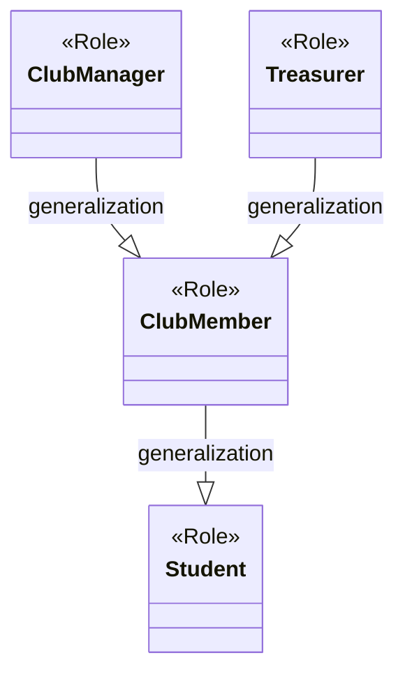
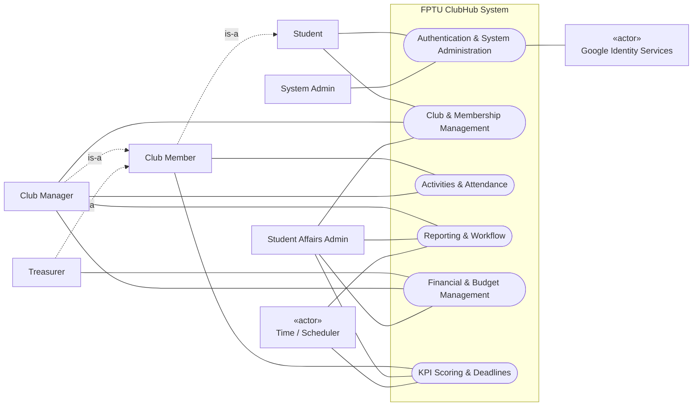
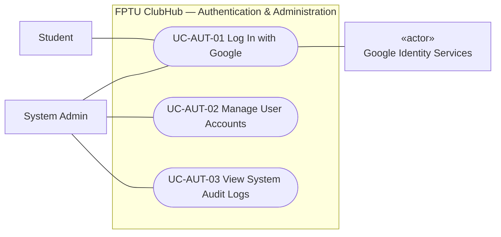
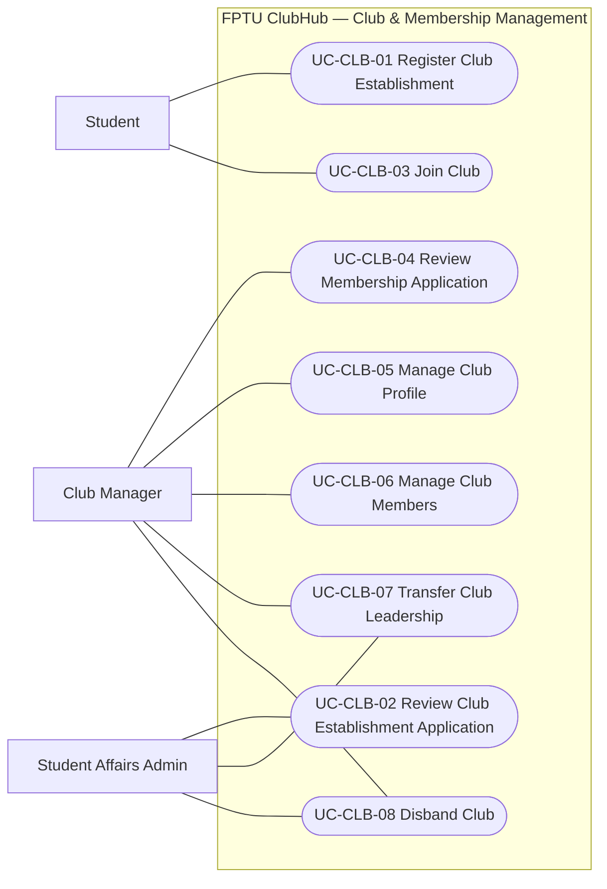
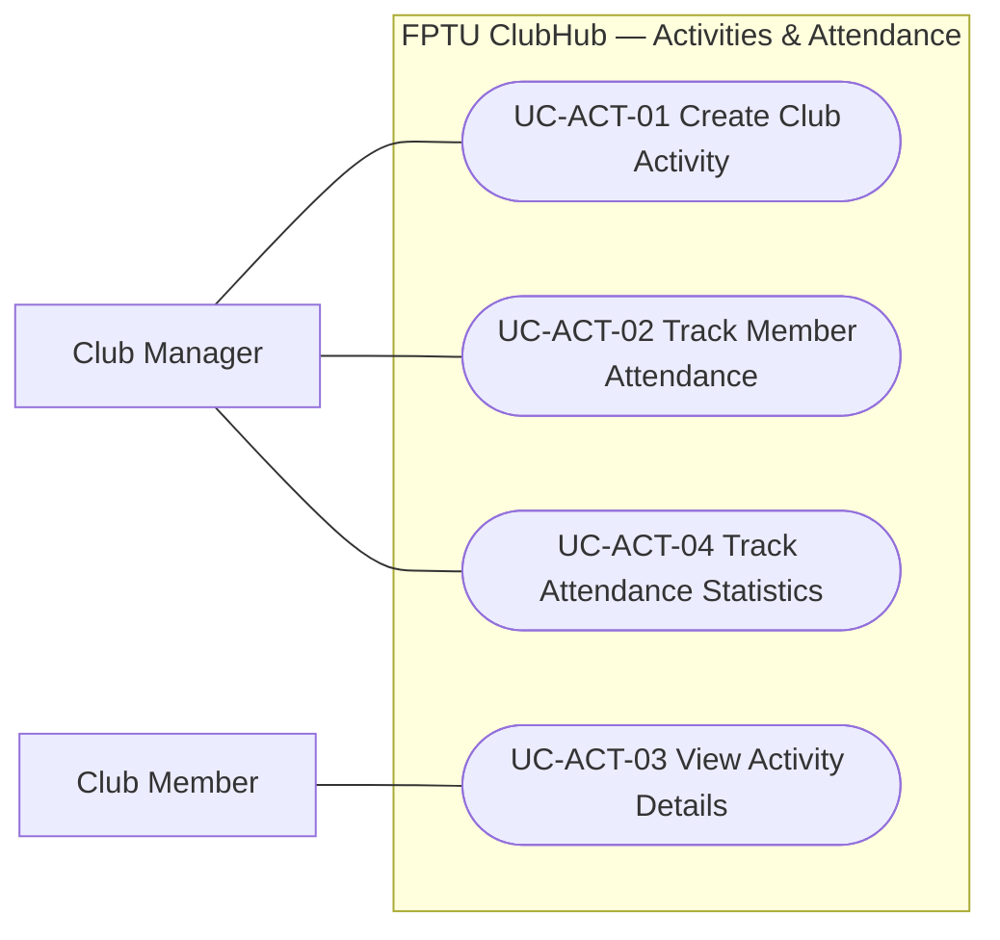
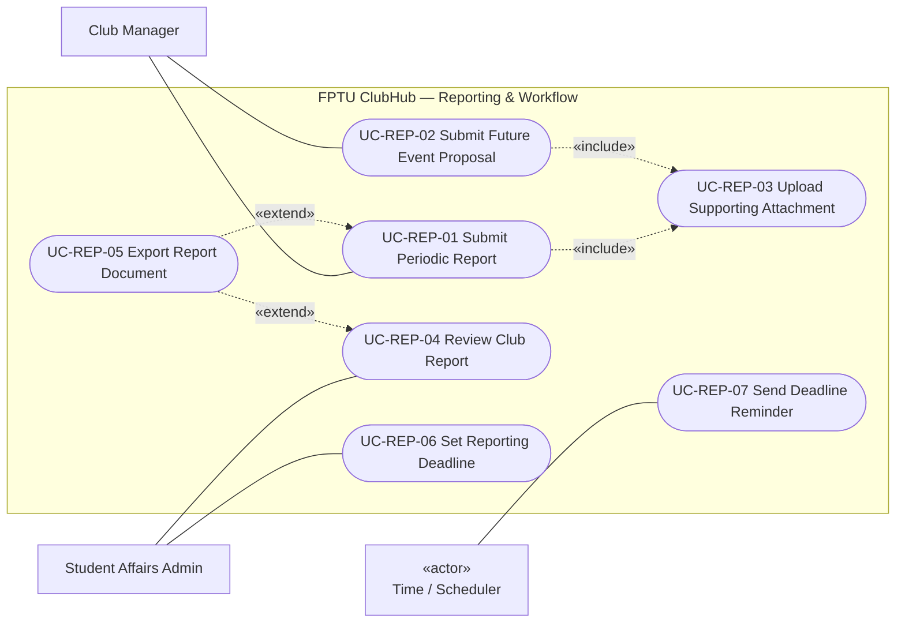
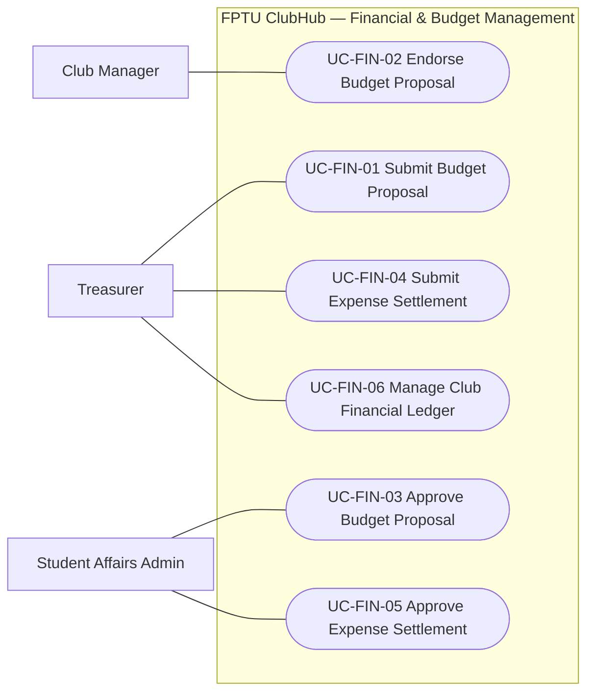
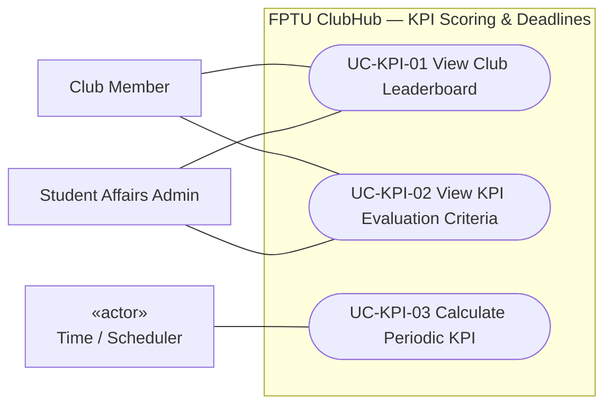

# TÀI LIỆU ĐẶC TẢ USE CASE (USE CASE SPECIFICATION)
## HỆ THỐNG QUẢN LÝ VÀ ĐÁNH GIÁ CÂU LẠC BỘ SINH VIÊN (FPTU CLUBHUB)
**Dự án:** FPTU-Xperience ClubHub  
**Thành phần SRS:** Mục 3 — Yêu cầu chức năng (Functional Requirements)  
**Tiêu chuẩn áp dụng:** Hướng dẫn phân tích Use Case SRS, Chuẩn UML 2.5 & Checklist kiểm định chất lượng  

---

## 1. MỤC ĐÍCH & PHẠM VI TÀI LIỆU

### 1.1. Mục đích
Tài liệu này xác định ranh giới chức năng của hệ thống **FPTU ClubHub**, mô tả tương tác giữa các tác nhân (Actors) với hệ thống nhằm đạt được các mục tiêu nghiệp vụ cụ thể. Tài liệu cung cấp:
1. Danh sách Actors và mô hình phân cấp vai trò nghiệp vụ (Actor Generalization).
2. Sơ đồ Use Case Cấp 0 (Tổng quan toàn hệ thống).
3. Các sơ đồ Use Case Cấp 1 (Chi tiết hóa theo từng phân hệ nghiệp vụ).
4. Bảng danh mục Use Case chuẩn hóa (Use Case List) gồm 10 cột thông tin truy vết.
5. Biên bản kiểm tra chất lượng dựa trên Checklist và ma trận phòng ngừa 38 lỗi phổ biến.

### 1.2. Ranh giới hệ thống (System Boundary)
Hệ thống **FPTU ClubHub** cung cấp nền tảng quản lý tập trung toàn diện cho hoạt động của các Câu lạc bộ (CLB) sinh viên Trường Đại học FPT, kết nối thông suốt giữa Sinh viên, Ban Chủ nhiệm CLB và Phòng Công tác Sinh viên (CTSV).

* **Nằm trong phạm vi (In-Scope):**
  * Quản lý định danh và phân quyền người dùng qua tài khoản Google `@fpt.edu.vn`.
  * Vòng đời CLB: Nộp đơn thành lập, quản lý thông tin, phân công vai trò, chuyển giao chủ nhiệm, giải thể.
  * Tuyển quân và quản lý thành viên, danh sách kiểm soát (roster).
  * Lên kế hoạch hoạt động và điểm danh sinh hoạt (chuyên cần).
  * Quy trình nộp, thẩm định và phê duyệt báo cáo định kỳ / kế hoạch sự kiện.
  * Quản lý tài chính: Đề xuất dự trù kinh phí, quyết toán hoàn ứng và sổ quỹ CLB.
  * Tính điểm và xếp hạng phong trào (KPI Leaderboard) tự động theo học kỳ.
* **Nằm ngoài phạm vi (Out-of-Scope):**
  * Cổng thanh toán trực tuyến tiền mặt/học phí (hệ thống chỉ quản lý chứng từ và định mức giải ngân nội bộ).
  * Mạng xã hội nhắn tin thời gian thực công cộng (chỉ hỗ trợ thông báo hệ thống và phản hồi nghiệp vụ).

---

## 2. THUẬT NGỮ VÀ DANH SÁCH ACTOR

### 2.1. Phân loại Actor

| STT | Tên Actor | Loại Actor | Phân loại | Mô tả vai trò nghiệp vụ |
| :---: | :--- | :---: | :---: | :--- |
| 1 | **Student** | Noun | Primary | Sinh viên Trường Đại học FPT; có thể nộp đơn gia nhập CLB hoặc nộp đề án thành lập CLB mới. |
| 2 | **Club Member** | Noun | Primary | Sinh viên đã được phê duyệt làm thành viên chính thức của ít nhất một CLB. |
| 3 | **Club Manager** | Noun | Primary | Chủ nhiệm hoặc Phó Chủ nhiệm CLB; chịu trách nhiệm điều hành, duyệt thành viên, nộp báo cáo và sự kiện. |
| 4 | **Treasurer** | Noun | Primary | Thủ quỹ CLB do Chủ nhiệm bổ nhiệm; chịu trách nhiệm lập đề xuất kinh phí, chứng từ quyết toán và ghi sổ quỹ. |
| 5 | **Student Affairs Admin** | Noun | Primary | Cán bộ Phòng Công tác Sinh viên (CTSV); thẩm định và phê duyệt hồ sơ CLB, báo cáo, kinh phí và ban hành deadline. |
| 6 | **System Admin** | Noun | Primary | Quản trị viên kỹ thuật; quản lý danh sách email cho phép, phân quyền vai trò tổng thể và kiểm toán hệ thống. |
| 7 | **Google Identity Services** | Noun | Secondary | Hệ thống xác thực danh tính ngoài của Google Workspace FPTU cấp OAuth2 Token. |
| 8 | **Time / Scheduler** | Noun | Primary (System) | Trình định thời tự động (Hangfire) kích hoạt việc nhắc deadline báo cáo và tính toán KPI định kỳ. |

### 2.2. Mô hình Kế thừa Actor (Actor Generalization)
Nhằm tối ưu hóa số lượng đường liên kết và biểu diễn chính xác mối quan hệ vai trò nghiệp vụ:
* `Club Member` kế thừa từ `Student` (Thành viên CLB cũng là Sinh viên).
* `Club Manager` kế thừa từ `Club Member` (Chủ nhiệm CLB có toàn bộ quyền của Thành viên CLB, cộng thêm quyền quản trị CLB).
* `Treasurer` kế thừa từ `Club Member` (Thủ quỹ CLB có toàn bộ quyền của Thành viên CLB, cộng thêm nghiệp vụ thủ quỹ).

---

## 3. SƠ ĐỒ USE CASE CẤP 0 (TỔNG QUAN TOÀN HỆ THỐNG)

Sơ đồ cấp 0 thể hiện sự tương tác giữa các tác nhân và 6 phân hệ chức năng chính (Package / Subsystem) ở mức trừu tượng **Summary**:

---

## 4. SƠ ĐỒ USE CASE CẤP 1 (CHI TIẾT THEO PHÂN HỆ)

### 4.1. Phân hệ 1: Xác thực & Quản trị Hệ thống (Authentication & System Administration)
* **Phạm vi:** Đăng nhập một chạm bằng tài khoản FPT, quản lý danh sách truy cập người dùng và nhật ký kiểm toán quản trị.

---

### 4.2. Phân hệ 2: Quản lý Câu lạc bộ & Thành viên (Club & Membership Management)
* **Phạm vi:** Vòng đời CLB từ khi xin thành lập đến giải thể, gia nhập và quản lý thành viên.

---

### 4.3. Phân hệ 3: Hoạt động & Điểm danh (Activities & Attendance)
* **Phạm vi:** Tạo lịch sinh hoạt, tổ chức sự kiện và theo dõi điểm danh chuyên cần của thành viên.

---

### 4.4. Phân hệ 4: Báo cáo & Phê duyệt (Reporting & Workflow)
* **Phạm vi:** Báo cáo định kỳ tháng/kỳ, nộp kế hoạch sự kiện tương lai, tải minh chứng bắt buộc dùng chung và ban hành hạn chót nộp báo cáo.

> **Ghi chú quan hệ:**
> * `«include»`: `UC-REP-03` là hành vi đính kèm minh chứng hợp lệ, bắt buộc phải có khi thực hiện cả nộp báo cáo định kỳ (`UC-REP-01`) và đề án sự kiện tương lai (`UC-REP-02`).
> * `«extend»`: `UC-REP-05` chỉ được kích hoạt khi người dùng có nhu cầu kết xuất hồ sơ lưu trữ ra file vật lý (PDF/Excel) từ báo cáo đã lập hoặc đã duyệt.

---

### 4.5. Phân hệ 5: Quản lý Tài chính & Quyết toán (Financial & Budget Management)
* **Phạm vi:** Quản lý dự trù ngân sách sự kiện, thủ tục quyết toán chi tiêu thực tế và duy trì nhật ký thu chi nội bộ của CLB.

---

### 4.6. Phân hệ 6: Đánh giá KPI & Xếp hạng (KPI Scoring & Deadlines)
* **Phạm vi:** Theo dõi bảng vàng thành tích CLB (Leaderboard), tra cứu quy chế tính điểm và tự động tổng hợp điểm KPI định kỳ.

---

## 5. DANH MỤC USE CASE CHUẨN HÓA (USE CASE LIST)

Bảng tổng hợp toàn bộ các Use Case trong hệ thống FPTU ClubHub tuân thủ định dạng 10 cột bắt buộc của tài liệu SRS:

| UC ID | Use Case Name | Primary Actor | Secondary Actor(s) | Subsystem | Description | Precondition | Relationships | Priority | Note |
| :--- | :--- | :--- | :--- | :--- | :--- | :--- | :--- | :---: | :--- |
| **UC-AUT-01** | Log In with Google | Student | Google Identity Services | Authentication | Người dùng đăng nhập hệ thống bằng email FPT qua Google OAuth2 và nhận token phiên làm việc. | Có tài khoản email FPT hợp lệ trong Allowlist. | — | Must | Verified Google Token |
| **UC-AUT-02** | Manage User Accounts | System Admin | — | Authentication | Quản lý danh sách người dùng được phép truy cập hệ thống: thêm email vào allowlist, gán vai trò ban đầu, khóa và mở khóa tài khoản. | Đã đăng nhập với quyền System Admin. | — | Must | CRUD Allowlist & Roles |
| **UC-AUT-03** | View System Audit Logs | System Admin | — | Authentication | Tra cứu, lọc và kiểm tra các sự kiện kiểm toán bảo mật và thao tác quản trị trên toàn hệ thống. | Đã đăng nhập với quyền System Admin. | — | Should | Phân trang tối đa 100 bản ghi |
| **UC-CLB-01** | Register Club Establishment | Student | — | Club Management | Nhóm sinh viên sáng lập gửi hồ sơ đề án thành lập CLB mới bao gồm tôn chỉ, nhân sự nòng cốt và kế hoạch hành động. | Đã đăng nhập; chưa là Chủ nhiệm CLB khác. | — | Must | Trạng thái hồ sơ: Pending |
| **UC-CLB-02** | Review Club Establishment Application | Student Affairs Admin | — | Club Management | Cán bộ CTSV thẩm định đề cương mở CLB, ghi nhận ý kiến phản hồi và quyết định phê duyệt hoặc từ chối cấp phép. | Đã đăng nhập quyền CTSV; có hồ sơ đề án chờ duyệt. | — | Must | Kèm review note |
| **UC-CLB-03** | Join Club | Student | — | Club Management | Sinh viên điền đơn đăng ký ứng tuyển gia nhập vào một CLB đang hoạt động kèm thông tin nguyện vọng và kỹ năng. | Đã đăng nhập; chưa là thành viên của CLB này. | — | Must | — |
| **UC-CLB-04** | Review Membership Application | Club Manager | — | Club Management | Chủ nhiệm CLB đánh giá danh sách đơn xin vào CLB và phê duyệt hoặc từ chối kết nạp sinh viên. | Đã đăng nhập; có quyền Chủ nhiệm CLB tương ứng. | — | Must | — |
| **UC-CLB-05** | Manage Club Profile | Club Manager | — | Club Management | Xem và cập nhật thông tin giới thiệu, hình ảnh đại diện, email liên hệ và tôn chỉ hoạt động của CLB. | Đã đăng nhập; là Chủ nhiệm CLB. | — | Should | Cập nhật thông tin công khai |
| **UC-CLB-06** | Manage Club Members | Club Manager | — | Club Management | Quản lý danh sách nhân sự chính thức: đối soát danh sách thành viên (roster), phân công bổ nhiệm Thủ quỹ hoặc bãi nhiệm thành viên. | Đã đăng nhập; là Chủ nhiệm CLB. | — | Must | Bao gồm CRUD thành viên & bổ nhiệm |
| **UC-CLB-07** | Transfer Club Leadership | Club Manager | — | Club Management | Chủ nhiệm khởi tạo yêu cầu chuyển giao chức vụ cho thành viên đủ tiêu chuẩn; đơn được chuyển tiếp tới CTSV phê chuẩn. | Đã đăng nhập; là Chủ nhiệm; CLB không nợ báo cáo. | — | Should | Cần CTSV duyệt chuyển giao |
| **UC-CLB-08** | Disband Club | Club Manager | — | Club Management | Chủ nhiệm nộp hồ sơ xin giải thể CLB kèm phương án bàn giao tài sản, công nợ để CTSV thẩm định bãi bỏ. | Đã đăng nhập; là Chủ nhiệm CLB. | — | Could | Cần CTSV xác nhận giải thể |
| **UC-ACT-01** | Create Club Activity | Club Manager | — | Activity | Khởi tạo lịch sinh hoạt định kỳ hoặc sự kiện nội bộ của CLB (thời gian, địa điểm, nội dung). | Đã đăng nhập; là Chủ nhiệm CLB. | — | Must | — |
| **UC-ACT-02** | Track Member Attendance | Club Manager | — | Activity | Điểm danh mức độ tham gia của từng thành viên (Present, Absent, Excused, Late) trong một buổi hoạt động. | Buổi hoạt động đã được tạo và đang diễn ra hoặc đã kết thúc. | — | Must | Hỗ trợ điểm danh đơn lẻ & hàng loạt |
| **UC-ACT-03** | View Activity Details | Club Member | — | Activity | Thành viên CLB tra cứu lịch hoạt động sắp tới, địa điểm tổ chức và lịch sử điểm danh của bản thân. | Đã đăng nhập; là thành viên CLB. | — | Must | — |
| **UC-ACT-04** | Track Attendance Statistics | Club Manager | — | Activity | Tổng hợp số liệu chuyên cần, tỷ lệ tham gia sinh hoạt định kỳ của toàn thể thành viên phục vụ đánh giá nhân sự. | Đã đăng nhập; có quyền Chủ nhiệm CLB. | — | Should | — |
| **UC-REP-01** | Submit Periodic Report | Club Manager | — | Report & Workflow | Lập và nộp báo cáo hoạt động định kỳ (tháng/học kỳ) lên Nhà trường để đánh giá tiến độ và thành tích. | Đã đăng nhập; là Chủ nhiệm; đợt báo cáo đang mở. | include UC-REP-03 | Must | Bắt buộc có tệp minh chứng |
| **UC-REP-02** | Submit Future Event Proposal | Club Manager | — | Report & Workflow | Nộp kế hoạch tổ chức sự kiện sắp tới kèm dự toán ngân sách để đăng ký lịch trình và xin bảo trợ từ CTSV. | Đã đăng nhập; kế hoạch lập trước ngày tổ chức tối thiểu 14 ngày. | include UC-REP-03 | Must | Bắt buộc có đề án chi tiết |
| **UC-REP-03** | Upload Supporting Attachment | Club Manager | — | Report & Workflow | Tải lên các tệp tài liệu số hóa, hình ảnh hoặc hóa đơn tài chính minh chứng cho hoạt động của CLB. | Đang trong tiến trình lập báo cáo hoặc quyết toán. | included by UC-REP-01, UC-REP-02 | Must | Subfunction dùng chung bắt buộc |
| **UC-REP-04** | Review Club Report | Student Affairs Admin | — | Report & Workflow | Cán bộ CTSV xem xét chi tiết nội dung báo cáo hoạt động và đưa ra quyết định: Duyệt, Yêu cầu chỉnh sửa hoặc Từ chối. | Có báo cáo ở trạng thái `Submitted`. | extended by UC-REP-05 | Must | Ghi nhận phản hồi thẩm định |
| **UC-REP-05** | Export Report Document | Club Manager | — | Report & Workflow | Kết xuất nội dung báo cáo thành văn bản định dạng chuẩn PDF hoặc Excel để lưu trữ hoặc trình ký ngoại tuyến. | Báo cáo đã lập hoặc đã được phê duyệt. | extend UC-REP-01, UC-REP-04 | Should | Condition: {Người dùng yêu cầu xuất file lưu trữ} |
| **UC-REP-06** | Set Reporting Deadline | Student Affairs Admin | — | Report & Workflow | Thiết lập hoặc gia hạn mốc thời gian chót nộp báo cáo định kỳ cho các CLB trong từng học kỳ. | Đã đăng nhập với quyền CTSV. | — | Must | Quy định mốc thời gian áp dụng |
| **UC-REP-07** | Send Deadline Reminder | Time / Scheduler | — | Report & Workflow | Trình chạy nền tự động quét hạn nộp và gửi thông báo nhắc nhở đến các Chủ nhiệm CLB chưa hoàn thành nộp báo cáo. | Đến các mốc thời gian cấu hình (T-3 ngày, T-1 ngày trước hạn). | — | Should | Kích hoạt tự động theo lịch Hangfire |
| **UC-FIN-01** | Submit Budget Proposal | Treasurer | — | Finance | Thủ quỹ lập dự toán chi tiết các hạng mục chi tiêu cho sự kiện sắp tới để xin cấp hạn mức kinh phí từ Nhà trường. | Kế hoạch sự kiện đã được lập. | — | Must | — |
| **UC-FIN-02** | Endorse Budget Proposal | Club Manager | — | Finance | Chủ nhiệm CLB kiểm tra tính xác thực và ký duyệt dự toán nội bộ trước khi đề xuất được gửi lên Phòng CTSV. | Có dự toán do Thủ quỹ khởi tạo ở trạng thái chờ duyệt nội bộ. | — | Must | Thẩm định nội bộ cấp CLB |
| **UC-FIN-03** | Approve Budget Proposal | Student Affairs Admin | — | Finance | Cán bộ CTSV thẩm tra tính hợp lệ của dự trù ngân sách và phê duyệt số tiền giải ngân tối đa cho sự kiện. | Có dự thảo kinh phí đã được Chủ nhiệm CLB ký duyệt. | — | Must | Xác lập ngân sách thực cấp |
| **UC-FIN-04** | Submit Expense Settlement | Treasurer | — | Finance | Thủ quỹ nộp hồ sơ quyết toán chi tiêu thực tế kèm đầy đủ bảng kê hóa đơn và tài liệu chứng minh hoàn ứng. | Sự kiện đã kết thúc và đề xuất ngân sách đã được duyệt trước đó. | — | Must | Hồ sơ hóa đơn chứng từ tài chính |
| **UC-FIN-05** | Approve Expense Settlement | Student Affairs Admin | — | Finance | Cán bộ CTSV đối chiếu chứng từ thu chi thực tế với hạn mức cấp ban đầu để phê duyệt tất toán giải ngân. | Có hồ sơ quyết toán gửi đến kèm chứng từ hợp lệ. | — | Must | Khóa sổ quyết toán sự kiện |
| **UC-FIN-06** | Manage Club Financial Ledger | Treasurer | — | Finance | Quản lý sổ nhật ký thu chi nội bộ của CLB: ghi nhận tiền quỹ CLB thu được, các khoản chi sinh hoạt và kết xuất số dư quỹ. | Đã đăng nhập; là Thủ quỹ CLB. | — | Should | Ghi nhận giao dịch thu chi quỹ nội bộ |
| **UC-KPI-01** | View Club Leaderboard | Club Member | — | KPI & Ranking | Tra cứu thứ hạng, tổng điểm thi đua và bảng xếp hạng phong trào của các CLB theo từng kỳ học. | Đã đăng nhập hệ thống. | — | Must | Dữ liệu cập nhật theo kỳ học |
| **UC-KPI-02** | View KPI Evaluation Criteria | Club Member | — | KPI & Ranking | Xem chi tiết quy chế, barem thang điểm đánh giá định lượng cho từng hạng mục hoạt động CLB của Trường. | Đã đăng nhập hệ thống. | — | Should | Công khai quy chế thi đua |
| **UC-KPI-03** | Calculate Periodic KPI | Time / Scheduler | — | KPI & Ranking | Tự động tổng hợp dữ liệu báo cáo, số lượng hoạt động, chuyên cần và tỷ lệ giải ngân để tính toán điểm thi đua cho CLB. | Kết thúc chu kỳ học kỳ hoặc được kích hoạt tái tính toán theo lịch. | — | Must | Tự động hóa qua gRPC & Background Job |

---

## 6. MA TRẬN TRUY VẾT & LIÊN KẾT HỆ THỐNG (TRACEABILITY MATRIX)

### 6.1. Liên kết với External Entities trên Business Context Diagram (BCD)
* Mọi Actor người dùng đều tương thích hoàn toàn với External Entity trên sơ đồ BCD:
  * `Student`, `Club Manager`, `Treasurer` $\leftrightarrow$ Nhóm thực thể Sinh viên & Ban Điều hành CLB.
  * `Student Affairs Admin` $\leftrightarrow$ Phòng Công tác Sinh viên (CTSV).
  * `System Admin` $\leftrightarrow$ Quản trị viên kỹ thuật trường.
  * `Google Identity Services` $\leftrightarrow$ Cổng xác thực danh tính FPT Google Workspace.
  * `Time / Scheduler` $\leftrightarrow$ Thực thể đồng hồ thời gian hệ thống (System Timer).

### 6.2. Liên kết với Thực thể Dữ liệu (ERD)
Các đối tượng trong tên Use Case phản ánh chính xác các thực thể trung tâm trong mô hình dữ liệu quan hệ:
* `UserAccount`, `Role` $\leftrightarrow$ `UC-AUT-01`, `UC-AUT-02`
* `Club`, `Membership`, `ClubApplication` $\leftrightarrow$ `UC-CLB-01` đến `UC-CLB-08`
* `Activity`, `AttendanceRecord` $\leftrightarrow$ `UC-ACT-01` đến `UC-ACT-04`
* `Report`, `ReportDetail`, `ReportAttachment`, `Deadline` $\leftrightarrow$ `UC-REP-01` đến `UC-REP-07`
* `BudgetProposal`, `Settlement`, `TransactionLedger` $\leftrightarrow$ `UC-FIN-01` đến `UC-FIN-06`
* `KpiRule`, `KpiLeaderboardSnapshot` $\leftrightarrow$ `UC-KPI-01` đến `UC-KPI-03`

---

## 7. BIÊN BẢN KIỂM TRA CHẤT LƯỢNG (QUALITY CHECKLIST)

Tất cả các tiêu chí trong danh mục kiểm định chất lượng mục 9 đã được thực thi và xác nhận:

| Nhóm kiểm tra | Tiêu chí đánh giá | Kết quả | Ghi chú minh chứng |
| :--- | :--- | :---: | :--- |
| **A. Actor** | 1. Mọi Actor đều nằm ngoài System Boundary. | **ĐẠT** | Toàn bộ Actor được đặt bên ngoài khung hệ thống trên mọi sơ đồ. |
| | 2. Mọi Actor là vai trò nghiệp vụ (danh từ), không có tên cá nhân. | **ĐẠT** | Sử dụng: `Student`, `Club Manager`, `Student Affairs Admin`... |
| | 3. Không có thành phần kỹ thuật nội bộ (Database, Server, AI) làm Actor. | **ĐẠT** | Không đưa SQL Server, API Gateway hay Redis làm Actor. |
| | 4. Actor khớp 100% với BCD. | **ĐẠT** | Tất cả các luồng tương tác đều tương ứng với thực thể ngoài. |
| | 5. Áp dụng Actor generalization đúng bản chất kế thừa "is-a". | **ĐẠT** | `Club Manager` & `Treasurer` $\to$ `Club Member` $\to$ `Student`. |
| **B. Use Case** | 1. Tên Use Case tuân thủ `Verb + Object`, thể chủ động, góc nhìn Actor. | **ĐẠT** | 100% Use Case dùng động từ hành động mạnh (`Submit`, `Review`, `Create`...). |
| | 2. Không chứa bước giao diện (`Click`, `Open Form`) hay kỹ thuật (`Call API`). | **ĐẠT** | Đã chuyển thành mục tiêu nghiệp vụ mức User Goal. |
| | 3. Mọi Use Case trên sơ đồ chi tiết đều vượt qua **Goal Test**. | **ĐẠT** | Hoàn thành một Use Case đem lại kết quả trọn vẹn và dừng lại hài lòng. |
| | 4. Use Case tổng hợp `Manage X` chỉ dùng cho CRUD và có liệt kê thao tác con. | **ĐẠT** | Xem `UC-AUT-02`, `UC-CLB-05`, `UC-CLB-06`, `UC-FIN-06` trong Use Case List. |
| **C. Quan hệ** | 1. Association chỉ nối Actor — Use Case, đường liền nét trơn không mang tên. | **ĐẠT** | Không đặt tên luồng dữ liệu trên Association. |
| | 2. `«include»` là hành vi bắt buộc và được $\ge 2$ Use Cases dùng chung. | **ĐẠT** | `UC-REP-03 Upload Supporting Attachment` được include bởi `UC-REP-01` & `UC-REP-02`. |
| | 3. Không `include Log In` vào mọi Use Case. | **ĐẠT** | Đăng nhập được ghi nhận ở cột Precondition. |
| | 4. `«extend»` là hành vi tùy chọn có điều kiện, chiều mũi tên từ Mở rộng $\to$ Gốc. | **ĐẠT** | `UC-REP-05 Export Report Document` trỏ ngược về `UC-REP-01` và `UC-REP-04`. |
| | 5. Không dùng include/extend để chia nhỏ tuần tự các bước xử lý. | **ĐẠT** | Trình tự xử lý được giao cho Activity Diagram. |
| **D. Phân cấp** | 1. Phân chia rõ ràng: Cấp 0 (Tổng quan) và Cấp 1 (Theo 6 phân hệ). | **ĐẠT** | Tuân thủ tuyệt đối cấu trúc sơ đồ đa cấp. |
| | 2. Số lượng phần tử mỗi sơ đồ tối ưu: $3 - 8$ Use Cases, $\le 3$ Actors. | **ĐẠT** | Người đọc nắm bắt toàn bộ nội dung sơ đồ trong dưới 60 giây. |
| | 3. Không có đường nối cắt chéo chồng chéo. | **ĐẠT** | Bố cục sơ đồ trực quan, luồng Actor chính bên trái, thứ cấp bên phải. |
| **E. Truy vết** | 1. Mã định danh bất biến chuẩn format `UC--NN`. | **ĐẠT** | Đánh số 2 chữ số có đệm số 0 theo từng phân hệ. |
| | 2. Nhất quán 100% giữa sơ đồ và Use Case List. | **ĐẠT** | 31 Use Case trên các sơ đồ ứng với đúng 31 dòng trong bảng. |

---

## 8. BẢNG ĐỐI CHIẾU PHÒNG NGỪA 38 LỖI PHỔ BIẾN (COMMON MISTAKES AUDIT)

Hệ thống tài liệu đã được rà soát và khắc phục triệt để 38 lỗi phổ biến theo chuẩn đào tạo Capstone:

* **Nhóm cấu trúc (Lỗi 1 - 5):** Đã tách thành 1 sơ đồ Cấp 0 và 6 sơ đồ Cấp 1 theo phân hệ; loại bỏ việc liệt kê vụn vặt CRUD bằng abstraction `Manage X`; mọi Use Case ở Cấp 0 đều được triển khai 1:1 xuống Cấp 1.
* **Nhóm Actor (Lỗi 6 - 12):** Không có Database/Backend/Redis làm Actor; Actor là danh từ chỉ vai trò, không có tên riêng; áp dụng Actor generalization để tránh trùng lặp đường nối.
* **Nhóm Tên & Mức độ (Lỗi 13 - 19):** 100% tên ở dạng `Verb + Object`; không chứa từ ngữ giao diện (`Click`, `Open`); không đưa bước kỹ thuật (`Call API`); không nhầm màn hình với Use Case; qua được bài kiểm tra Goal Test.
* **Nhóm Quan hệ (Lỗi 20 - 27):** Không `include Log In`; không dùng include để nối các bước; mũi tên `extend` vẽ đúng hướng từ Mở rộng $\to$ Gốc; quan hệ `extend` có ghi rõ điều kiện kích hoạt; không có mũi tên trên Association.
* **Nhóm Nhất quán & Mã số (Lỗi 28 - 38):** Không có Use Case ngoài phạm vi; mã số thống nhất dạng `UC--NN` không chứa thông tin biến động (như `Must` hay `Sprint`); mô tả trong Use Case List ngắn gọn (1–2 câu) tập trung vào mục tiêu và kết quả, không viết thành kịch bản luồng thao tác.
